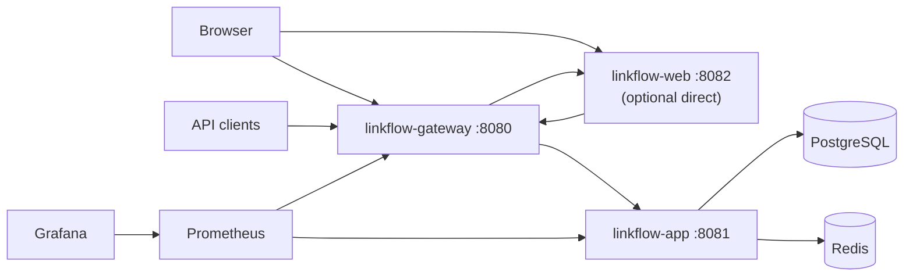

# LinkFlow

Production-style URL shortener built as a **modular monolith** with Java 21 and Spring Boot 3.4.1. LinkFlow lets authenticated users create short links (with optional custom aliases and expiry), redirect visitors via public short codes, track click analytics, and manage URLs through a REST API or server-rendered web UI.

## What problem it solves

LinkFlow demonstrates how to build a real-world link-management platform: secure multi-user auth, idempotent URL creation, Redis-backed caching and rate limiting, async analytics, observability, and a gateway-fronted API — without splitting into microservices prematurely.

## Architecture summary

Three independently runnable Spring Boot processes compose the full product:

| Process | Port | Role |
|---------|------|------|
| `linkflow-gateway` | 8080 | **Public entry** — routes `/api/**`, `/r/**`, Swagger, and web UI (`/**`) |
| `linkflow-app` | 8081 | Modular monolith assembling all feature JARs |
| `linkflow-web` | 8082 | Thymeleaf SSR UI — also reachable via gateway at `/` |

Infrastructure: **Cloud PostgreSQL (Neon)** (primary data), **Redis 7** (URL cache, rate limits, alias locks), **Prometheus + Grafana** (Docker full stack only).



Canonical design: [docs/system-design.md](docs/system-design.md)

## Module map

| Module | Responsibility |
|--------|----------------|
| `linkflow-common` | Shared API envelopes, exceptions, audit base, Redis config, port interfaces |
| `linkflow-auth` | JWT access tokens, opaque refresh tokens, `SecurityConfig` |
| `linkflow-user` | User entity, profile API, admin user listing |
| `linkflow-url` | Short URL CRUD, redirects, QR codes, idempotency, Redis cache |
| `linkflow-rate-limit` | Redis Lua rate limiter (`RateLimitFilter`) |
| `linkflow-analytics` | Async click tracking, aggregate analytics |
| `linkflow-observability` | Custom Redis health indicator, Micrometer/Prometheus |
| `linkflow-app` | Runnable backend — Flyway migrations, schedulers, wiring |
| `linkflow-gateway` | API gateway — correlation ID propagation |
| `linkflow-web` | Server-rendered UI — session-stored JWTs, no backend compile deps |

## Tech stack

- Java 21, Maven multi-module
- Spring Boot 3.4.1, Spring Security 6, Spring Data JPA, Spring Cloud Gateway 2024.0.0
- Cloud PostgreSQL (Neon) + Flyway, Redis 7
- JWT (jjwt, HMAC-SHA512), BCrypt password hashing
- Micrometer, Prometheus, Grafana, Logstash JSON logging
- Thymeleaf + Tabler (web UI), Testcontainers (integration tests)

## Key features

- Register / login / refresh / logout with JWT + rotating refresh tokens
- Create short URLs (single + bulk) with optional `Idempotency-Key`
- Public redirect at `GET /r/{shortCode}` with Redis cache-aside
- Per-URL and system analytics (aggregate counts + recent click events)
- QR code PNG generation (ZXing)
- Per-user and per-IP rate limiting with `X-RateLimit-*` headers
- Admin endpoints for users (including disable/enable/delete), URLs, analytics, and system stats
- Bootstrap admin user via environment variables
- Scheduled expiry cleanup (`ExpiredUrlCleanupJob`)

## Request flow summary

1. **API auth:** Client → gateway → `JwtAuthenticationFilter` → controller → service → PostgreSQL/Redis
2. **Redirect:** Client → gateway → `RedirectController` → `RedirectService` → Redis cache or PostgreSQL → async click tracking
3. **Web UI:** Browser → `linkflow-web` → session JWT → gateway → backend; tokens never exposed to browser JavaScript

Details: [docs/code-walkthrough.md](docs/code-walkthrough.md)

## Local development

### Prerequisites

- **JDK 21** (enforced by Maven Enforcer)
- Maven 3.9+
- Docker Desktop (Redis, integration tests)

### Quick start

```bash
export JAVA_HOME=$(/usr/libexec/java_home -v 21)

# Infrastructure
docker compose up -d redis

# Build
mvn clean package -DskipTests

# Backend (8081)
java -jar linkflow-app/target/linkflow-app-1.0.0-SNAPSHOT.jar --spring.profiles.active=dev

# Gateway (8080) — separate terminal
export LINKFLOW_APP_URI=http://127.0.0.1:8081
java -jar linkflow-gateway/target/linkflow-gateway-1.0.0-SNAPSHOT.jar --spring.profiles.active=dev

# Web UI (8082) — separate terminal
java -jar linkflow-web/target/linkflow-web-1.0.0-SNAPSHOT.jar --spring.profiles.active=dev
```

Full runbook: [LOCAL_SETUP.md](LOCAL_SETUP.md) and [docs/setup.md](docs/setup.md)

## Docker / Docker Compose

```bash
cp .env.example .env
# Set LINKFLOW_JWT_SECRET in .env
docker compose up --build
```

**Included in Compose:** redis, linkflow-app, linkflow-gateway, **linkflow-web**, prometheus, grafana

Open **http://localhost:8080** for the full experience (web UI + API via gateway).

Guide: [docs/docker.md](docs/docker.md)

## Environment variables

| Variable | Default | Description |
|----------|---------|-------------|
| `SPRING_DATASOURCE_URL` | (required) | PostgreSQL JDBC URL (e.g. Neon DB) |
| `SPRING_DATASOURCE_USERNAME` | (required) | DB user |
| `SPRING_DATASOURCE_PASSWORD` | (required) | DB password |
| `SPRING_DATA_REDIS_HOST` | `localhost` | Redis host |
| `SPRING_DATA_REDIS_PORT` | `6379` | Redis port |
| `LINKFLOW_JWT_SECRET` | (required in prod) | Base64-encoded secret for HMAC-SHA512 JWT |
| `LINKFLOW_JWT_ACCESS_EXPIRATION_MS` | `900000` | Access token TTL (15 min) |
| `LINKFLOW_JWT_REFRESH_EXPIRATION_MS` | `2592000000` | Refresh token TTL (30 days) |
| `LINKFLOW_BASE_URL` | `http://localhost:8080` | Prefix for generated short URLs |
| `LINKFLOW_CORS_ALLOWED_ORIGINS` | `*` | CORS allowed origins |
| `LINKFLOW_RATE_LIMIT_USER_RPM` | `100` | Authenticated requests/minute |
| `LINKFLOW_RATE_LIMIT_IP_RPM` | `200` | Anonymous requests/minute |
| `LINKFLOW_BOOTSTRAP_ADMIN_*` | disabled | Optional first admin user |
| `LINKFLOW_APP_URI` | `http://127.0.0.1:8081` | Gateway upstream for backend (gateway module) |
| `LINKFLOW_WEB_URI` | `http://127.0.0.1:8082` | Gateway upstream for web UI (gateway module) |
| `LINKFLOW_GATEWAY_URL` | `http://127.0.0.1:8080` | Gateway URL (web module) |
| `LINKFLOW_RATE_LIMIT_AUTH_FAIL_CLOSED` | `true` | Return 503 on auth paths when Redis is down |
| `LINKFLOW_SECURITY_SWAGGER_PUBLIC` | `true` (dev) | Allow Swagger without auth |
| `LINKFLOW_SECURITY_ACTUATOR_PUBLIC` | `true` (dev) | Allow all actuator paths without auth |
| `LINKFLOW_SECURITY_METRICS_PUBLIC` | `false` | Allow Prometheus/metrics without auth (dev default) |
| `LINKFLOW_METRICS_PUBLIC` | `false` | Prod profile alias for `metrics-public` |

Full reference: [docs/environment.md](docs/environment.md)

## Build and test

```bash
export JAVA_HOME=$(/usr/libexec/java_home -v 21)

# Build without tests
mvn clean package -DskipTests

# Full verify (unit + integration; Docker required for ITs)
mvn clean verify

# Single module
mvn clean package -DskipTests -pl linkflow-app -am
```

Guide: [docs/testing.md](docs/testing.md)

## Observability

| Endpoint | URL (local Docker stack) |
|----------|--------------------------|
| App health | http://localhost:8081/actuator/health |
| Gateway health | http://localhost:8080/actuator/health |
| Prometheus metrics (app) | http://localhost:8081/actuator/prometheus |
| Prometheus UI | http://localhost:9090 |
| Grafana | http://localhost:3000 (admin/admin) |

Custom health: `RedisHealthIndicator` in `linkflow-observability`.

## API documentation

| Resource | URL |
|----------|-----|
| Swagger UI (via gateway) | http://localhost:8080/swagger-ui/index.html |
| OpenAPI JSON | http://localhost:8080/v3/api-docs |
| Endpoint inventory | [docs/api-inventory.md](docs/api-inventory.md) |

## Security notes

- Stateless JWT API (`SecurityConfig` in `linkflow-auth`); CSRF disabled on API
- Refresh tokens are opaque, SHA-256 hashed in PostgreSQL, rotated on refresh
- BCrypt strength 12 for passwords
- Rate limiting: **auth paths fail closed** (503) when Redis is down; authenticated and redirect traffic **fail open**
- Actuator/Swagger exposure is **profile-based** — prod denies Swagger and restricts actuator to health (+ optional metrics via `LINKFLOW_METRICS_PUBLIC`)
- Web UI stores JWTs in server-side `HttpSession`, not browser storage

Full review: [docs/security-review.md](docs/security-review.md)

## Troubleshooting

| Symptom | Fix |
|---------|-----|
| Maven Java version error | Set `JAVA_HOME` to JDK 21 |
| `role "linkflow" does not exist` | Native Postgres on 5432 — stop it or remap Docker port |
| Gateway 500 to app | Use `LINKFLOW_APP_URI=http://127.0.0.1:8081` on macOS |
| JWT startup failure | Use `--spring.profiles.active=dev` or set `LINKFLOW_JWT_SECRET` |
| Integration tests fail | Ensure Docker Desktop is running |

More: [LOCAL_SETUP.md](LOCAL_SETUP.md#troubleshooting)

## Deployment

Docker Compose deploys app + gateway + observability on a single host. Kubernetes outline and production checklist: [docs/deployment.md](docs/deployment.md)

## Interview talking points

- **Modular monolith:** feature modules compile independently but deploy as one JAR; cross-module calls use ports in `linkflow-common` (`UserLookupPort`, `ClickTrackingPort`)
- **Gateway:** single public entry, correlation IDs, future cross-cutting concerns without touching business code
- **Redis:** redirect cache (15 min), Lua rate limiter, alias creation locks — each with different TTL semantics
- **Analytics:** `@Async` click tracking so redirects stay fast; aggregates in `url_analytics`, raw events in `click_events` with paginated recent-click APIs
- **Idempotency:** `idempotency_records` table keyed by `(user_id, endpoint, idempotency_key)`

Prep guide: [docs/interview-prep.md](docs/interview-prep.md)

## Documentation

Start at [docs/index.md](docs/index.md) for the full documentation map.

## License

See repository license file if present.
