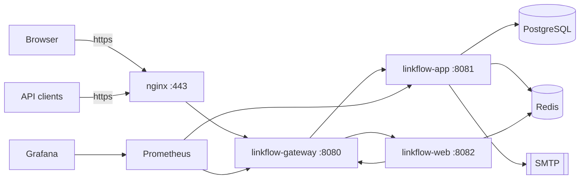

# LinkFlow

Production-style URL shortener built as a **modular monolith** with Java 21 and Spring Boot 3.4.1. LinkFlow lets authenticated users create short links (with optional custom aliases and expiry), redirect visitors via public short codes, track click analytics, and manage URLs through a REST API or server-rendered web UI.

## What problem it solves

LinkFlow demonstrates how to build a real-world link-management platform: secure multi-user auth, idempotent URL creation, Redis-backed caching and rate limiting, async analytics, observability, and a gateway-fronted API — without splitting into microservices prematurely.

## Architecture summary

Three independently runnable Spring Boot processes compose the full product, behind Nginx at the
edge:

| Process | Port | Role |
|---------|------|------|
| `nginx` | 80, 443 | **Public entry** — TLS termination, compression, edge rate limiting |
| `linkflow-gateway` | 8080 | Routes `/api/**`, `/r/**`, Swagger, and web UI (`/**`) |
| `linkflow-app` | 8081 | Modular monolith assembling all feature JARs |
| `linkflow-web` | 8082 | Thymeleaf SSR UI — also reachable via gateway at `/` |

Infrastructure: **PostgreSQL 16** (primary data), **Redis 7** (URL cache, rate limits, sessions,
analytics buffering), **SMTP** (account activation and recovery mail), **Prometheus + Grafana**
(Docker full stack only). The Compose stack bundles all of them, so it needs nothing external.



Canonical design: [docs/system-design.md](docs/system-design.md)

## Module map

| Module | Responsibility |
|--------|----------------|
| `linkflow-common` | Shared API envelopes, exceptions, audit base, Redis config, port interfaces |
| `linkflow-auth` | JWT access tokens, opaque refresh tokens, `SecurityConfig` |
| `linkflow-user` | User entity, profile API, admin user listing |
| `linkflow-url` | Short URL CRUD, redirects, QR codes, idempotency, Redis cache |
| `linkflow-rate-limit` | Redis Lua rate limiter (`RateLimitFilter`) |
| `linkflow-analytics` | Async click tracking, aggregate analytics |
| `linkflow-observability` | Custom Redis health indicator, Micrometer/Prometheus |
| `linkflow-app` | Runnable backend — Flyway migrations, schedulers, wiring |
| `linkflow-gateway` | API gateway — correlation ID propagation |
| `linkflow-web` | Server-rendered UI — session-stored JWTs, no backend compile deps |

## Tech stack

- Java 21, Maven multi-module
- Spring Boot 3.4.1, Spring Security 6, Spring Data JPA, Spring Cloud Gateway 2024.0.0
- Cloud PostgreSQL (Neon) + Flyway, Redis 7
- JWT (jjwt, HMAC-SHA512), BCrypt password hashing
- Micrometer, Prometheus, Grafana, Logstash JSON logging
- Thymeleaf + Tabler (web UI), Testcontainers (integration tests)

## Key features

- Register / login / refresh / logout with JWT + rotating refresh tokens
- Full account lifecycle over real SMTP: email activation, resend, password reset, and email change
  — single-use hashed tokens, links that supersede one another, per-recipient send throttling, and a
  nightly reaper for spent tokens
- Create short URLs (single + bulk) with optional `Idempotency-Key`
- Public redirect at `GET /r/{shortCode}` with Redis cache-aside
- Per-URL and system analytics (aggregate counts, 7d/30d/90d daily click trends, and recent activity feeds with IP address masking for user privacy)
- QR code PNG generation (ZXing)
- Per-user and per-IP rate limiting with `X-RateLimit-*` headers
- Admin endpoints for users (including disable/enable/delete), URLs, analytics, and system stats
- Bootstrap admin user via environment variables
- Scheduled cleanup of expired URLs and spent single-use tokens, guarded by ShedLock so only one
  instance runs each job

## Request flow summary

1. **API auth:** Client → gateway → `JwtAuthenticationFilter` → controller → service → PostgreSQL/Redis
2. **Redirect:** Client → gateway → `RedirectController` → `RedirectService` → Redis cache or PostgreSQL → async click tracking
3. **Web UI:** Browser → `linkflow-web` → session JWT → gateway → backend; tokens never exposed to browser JavaScript

Details: [docs/code-walkthrough.md](docs/code-walkthrough.md)

## Local development

### Prerequisites

- **JDK 21** (enforced by Maven Enforcer)
- Maven 3.9+
- Docker Desktop (Redis, integration tests)

### Quick start

```bash
export JAVA_HOME=$(/usr/libexec/java_home -v 21)

# Infrastructure
docker compose up -d redis

# Build
mvn clean package -DskipTests

# Backend (8081)
java -jar linkflow-app/target/linkflow-app-1.0.0-SNAPSHOT.jar --spring.profiles.active=dev

# Gateway (8080) — separate terminal
export LINKFLOW_APP_URI=http://127.0.0.1:8081
java -jar linkflow-gateway/target/linkflow-gateway-1.0.0-SNAPSHOT.jar --spring.profiles.active=dev

# Web UI (8082) — separate terminal
java -jar linkflow-web/target/linkflow-web-1.0.0-SNAPSHOT.jar --spring.profiles.active=dev
```

Full runbook: [LOCAL_SETUP.md](LOCAL_SETUP.md) and [docs/setup.md](docs/setup.md)

## Docker / Docker Compose

```bash
./docker/nginx/generate-dev-certs.sh   # self-signed cert for local TLS
cp .env.example .env                   # then set LINKFLOW_JWT_SECRET
docker compose up --build
```

Open **https://localhost**. The browser warns about the self-signed certificate, which is expected —
the stack exercises the real TLS path rather than pretending to.

**Included in Compose:** nginx, postgres, redis, mailhog, linkflow-app, linkflow-gateway,
linkflow-web, prometheus, grafana. Nothing external is required; point `SPRING_DATASOURCE_*` at a
managed database if you prefer one.

Only Nginx publishes application ports — the gateway, app, web, database, and Redis are reachable
only on the private Compose network.

Guide: [docs/docker.md](docs/docker.md)

## Environment variables

| Variable | Default | Description |
|----------|---------|-------------|
| `SPRING_DATASOURCE_URL` | (required) | PostgreSQL JDBC URL (e.g. Neon DB) |
| `SPRING_DATASOURCE_USERNAME` | (required) | DB user |
| `SPRING_DATASOURCE_PASSWORD` | (required) | DB password |
| `SPRING_DATA_REDIS_HOST` | `localhost` | Redis host |
| `SPRING_DATA_REDIS_PORT` | `6379` | Redis port |
| `SPRING_DATA_REDIS_PASSWORD` | (required in prod) | Redis password; Redis holds sessions and rate-limit state |
| `LINKFLOW_JWT_SECRET` | (required in prod) | Base64 secret for HS512 JWT; must decode to ≥64 bytes |
| `LINKFLOW_JWT_ACCESS_EXPIRATION_MS` | `900000` | Access token TTL (15 min) |
| `LINKFLOW_JWT_REFRESH_EXPIRATION_MS` | `2592000000` | Refresh token TTL (30 days) |
| `LINKFLOW_BASE_URL` | `http://localhost:8080` | Prefix for generated short URLs |
| `LINKFLOW_CORS_ALLOWED_ORIGINS` | `*` | CORS allowed origins; `*` is rejected in prod |
| `LINKFLOW_TRUSTED_PROXIES` | (empty) | CIDRs allowed to set `X-Forwarded-For`; empty ignores the header |
| `LINKFLOW_RATE_LIMIT_USER_RPM` | `100` | Authenticated requests/minute |
| `LINKFLOW_RATE_LIMIT_IP_RPM` | `200` | Anonymous requests/minute |
| `LINKFLOW_BOOTSTRAP_ADMIN_*` | disabled | Optional first admin user |
| `LINKFLOW_APP_URI` | `http://127.0.0.1:8081` | Gateway upstream for backend (gateway module) |
| `LINKFLOW_WEB_URI` | `http://127.0.0.1:8082` | Gateway upstream for web UI (gateway module) |
| `LINKFLOW_GATEWAY_URL` | `http://127.0.0.1:8080` | Gateway URL (web module) |
| `LINKFLOW_RATE_LIMIT_AUTH_FAIL_CLOSED` | `true` | Return 503 on auth paths when Redis is down |
| `LINKFLOW_SECURITY_SWAGGER_PUBLIC` | `true` (dev) | Allow Swagger without auth |
| `LINKFLOW_SECURITY_ACTUATOR_PUBLIC` | `true` (dev) | Allow all actuator paths without auth |
| `LINKFLOW_SECURITY_METRICS_PUBLIC` | `false` | Allow Prometheus/metrics without auth (dev default) |
| `LINKFLOW_METRICS_PUBLIC` | `false` | Prod profile alias for `metrics-public` |

Full reference: [docs/environment.md](docs/environment.md)

## Build and test

```bash
export JAVA_HOME=$(/usr/libexec/java_home -v 21)

# Build without tests
mvn clean package -DskipTests

# Full verify (unit + integration; Docker required for ITs)
mvn clean verify

# Single module
mvn clean package -DskipTests -pl linkflow-app -am
```

Guide: [docs/testing.md](docs/testing.md)

## Performance (k6)

Reusable load scenarios live under [`performance/`](performance/README.md). Seed verified users via MailHog, then run:

```bash
./performance/scripts/seed.sh
./performance/run.sh smoke
./performance/run.sh redirect
```

Reports are written to `performance/reports/`. Threshold defaults are **regression gates for a run**, not published product SLOs — do not invent or quote numbers without a real run. For stress/soak, raise rate limits with `docker-compose.perf.yml` (see the performance README).

## Observability

| Endpoint | URL |
|----------|-----|
| Nginx health | https://localhost/nginx-health |
| Prometheus UI | http://localhost:9090 |
| Grafana | http://localhost:3000 (admin/admin) — provisioned **LinkFlow Overview** dashboard |
| MailHog inbox | http://localhost:8025 |

Prometheus scrapes the app and gateway over the private Compose network (`/actuator` is denied at
Nginx). Alert rules live in `docker/prometheus/alerts.yml` (availability, 5xx rate, email delivery
failures, rate-limiter Redis outages, analytics flush failures, heap pressure).

Business counters (prefix `linkflow_`) cover redirects, URL-cache hit/miss, login success/failure,
registration, URL creation, email delivery outcomes, rate-limit rejections, and analytics flush.
JVM/HTTP meters come from Spring Boot Actuator as usual.

```bash
docker compose exec linkflow-app wget -qO- http://127.0.0.1:8081/actuator/health/readiness
docker compose exec linkflow-app wget -qO- http://127.0.0.1:8081/actuator/prometheus
# Alerts loaded?
curl -s http://localhost:9090/api/v1/rules | head
```

Liveness excludes external dependencies while readiness includes them. Custom health:
`RedisHealthIndicator` in `linkflow-observability`.

## API documentation

Swagger is enabled under the `dev` profile and **denied under `docker` and `prod`** — an
unauthenticated schema of every endpoint is not something to publish.

| Resource | URL (`dev` profile) |
|----------|---------------------|
| Swagger UI (via gateway) | http://localhost:8080/swagger-ui/index.html |
| OpenAPI JSON | http://localhost:8080/v3/api-docs |
| Endpoint inventory | [docs/api-inventory.md](docs/api-inventory.md) |

## Security notes

- Stateless JWT API (`SecurityConfig` in `linkflow-auth`); CSRF disabled on API
- Refresh tokens are opaque, SHA-256 hashed in PostgreSQL, rotated on refresh
- BCrypt strength 12 for passwords
- Rate limiting: **auth paths fail closed** (503) when Redis is down; authenticated and redirect traffic **fail open**
- Actuator/Swagger exposure is **profile-based** — prod denies Swagger and restricts actuator to health (+ optional metrics via `LINKFLOW_METRICS_PUBLIC`); Nginx additionally denies `/actuator` at the edge
- Web UI stores JWTs in server-side `HttpSession`, not browser storage
- TLS terminates at Nginx, which sets HSTS once at the boundary; `X-Forwarded-For` is replaced rather than appended, so a client cannot forge its own IP
- `X-Forwarded-For` is honoured only from configured trusted proxies, so IP rate limiting cannot be bypassed with a header
- Containers run as a non-root numeric UID and the JVM exits on OOM rather than limping

Full review: [docs/security-review.md](docs/security-review.md)

## Troubleshooting

| Symptom | Fix |
|---------|-----|
| Maven Java version error | Set `JAVA_HOME` to JDK 21 |
| `role "linkflow" does not exist` | Native Postgres on 5432 — stop it or remap Docker port |
| Gateway 500 to app | Use `LINKFLOW_APP_URI=http://127.0.0.1:8081` on macOS |
| JWT startup failure | Use `--spring.profiles.active=dev` or set `LINKFLOW_JWT_SECRET` |
| Integration tests fail | Ensure Docker Desktop is running |

More: [LOCAL_SETUP.md](LOCAL_SETUP.md#troubleshooting)

## Deployment

Docker Compose deploys app + gateway + observability on a single host. Kubernetes outline and production checklist: [docs/deployment.md](docs/deployment.md)

## Interview talking points

- **Modular monolith:** feature modules compile independently but deploy as one JAR; cross-module calls use ports in `linkflow-common` (`UserLookupPort`, `ClickTrackingPort`)
- **Gateway:** single public entry, correlation IDs, future cross-cutting concerns without touching business code
- **Redis:** redirect cache (15 min, stale-while-revalidate), Lua sliding-window rate limiter, session store, click-event stream — each with different TTL and durability semantics
- **Cache consistency:** invalidation is deferred to after commit via `@TransactionalEventListener`, so a concurrent reader cannot repopulate the cache from a pre-commit row
- **Uniqueness under concurrency:** the unique index on `short_code` is the authority; a losing race surfaces as a 409 rather than a 500
- **Analytics:** `@Async` click tracking to Redis buffers/flusher; daily click trends (7d/30d/90d ranges) and user/admin activity feeds (with IP masking for standard users) queried via JPA projections from PostgreSQL
- **Idempotency:** `idempotency_records` table keyed by `(user_id, endpoint, idempotency_key)`

Prep guide: [docs/interview-prep.md](docs/interview-prep.md)

## Documentation

Start at [docs/index.md](docs/index.md) for the full documentation map.

## License

See repository license file if present.
