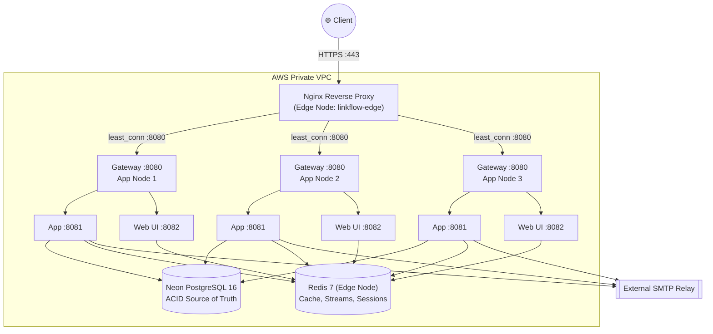
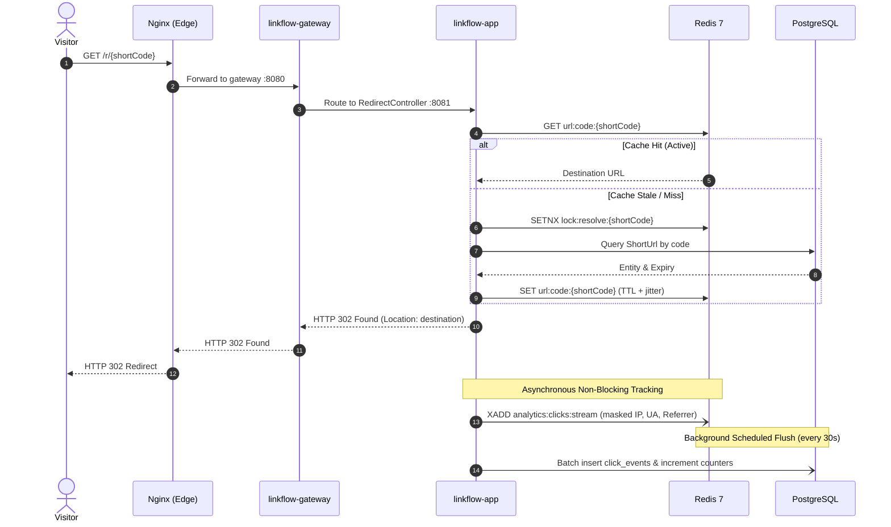
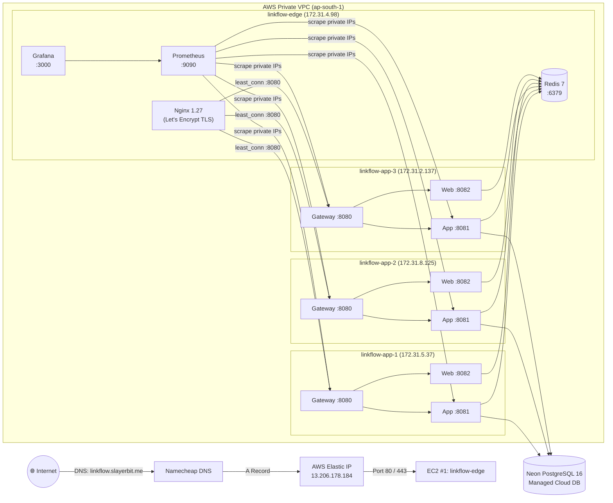
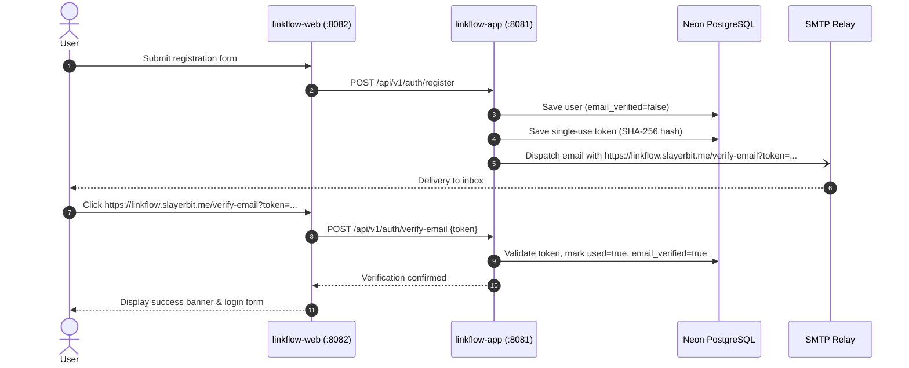
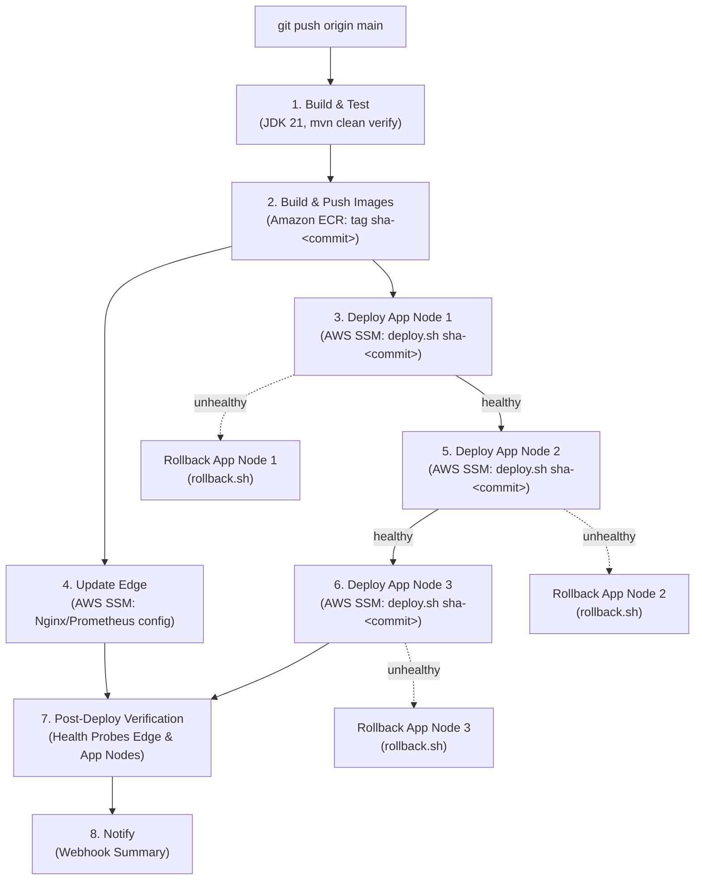
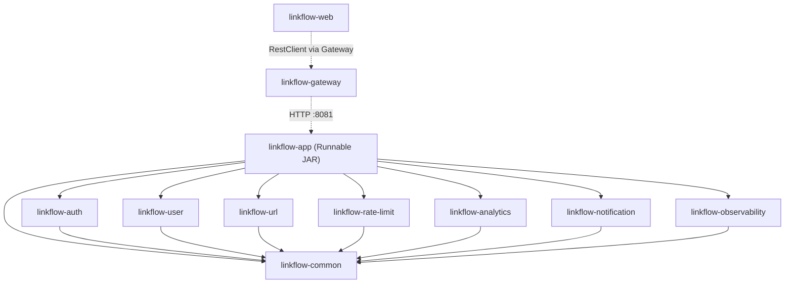

<p align="center">
  <h1 align="center">⚡ LinkFlow</h1>
  <p align="center">
    <strong>High-Performance Distributed URL Shortener & Analytics Platform</strong><br/>
    Built as a Modular Monolith in Java 21 & Spring Boot 3.4.1 • Distributed 4-EC2 AWS Cluster
  </p>
  <p align="center">
    <a href="https://linkflow.slayerbit.me"></a>
    
    
    
    
  </p>
</p>

---

> 🌐 **Production Application**: [https://linkflow.slayerbit.me](https://linkflow.slayerbit.me)<br/>
> 🩺 **System Edge Health Probe**: [https://linkflow.slayerbit.me/nginx-health](https://linkflow.slayerbit.me/nginx-health)<br/>
> 📖 **Deep Documentation**: [Architecture](docs/ARCHITECTURE.md) • [Deployment](docs/DEPLOYMENT.md) • [REST API](docs/API.md) • [Interview Guide](docs/INTERVIEW_GUIDE.md)

---

## Table of Contents

- [What is LinkFlow?](#what-is-linkflow)
- [At a Glance](#at-a-glance)
- [Core Capabilities](#core-capabilities)
- [Application Architecture](#application-architecture)
- [Request Lifecycle & Redirect Flow](#request-lifecycle--redirect-flow)
- [Production AWS Cluster Architecture](#production-aws-cluster-architecture)
- [Email Verification & Account Security](#email-verification--account-security)
- [CI/CD & Rolling Deployment Pipeline](#cicd--rolling-deployment-pipeline)
- [Security & Defense-in-Depth](#security--defense-in-depth)
- [Technology Stack](#technology-stack)
- [Module Architecture](#module-architecture)
- [Quick Start (Local Development)](#quick-start-local-development)
- [Testing](#testing)
- [Observability](#observability)
- [Core API Reference](#core-api-reference)
- [Limitations & Roadmap](#limitations--roadmap)

---

## What is LinkFlow?

**LinkFlow** is a production-grade URL shortening, QR generation, and real-time click analytics platform. Designed to demonstrate robust enterprise backend engineering, it marries clean modular architecture with high-throughput operational resiliency.

Visitors follow `GET /r/{shortCode}` to be redirected via an optimized Redis cache-aside layer, while click attribution data is ingested asynchronously through Redis Streams without adding latency to the redirect hot path. Operators and users interact via an authenticated REST API and a server-rendered administration dashboard.

### What Makes It Technically Interesting?

- **Strict Modular Monolith**: Enforced boundaries across 11 Maven modules using port-based interfaces (`UserLookupPort`, `TokenRevocationPort`, `ClickTrackingPort`) without cross-feature compile dependencies.
- **Decoupled Asynchronous Click Ingest**: Redirects complete in single-digit milliseconds via Redis cache-aside (with stale-while-revalidate and stampede locking); click streams are flushed in background batches to PostgreSQL.
- **Distributed Multi-Tier Rate Limiting**: Lua-scripted sliding-window rate limiters in Redis (per user / per IP) coupled with coarse Nginx edge drops.
- **Zero-Downtime Keyless CI/CD**: Pushes to `main` trigger GitHub Actions to build immutable commit-tagged Docker images (`sha-<hash>`), publish to Amazon ECR, and execute sequential rolling deployments across 3 application EC2 nodes via AWS Systems Manager (SSM) with automatic health probes and rollback.

---

## At a Glance

| Dimension | Production Implementation |
|---|---|
| **Live Domain** | [`https://linkflow.slayerbit.me`](https://linkflow.slayerbit.me) *(root domain `slayerbit.me` is reserved)* |
| **DNS & Ingress** | Namecheap DNS → AWS Elastic IP (`13.206.178.184`) → `linkflow-edge` EC2 |
| **TLS & Certificates** | Let's Encrypt automated TLS via Certbot; automatic HTTP (port 80) to HTTPS (301) redirect |
| **Cluster Topology** | 4 Amazon EC2 instances: 1 Edge Proxy + 3 Application Nodes behind a private VPC |
| **Backend Architecture**| Java 21 LTS + Spring Boot 3.4.1 (Modular Monolith) + Spring Cloud Gateway |
| **State & Cache** | Redis 7 (L2 Cache, Streams, Lua Rate Limiting, Spring Sessions) |
| **Database** | Neon PostgreSQL 16 over SSL with Flyway schema migrations (V1–V11) |
| **Authentication** | Stateless JWT (HS512) + rotating opaque refresh tokens + SMTP email verification |
| **Continuous Delivery**| Keyless GitHub Actions OIDC → Amazon ECR → AWS SSM rolling deploys with auto-rollback |

---

## Core Capabilities

- **High-Performance Redirects**: Cache-aside resolution with 15-minute freshness, 30-minute stale-while-revalidate (SWR), negative caching for missing codes, and distributed stampede locks (`SETNX`).
- **Real-Time Click Analytics**: Non-blocking click ingestion into Redis Streams (`XADD`) with background scheduled batch writes to PostgreSQL. IP addresses are anonymized before storage.
- **Email Verification & Account Recovery**: Registration triggers verification emails with single-use hashed tokens. Unverified users cannot log in (`EMAIL_NOT_VERIFIED`). Password resets and email-change requests are fully secured over SMTP.
- **QR Code Generation**: On-the-fly QR PNG generation via ZXing with process-local Caffeine caching.
- **Multi-Tier Rate Limiting**: Redis Lua sliding-window rate limiters (per-user / per-IP) with configurable fail-closed security on auth endpoints.
- **Administrative Dashboard**: Server-rendered UI using Thymeleaf, Tabler, and Chart.js for managing users, roles, URLs, and real-time analytics trends.
- **Full-Stack Telemetry**: Actuator metrics exported to Prometheus and visualized with pre-configured Grafana dashboards.

---

## Application Architecture

LinkFlow is structured as an edge-terminated modular monolith. Public traffic enters through Nginx on the edge node and is load-balanced across the internal application cluster:



### Process Isolation on Each Node

| Process | Internal Port | Responsibility |
|---|---|---|
| `nginx` | `80`, `443` | Edge TLS termination, HTTP→HTTPS redirect, coarse rate limiting, `/actuator` denial |
| `linkflow-gateway` | `8080` | Spring Cloud Gateway: path routing (`/api/**`, `/r/**`, `/`), correlation ID injection |
| `linkflow-app` | `8081` | Core business logic, domain modules, Flyway migrations, background schedulers |
| `linkflow-web` | `8082` | Thymeleaf SSR web frontend; user JWTs stored in Redis-backed `HttpSession` |

---

## Request Lifecycle & Redirect Flow

The redirect hot path is optimized to eliminate synchronous database writes from the critical path:



---

## Production AWS Cluster Architecture

The live cluster runs on 4 Amazon EC2 instances in `ap-south-1` within a private VPC:



### Production Node Inventory

| Node Name | Instance ID | Role | Private IP | Compose Stack |
|---|---|---|---|---|
| `linkflow-edge` | `i-09762b0270a4327dd` | Ingress TLS, Nginx LB, Redis 7, Prometheus, Grafana | `172.31.4.98` | `docker-compose.ec2-edge.yml` |
| `linkflow-app-1` | `i-0c4f9bdb54bc90f35` | Application Node 1 (Gateway + App + Web) | `172.31.5.37` | `docker-compose.ec2-app.yml` |
| `linkflow-app-2` | `i-06b58e726a0c83746` | Application Node 2 (Gateway + App + Web) | `172.31.8.125` | `docker-compose.ec2-app.yml` |
| `linkflow-app-3` | `i-0016df717b7272284` | Application Node 3 (Gateway + App + Web) | `172.31.2.137` | `docker-compose.ec2-app.yml` |

- **Elastic IP**: `13.206.178.184` is bound to `linkflow-edge` ensuring a persistent IPv4 address that does not change across instance restarts.
- **VPC Isolation**: Application nodes are not exposed to the public internet; only `linkflow-edge` receives traffic from the internet on ports 80/443.

---

## Email Verification & Account Security

LinkFlow enforces email verification for account activation to protect against spam and unverified access:



- **HTTPS URLs**: Verification links strictly resolve to `https://linkflow.slayerbit.me/verify-email?token=...`.
- **Configuration Hierarchy**: `linkflow.mail.base-url` automatically falls back to `linkflow.base-url` (`https://linkflow.slayerbit.me`).
- **Unverified Login Prevention**: Attempting to authenticate with unverified credentials yields HTTP 401 with `EMAIL_NOT_VERIFIED`.

---

## CI/CD & Rolling Deployment Pipeline

Continuous Deployment is managed automatically on every push to `main` via `.github/workflows/deploy.yml`:



### Key Deployment Engineering Principles

1. **Immutable Image Tagging**: Every build generates an immutable commit-derived tag (e.g. `sha-e9d1420`). The exact tag is propagated from GitHub Actions → ECR → SSM → EC2 → Docker Compose. The deployment pipeline **never** falls back to `latest`.
2. **Keyless AWS Authentication**: Authenticates via GitHub OIDC federation with IAM role `linkflow-github-actions`. No long-lived AWS keys or SSH secrets exist in CI.
3. **Deployment Resiliency**: `scripts/deploy.sh` connects to GitHub with a 10s connect timeout and a 3-attempt retry loop. If GitHub is temporarily unreachable, the script continues using the existing local compose configuration with the **requested immutable SHA tag**. Pre-built container images are pulled directly from AWS ECR in `ap-south-1`.
4. **Safe Interpreter Re-Execution**: When the repository is synchronized, `deploy.sh` invokes `LINKFLOW_DEPLOY_SYNCED=1 exec bash "$0" "$@"` so bash re-executes cleanly from byte 0, eliminating any risk of in-place file descriptor corruption if `deploy.sh` was modified.
5. **Automated Rollback**: If a node fails its readiness health checks during deployment, `scripts/rollback.sh` reverts the instance to `.rollback-tag` (saved prior to deploy), restoring the previous known-good release.
6. **CI vs Production Certificate Validation**: In CI (`ci.yml`), a temporary self-signed test certificate is generated on-the-fly at the expected certificate path so `nginx:1.27-alpine nginx -t` tests the exact committed `linkflow-ec2.conf` without requiring or leaking production Let's Encrypt keys.

---

## Security & Defense-in-Depth

```
  ┌─────────────────────────────────────────────────────────────┐
  │ 1. EDGE: Nginx TLS (Let's Encrypt), HTTP 301, Edge Drop Rate │
  └──────────────────────────────┬──────────────────────────────┘
                                 │
  ┌──────────────────────────────▼──────────────────────────────┐
  │ 2. GATEWAY: Correlation ID, Routing, /actuator Denial       │
  └──────────────────────────────┬──────────────────────────────┘
                                 │
  ┌──────────────────────────────▼──────────────────────────────┐
  │ 3. APPLICATION: HS512 JWT, Rotating Refresh, BCrypt 12,     │
  │    Redis Lua Rate Limits, Idempotency, Single-Use Tokens    │
  └──────────────────────────────┬──────────────────────────────┘
                                 │
  ┌──────────────────────────────▼──────────────────────────────┐
  │ 4. WEB UI: Nonce CSP, SameSite=Strict, HttpOnly Cookies     │
  └─────────────────────────────────────────────────────────────┘
```

- **Transport Security**: HSTS, Let's Encrypt TLS with automated renewal on `https://linkflow.slayerbit.me`.
- **Stateless Tokens**: HS512 JWT access tokens (15-minute expiry) with cryptographic issuer and audience verification.
- **Refresh Token Rotation**: Opaque 30-day refresh tokens stored as SHA-256 hashes in PostgreSQL; reuse of a revoked token invalidates all active sessions for that user.
- **Web UI Cookie Hardening**: `SERVER_SERVLET_SESSION_COOKIE_SECURE=true`, `SameSite=Strict`, `HttpOnly`. Tokens never reach browser JavaScript.
- **Content Security Policy (CSP)**: Strict `default-src 'self'` with per-request cryptographic script nonces (`script-src 'self' 'nonce-...'`). No external CDN dependencies.
- **Network Isolation**: Application nodes operate on private VPC IPs (`172.31.0.0/16`). Public ingress is confined to `linkflow-edge`.

---

## Technology Stack

| Layer | Technology | Version | Purpose |
|---|---|---|---|
| **Language & Runtime** | OpenJDK Java | 21 (LTS) | Records, Virtual Threads, Pattern Matching |
| **Framework** | Spring Boot | 3.4.1 | Dependency injection, MVC, Scheduling |
| **API Gateway** | Spring Cloud Gateway | 2024.0.0 | Reactive routing, path predicates, correlation IDs |
| **Database** | PostgreSQL (Neon) | 16 | ACID system of record, Flyway schema migrations (V1–V11) |
| **Cache & Buffering** | Redis | 7-alpine | L2 cache, Lua sliding-window rate limiters, Streams |
| **Edge Reverse Proxy** | Nginx | 1.27-alpine | TLS termination, load balancing, edge rate limits |
| **Web Frontend** | Thymeleaf + Tabler | 1.0.0 | Responsive server-rendered administrative dashboard |
| **Security** | Spring Security + jjwt | 0.12.6 | HS512 JWT validation, BCrypt (strength 12) |
| **Observability** | Micrometer + Prometheus | v2.54.1 | Metric collection, custom timers/counters, alerts |
| **Dashboards** | Grafana | 11.2.0 | Cluster KPIs, JVM memory, and throughput dashboards |
| **Cloud Infrastructure**| AWS EC2 (Amazon Linux 2023) | 4 Instances | 1 Edge + 3 Application Nodes in private VPC |
| **Continuous Delivery** | GitHub Actions + AWS SSM | Latest | Keyless OIDC AWS authentication, rolling deployments |

---

## Module Architecture

LinkFlow is engineered as a clean modular monolith:



### Module Responsibilities

| Module | Core Responsibility |
|---|---|
| [`linkflow-common`](linkflow-common/) | Shared envelopes (`ApiResponse`), exceptions, ports, and Redis configuration |
| [`linkflow-auth`](linkflow-auth/) | JWT generation/validation, refresh token rotation, account recovery |
| [`linkflow-user`](linkflow-user/) | User profiles, role management, and administration |
| [`linkflow-url`](linkflow-url/) | Short URL generation, custom aliases, cache-aside redirects, QR codes |
| [`linkflow-rate-limit`](linkflow-rate-limit/) | Redis Lua sliding-window rate limiters |
| [`linkflow-analytics`](linkflow-analytics/) | Click tracking stream (`XADD`), scheduled batch flushes, analytics queries |
| [`linkflow-notification`](linkflow-notification/) | Transactional SMTP email delivery and HTML templates |
| [`linkflow-observability`](linkflow-observability/) | Micrometer metrics, custom timers, Redis health indicators |
| [`linkflow-app`](linkflow-app/) | Main runnable backend assembling all modules, Flyway, and schedulers |
| [`linkflow-gateway`](linkflow-gateway/) | Spring Cloud Gateway for external routing and correlation ID injection |
| [`linkflow-web`](linkflow-web/) | Thymeleaf server-rendered UI (BFF) |

---

## Quick Start (Local Development)

### Prerequisites
- **Java 21 LTS** (`JAVA_HOME` pointing to JDK 21)
- **Docker & Docker Compose v2**
- **Apache Maven 3.9+**

### Option A: Full Local Stack (Docker Compose)
Runs the entire platform locally including Nginx, Gateway, App, Web, PostgreSQL, Redis, and MailHog:

```bash
# 1. Generate local development TLS certificates
./infrastructure/nginx/generate-dev-certs.sh

# 2. Configure local environment variables
cp .env.example .env

# 3. Start all services
docker compose up --build
```
- Open **`https://localhost`** in your browser (accept the self-signed test certificate).
- View development activation emails via MailHog at **`http://localhost:8025`**.

### Option B: Host JAR Workflow (Fast Iteration)
Start only the backing infrastructure in Docker and run the Spring Boot apps on your host:

```bash
# Start PostgreSQL, Redis, and MailHog
docker compose -f docker-compose.yml -f docker-compose.dev.yml up -d postgres redis mailhog

# Package application JARs
mvn clean package -DskipTests

# Run the backend with the dev profile
java -jar linkflow-app/target/linkflow-app-1.0.0-SNAPSHOT.jar --spring.profiles.active=dev
```

### Configuration Profiles

| Profile | Target Environment | Characteristics |
|---|---|---|
| **`dev`** | Host JAR development | Connects to `localhost` backing services; embedded JWT secret fallback |
| **`docker`** | Docker Compose / EC2 | Resolves container network hostnames; loads container environment variables |
| **`prod`** | Production AWS Cluster | **Strict validation**: Requires Base64 ≥64-byte `LINKFLOW_JWT_SECRET`, valid SMTP relay, HTTPS base URL, and Redis password |

---

## Testing

LinkFlow maintains comprehensive automated test suites:

```bash
# Run unit tests across all modules
mvn test

# Run full integration test suite (requires Docker for Testcontainers)
mvn clean verify
```

- **Integration Testing**: Powered by **Testcontainers** running real PostgreSQL 16 and Redis 7 containers.
- **SMTP Verification**: Tested against GreenMail embedded servers.
- **Web UI Smoke Tests**: Controller slice tests (`@WebMvcTest`) verify template rendering and security configurations.

---

## Observability

- **Prometheus**: Scrapes metrics from `linkflow-app` and `linkflow-gateway` on each node every 15s. Pre-configured alert rules live in `infrastructure/prometheus/alerts.yml`.
- **Grafana**: Pre-configured dashboards provide visibility into redirect latency, JVM heap, cache hit ratios, and Redis Stream throughput.
- **Accessing Dashboards**: Grafana is bound to localhost on `linkflow-edge` for security. Access it via SSH tunnel:
  ```bash
  ssh -L 3000:127.0.0.1:3000 ec2-user@13.206.178.184
  # Open http://localhost:3000 in your browser
  ```

---

## Core API Reference

The backend exposes 45 REST endpoints. Full specifications and payloads are documented in [docs/API.md](docs/API.md).

| Method | Endpoint | Module | Purpose |
|---|---|---|---|
| `GET` | `/r/{shortCode}` | `linkflow-url` | Public 302 redirect with Redis cache-aside resolution |
| `POST` | `/api/v1/auth/register` | `linkflow-auth` | User registration (triggers verification email) |
| `POST` | `/api/v1/auth/login` | `linkflow-auth` | Authenticates user; returns JWT and opaque refresh token |
| `POST` | `/api/v1/auth/verify-email` | `linkflow-auth` | Validates single-use token and activates account |
| `POST` | `/api/v1/auth/refresh` | `linkflow-auth` | Rotates refresh token and issues new JWT |
| `POST` | `/api/v1/urls` | `linkflow-url` | Creates short link (supports custom alias and TTL) |
| `POST` | `/api/v1/urls/bulk` | `linkflow-url` | Bulk URL creation with `Idempotency-Key` support |
| `GET` | `/api/v1/urls/{id}/qr` | `linkflow-url` | Generates QR code PNG image |
| `GET` | `/api/v1/analytics/urls/{id}` | `linkflow-analytics` | Fetches click aggregations and 7/30/90-day trends |
| `GET` | `/api/v1/admin/users` | `linkflow-user` | Admin: user management and role assignment |
| `GET` | `/nginx-health` | `nginx` | Edge proxy health probe (returns `ok`) |

---

## Limitations & Roadmap

- **Compose Demo Secrets**: Default passwords exist in local Compose files for rapid onboarding; production uses injected environment secrets.
- **Table Partitioning**: The `click_events` table is pruned via a nightly retention job (default 365 days); native PostgreSQL range partitioning is planned for high-volume deployments.
- **Authentication Scope**: Currently supports username/password + email verification; OAuth2/OIDC social login is roadmapped.
- **Analytics Dimensions**: Tracks clicks, referrers, and user agents; geo-IP attribution is planned.

---

<p align="center">
  <sub>Built with precision by SlayerBit • Designed for production scale.</sub>
</p>
