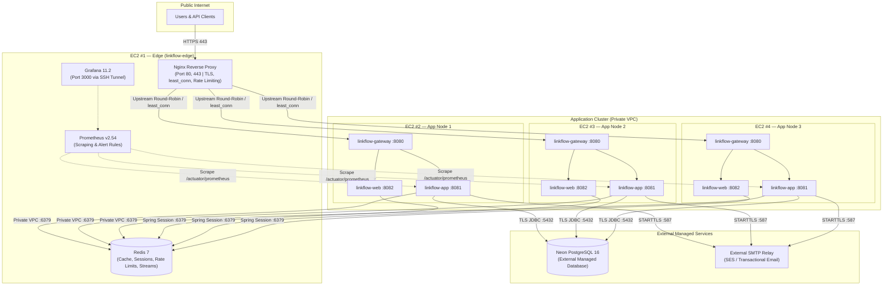
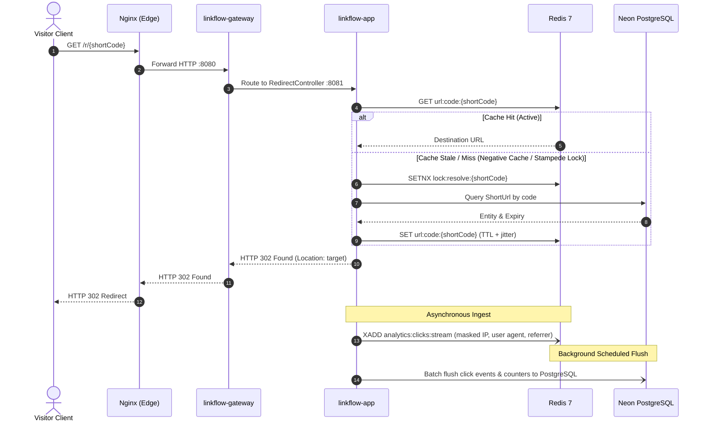
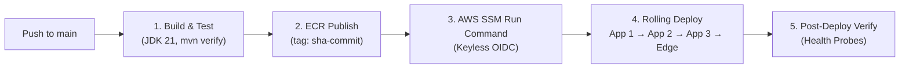

<p align="center">
  <h1 align="center">⚡ LinkFlow</h1>
  <p align="center">
    <strong>Production-Grade URL Shortener & Analytics Platform</strong><br/>
    Built as a Modular Monolith in Java 21 & Spring Boot 3.4.1
  </p>
  <p align="center">
    
    
    
    
    
    
    
    
    
    
  </p>
</p>

---

URL shortener built as a **modular monolith** in Java 21 and Spring Boot 3.4.1. Users create short links (optional alias and expiry). Visitors follow `GET /r/{shortCode}`. Clicks are recorded asynchronously. Operators use a REST API or a server-rendered web UI.

---

## Table of Contents

- [Features](#features)
- [Hosted Layout & Architecture](#hosted-layout-architecture)
  - [Distributed 4-EC2 Cluster Topology](#distributed-4-ec2-cluster-topology)
  - [Request Lifecycle & Redirect Flow](#request-lifecycle-redirect-flow)
- [Technology Stack](#technology-stack)
- [Processes](#processes)
- [Modules](#modules)
- [Quick Start](#quick-start)
  - [Prerequisites](#prerequisites)
  - [Full Local Stack (Docker Compose)](#full-local-stack-docker-compose)
  - [Host JAR Workflow (Selective Containers)](#host-jar-workflow-selective-containers)
  - [Configuration Profiles (dev vs docker vs prod)](#configuration-profiles-dev-vs-docker-vs-prod)
- [Build and Test](#build-and-test)
- [CI/CD Pipeline](#cicd-pipeline)
- [Core Endpoints & API Reference](#core-endpoints-api-reference)
- [Repository Layout](#repository-layout)
- [Documentation](#documentation)
- [Limitations](#limitations)

---

## Features

- **Auth & Tokens**: Register, login, refresh, logout — JWT access tokens (HS512) and rotating opaque refresh tokens.
- **Account Recovery**: Email activation, resend, password reset, and email change over SMTP (hashed single-use tokens).
- **URL Management**: Single and bulk URL create with optional `Idempotency-Key`.
- **High-Performance Redirects**: Public redirect with Redis cache-aside (stale-while-revalidate, negative cache, stampede lock).
- **Analytics Engine**: Per-URL and system analytics (aggregates, 7/30/90-day trends, recent feeds; user IPs masked).
- **QR Code Generation**: QR PNG (ZXing).
- **Multi-Tier Rate Limiting**: Redis Lua sliding-window rate limits (per user / per IP) plus Nginx edge limits in Compose.
- **Administration**: Admin API and UI: users (disable/enable/delete/roles), URLs, analytics, system health.
- **Telemetry & Alerts**: Prometheus metrics, Grafana **LinkFlow Overview**, Prometheus alert rules.

---

## Hosted Layout & Architecture

Four EC2 instances: **#1** is the public edge (Nginx, Redis, Prometheus, Grafana); **#2**, **#3**, and **#4** run identical gateway + app + web application nodes behind `least_conn` load balancing. PostgreSQL is Neon (external); SMTP is external. Automated CI/CD via GitHub Actions, ECR, and SSM. Details: [docs/DEPLOYMENT.md](docs/DEPLOYMENT.md).

### Distributed 4-EC2 Cluster Topology



### Request Lifecycle & Redirect Flow



---

## Technology Stack

| Layer | Technology | Version | Purpose |
| :--- | :--- | :--- | :--- |
| **Runtime & Language** | Java OpenJDK | 21 (LTS) | Modern language features, Virtual Threads, Records |
| **Framework** | Spring Boot | 3.4.1 | Core backend framework, dependency injection, scheduler |
| **API Gateway** | Spring Cloud Gateway | 2024.0.0 | Reactive routing, path predicates, `X-Correlation-ID` injection |
| **Relational Database**| PostgreSQL / Neon | 16 | ACID source of truth, Flyway schema migrations (V1–V11) |
| **In-Memory Store** | Redis | 7.x | L2 cache, Lua sliding-window rate limiters, Streams, HTTP sessions |
| **Web Frontend** | Thymeleaf + Tabler | Modern HTML5/CSS3 | Responsive server-rendered operations and administration UI |
| **Security** | Spring Security + jjwt | 0.12.6 | Stateless HS512 JWT verification, BCrypt (strength 12) |
| **Observability** | Micrometer + Prometheus | v2.54.1 | Actuator metric collection, custom timers/counters, alert rules |
| **Visualization** | Grafana | 11.2.0 | Dashboards for system KPIs, JVM metrics, and redirect throughput |
| **Build & Packaging** | Apache Maven | 3.9+ | Multi-module reactor build, layered Docker packaging |
| **Cloud Infrastructure**| AWS EC2 (Amazon Linux 2023) | 4 Instances | Distributed edge and application nodes behind VPC security groups |
| **Continuous Delivery** | GitHub Actions + AWS SSM | Latest | Keyless OIDC AWS authentication, zero-downtime rolling deploys |

---

## Processes

On a laptop, **Nginx** is the only public application entry (`https://localhost`). On the hosted stack, that role is EC2 #1.

| Process | Port | Role |
| :--- | :--- | :--- |
| `nginx` | 80, 443 | TLS, edge rate limits, `/actuator` deny |
| `linkflow-gateway` | 8080 | Routes `/api/**`, `/r/**`, Swagger, and the UI |
| `linkflow-app` | 8081 | Backend — all feature modules, Flyway, schedulers |
| `linkflow-web` | 8082 | Thymeleaf UI; JWTs live in a Redis `HttpSession` |

Infrastructure in the full stack: PostgreSQL 16, Redis 7, MailHog, Prometheus, Grafana.

---

## Modules

Feature modules depend only on `linkflow-common`. Cross-module calls use ports. `linkflow-web` has no compile dependency on `com.linkflow.*`.

| Module | Role |
| :--- | :--- |
| `linkflow-common` | Envelopes, exceptions, Redis config, ports, metrics interface |
| `linkflow-auth` | JWT, refresh tokens, account recovery |
| `linkflow-user` | Profiles, admin users |
| `linkflow-url` | Short URLs, redirects, QR, cache, idempotency |
| `linkflow-rate-limit` | Sliding-window limiter |
| `linkflow-analytics` | Click stream, flush, queries |
| `linkflow-notification` | SMTP + mail templates |
| `linkflow-observability` | Actuator extras, Micrometer, Redis health |
| `linkflow-app` | Runnable backend |
| `linkflow-gateway` | Path routing + `X-Correlation-ID` |
| `linkflow-web` | SSR UI |

---

## Quick Start

### Prerequisites

**JDK 21** is required (`JAVA_HOME` must point at 21). Docker is required for the stack and for integration tests.

### Full Local Stack (Docker Compose)

```bash
export JAVA_HOME=$(/usr/libexec/java_home -v 21)   # macOS

./infrastructure/nginx/generate-dev-certs.sh
cp .env.example .env                               # set LINKFLOW_JWT_SECRET
docker compose up --build
```

Open **https://localhost**. The browser warns about the self-signed certificate. Read activation mail at http://localhost:8025.

> [!NOTE]
> The browser warns about the self-signed certificate generated by `generate-dev-certs.sh`. This is expected and safe for local development.

### Host JAR Workflow (Selective Containers)

Host JAR workflow (Postgres, Redis, MailHog published on localhost):

```bash
docker compose -f docker-compose.yml -f docker-compose.dev.yml up -d postgres redis mailhog
mvn clean package -DskipTests
java -jar linkflow-app/target/linkflow-app-1.0.0-SNAPSHOT.jar --spring.profiles.active=dev
# then gateway and web; on macOS use LINKFLOW_APP_URI=http://127.0.0.1:8081
```

### Configuration Profiles (dev vs docker vs prod)

Use the `dev` profile for host JARs. Do not use `prod` locally — it refuses to start without a real SMTP relay, `https` mail/base URLs, explicit CORS origins, and a Redis password. Compose uses the `docker` profile for that reason.

| Profile | Purpose | Characteristics |
| :--- | :--- | :--- |
| **`dev`** | Host JAR development | Embedded dev JWT secret fallback, connects to localhost backing services. |
| **`docker`** | Local Docker Compose | Resolves container hostnames (`postgres`, `redis`, `mailhog`), uses local credentials. |
| **`prod`** | Production AWS Cluster | **Strict validation**: Requires Base64 ≥64-byte `LINKFLOW_JWT_SECRET`, real SMTP relay, HTTPS base URL, explicit CORS origins, and Redis password. |

> [!IMPORTANT]
> Do not use `prod` locally — it refuses to start without a real SMTP relay, `https` mail/base URLs, explicit CORS origins, and a Redis password.

---

## Build and Test

```bash
mvn clean package -DskipTests
mvn test
mvn clean verify          # unit + integration; Docker required for Testcontainers
```

GitHub Actions (`.github/workflows/ci.yml`) runs `mvn verify`, builds the three images, and validates Compose/Nginx config.

---

## CI/CD Pipeline

Automated continuous deployment is managed via GitHub Actions, Amazon ECR, and AWS Systems Manager (SSM):



* **Keyless AWS Authentication**: Authenticates to AWS via GitHub OIDC without long-lived access keys (`role-to-assume: ${{ secrets.AWS_ROLE_ARN }}`).
* **Rolling Application Deployment**: Uses AWS SSM to execute `scripts/deploy.sh <image-tag>` across App Node 1, Node 2, and Node 3 sequentially.
* **Automated Rollback**: Triggers `scripts/rollback.sh` to revert to `.rollback-tag` if readiness health checks fail.
* **Edge Synchronization**: Synchronizes Nginx and Prometheus configurations on EC2 #1 with zero downtime.

---

## Core Endpoints & API Reference

| Method | Endpoint / Route | Module | Purpose |
| :--- | :--- | :--- | :--- |
| `GET` | `/r/{shortCode}` | `linkflow-url` | Public redirect with Redis cache-aside resolution |
| `POST` | `/api/v1/auth/register` | `linkflow-auth` | Register user account (sends email token) |
| `POST` | `/api/v1/auth/login` | `linkflow-auth` | User login (returns HS512 JWT + opaque refresh token) |
| `POST` | `/api/v1/auth/refresh` | `linkflow-auth` | Rotate refresh token and issue new JWT |
| `POST` | `/api/v1/auth/logout` | `linkflow-auth` | Revoke refresh tokens and session |
| `POST` | `/api/v1/urls` | `linkflow-url` | Create short link (optional alias, expiry, `Idempotency-Key`) |
| `POST` | `/api/v1/urls/bulk` | `linkflow-url` | Bulk URL create with idempotency support |
| `GET` | `/api/v1/urls/{id}/qr` | `linkflow-url` | Download QR code PNG image |
| `GET` | `/api/v1/analytics/urls/{id}`| `linkflow-analytics` | Aggregates, 7/30/90-day trends, recent click feeds |
| `GET` | `/api/v1/admin/users` | `linkflow-user` | Admin: user list, roles, disable/enable/delete |
| `GET` | `/actuator/prometheus` | `linkflow-observability`| Prometheus scrape target |
| `GET` | `/` | `linkflow-web` | Public landing page and link generation UI |

Full endpoint definitions, parameters, and payloads are documented in [docs/API.md](docs/API.md).

---

## Repository Layout

```text
.
├── README.md                         # Project overview and quick start guide
├── pom.xml                           # Maven parent (modules stay at root)
├── docker-compose.yml                # local stack: docker compose up
├── docker-compose.dev.yml            # publish Postgres/Redis for host JARs
├── docker-compose.perf.yml           # k6 overlay
├── docker-compose.ec2-*.yml          # hosted edge + app node
├── .env.example / .env.ec2.example   # copy to .env at this directory
├── docs/                             # architecture, API, deployment, interview
├── infrastructure/                   # Dockerfile, Nginx, Prometheus, Grafana
├── performance/                      # k6 scenarios and seed scripts
├── scripts/                          # deployment, rollback, health-check, and AWS scripts
├── linkflow-*/                       # Maven modules
└── .github/workflows/ci.yml          # GitHub Actions CI workflow
```

---

## Documentation

| File | Contents |
| :--- | :--- |
| [docs/ARCHITECTURE.md](docs/ARCHITECTURE.md) | Modules, flows, Redis, schema, security |
| [docs/API.md](docs/API.md) | REST inventory and web routes |
| [docs/DEPLOYMENT.md](docs/DEPLOYMENT.md) | Local Compose, 2-EC2 hosted stack, env vars, load tests |
| [docs/INTERVIEW_GUIDE.md](docs/INTERVIEW_GUIDE.md) | Pitches and design Q&A for this codebase |

---

## Limitations

- Compose ships demo credentials (bootstrap admin, Grafana, local DB/Redis passwords)
- JWT role changes apply on the next refresh, not instantly
- `click_events` is retained (default 365 days) but not partitioned
- Password and email only — no social login; no geo/device analytics
- Prometheus alert rules evaluate in Prometheus; there is no notifier container
- k6 thresholds are per-run gates, not published SLOs
