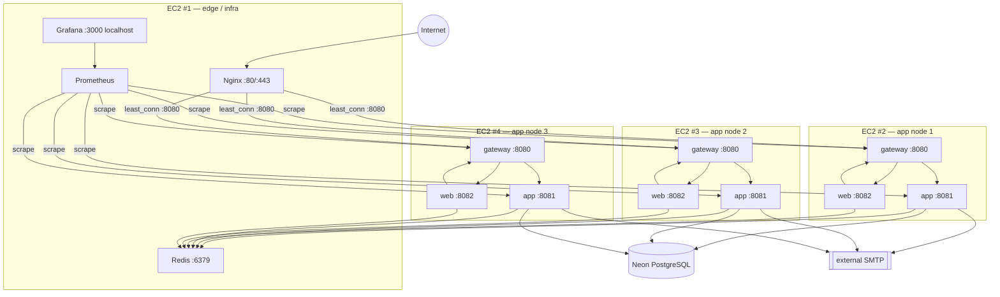
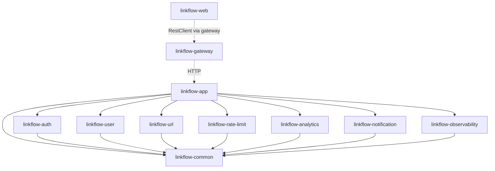
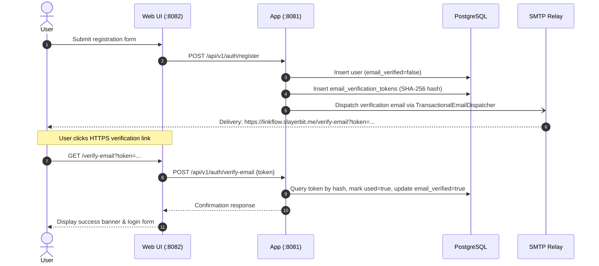
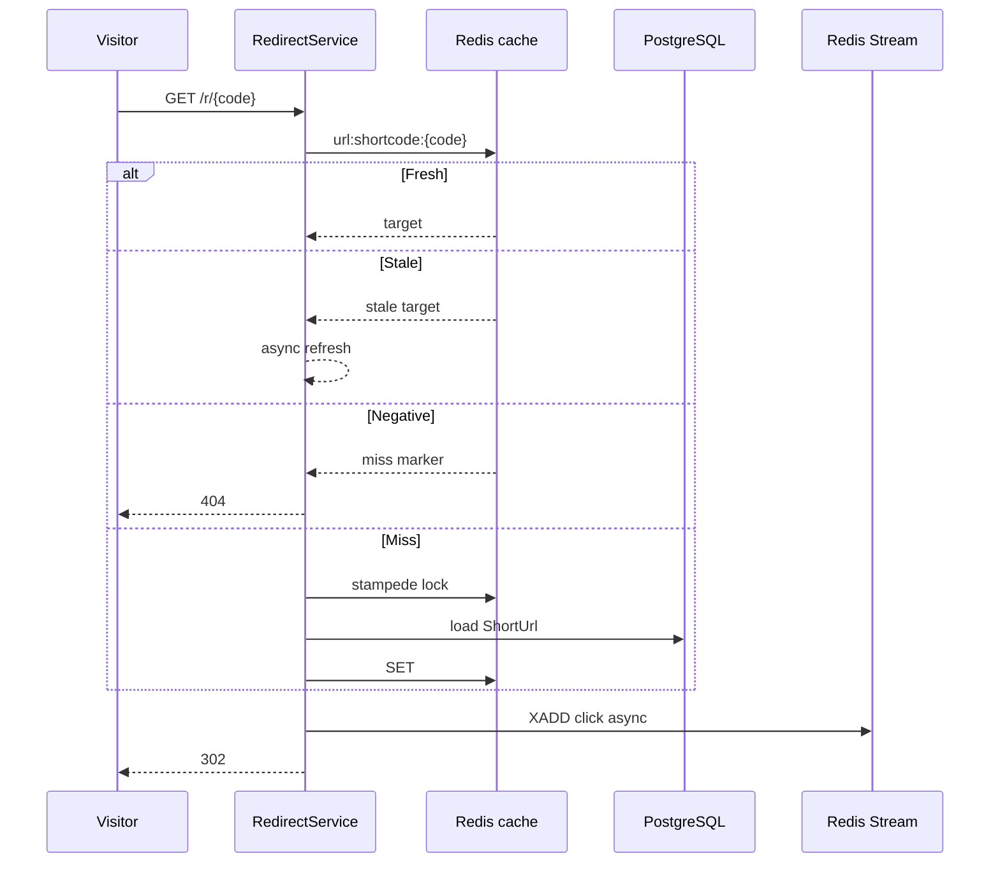

# LinkFlow architecture

How the current repository is structured. Run it with [README.md](../README.md) and [DEPLOYMENT.md](DEPLOYMENT.md). Endpoints: [API.md](API.md).

## Hosted topology (4 EC2)

The **current hosted** layout is **four EC2 instances**: one edge/infrastructure node (`linkflow-edge`) and three identical application nodes (`linkflow-app-1`, `linkflow-app-2`, `linkflow-app-3`) behind `least_conn` load balancing.

The production application is publicly served at **`https://linkflow.slayerbit.me`**.

> [!NOTE]
> The root domain `https://slayerbit.me` is reserved for a future personal site and is **not** LinkFlow. LinkFlow is served exclusively at `https://linkflow.slayerbit.me`.

- **Namecheap DNS**: Resolves `linkflow.slayerbit.me` to the edge node's public IP.
- **AWS Elastic IP**: `13.206.178.184` is associated with `linkflow-edge` to provide a static, stable public IPv4 address that does not change across instance stop/start cycles.
- **TLS Termination**: Nginx terminates HTTPS using a valid Let's Encrypt certificate (`/etc/letsencrypt/live/linkflow.slayerbit.me/fullchain.pem`) with Certbot automated renewal. All HTTP traffic on port 80 is redirected to HTTPS (301).
- **Internal Routing**: Nginx and Prometheus use stable upstream names (`app1`, `app2`, `app3`) resolved to private VPC IPs via Docker `extra_hosts` in `docker-compose.ec2-edge.yml`. The Nginx and Prometheus configs are committed and deterministic — only `.env` on EC2 #1 varies per deployment.

| Instance | Compose file | Runs |
|----------|--------------|------|
| EC2 #1 | `docker-compose.ec2-edge.yml` | Nginx (TLS + LB), Redis, Prometheus, Grafana |
| EC2 #2 | `docker-compose.ec2-app.yml` | gateway + app + web (app node 1) |
| EC2 #3 | `docker-compose.ec2-app.yml` | gateway + app + web (app node 2) |
| EC2 #4 | `docker-compose.ec2-app.yml` | gateway + app + web (app node 3) |

Each app node's 8080–8082 are for the private path from EC2 #1 (Nginx proxy + Prometheus scrape), not public ingress. PostgreSQL is external Neon (`SPRING_DATASOURCE_*`). SMTP is external (`SPRING_MAIL_*`). Redis is only on #1 (`REDIS_HOST` on #2/#3/#4). All three app nodes run the same compose file with the same `.env`; they are identical and stateless.

A laptop still uses `docker-compose.yml` (single host, bundled Postgres/Redis/MailHog). That is local development.

Deployment is automated via GitHub Actions: push to `main` → build + test → ECR push → SSM rolling deploy (App1 → App2 → App3) → verify. See [DEPLOYMENT.md](DEPLOYMENT.md).

## Processes

| Process | Port | Role |
|---------|------|------|
| nginx | 80, 443 | Public edge; rate-limit zones; `/actuator` deny |
| `linkflow-gateway` | 8080 | Path routing + `X-Correlation-ID` |
| `linkflow-app` | 8081 | Business logic, Flyway, schedulers |
| `linkflow-web` | 8082 | Thymeleaf BFF |

Gateway routes (order matters; catch-all last):

| Predicate | Upstream |
|-----------|----------|
| `/api/**` | app |
| `/r/**` | app |
| `/swagger-ui/**`, `/v3/api-docs/**` | app |
| `/css/**`, `/js/**`, `/vendor/**`, `/webjars/**` | web |
| `/**` | web |

Gateway `/actuator/**` is local to the gateway. Nginx denies `/actuator` on the public edge. Prometheus scrapes app and gateway on the private network.

## Modules

Feature modules compile only against `linkflow-common`. `linkflow-web` has no `com.linkflow.*` compile dependency.

### Ports

| Port | Implemented in | Used by | Purpose |
|------|----------------|---------|---------|
| `UserLookupPort` | user | auth | Create/find users, password, verification flags |
| `TokenRevocationPort` | auth | user | Revoke refresh tokens and mark access tokens revoked when an account is disabled or deleted |
| `ClickTrackingPort` | analytics | url | Record a click after a successful redirect |
| `UrlStatsPort` | url | analytics | URL counts and top-URL metadata without crossing tables |
| `EmailSenderPort` | notification | `TransactionalEmailDispatcher` | After-commit SMTP; auth/user publish `EmailRequestedEvent` |
| `LinkflowMetrics` | observability (`NoOp` in common) | feature modules | Business counters without a Micrometer dependency |

## Authentication

- Access token: JWT **HS512**, 15 minutes (`LINKFLOW_JWT_ACCESS_EXPIRATION_MS`). Claims: `jti`, `iss` (`linkflow`), `aud` (`linkflow-api`), `sub` (email), `userId`, `email`, `roles`, `token_type=access`. Verification requires issuer, audience, and HS512 — the header algorithm is not trusted. Clock skew 30s. `JwtSecretValidator` runs only on the **`prod`** profile (Base64, ≥64 decoded bytes, entropy check). jjwt still rejects a short key at sign time on any profile.
- Refresh token: opaque random string, SHA-256 hash in `refresh_tokens`, 30 days. Rotated on use. Reuse of a revoked token revokes **all** of that user's refresh tokens.
- Passwords: BCrypt strength 12.
- Email tokens: hashed, single-use, superseded on reissue. Activation and email-change are **idempotent** (mail scanners prefetch). Password reset is **not**. Resend and forgot-password always return 200 (no account oracle). Per-recipient send cooldown (`mail:cooldown:…`, default 60s) fails **open** if Redis is down.
- API CSRF: off (Bearer). Web CSRF: on.
- Web session: `@EnableRedisHttpSession`, namespace `linkflow:web:session`, timeout 30 minutes. Cookie `httpOnly`, `SameSite=Strict`, `Secure` when `SERVER_SERVLET_SESSION_COOKIE_SECURE=true`. Tokens never reach JavaScript.
- Roles: `USER` and `ADMIN` in `user_roles`. `PATCH /api/v1/admin/users/{id}/roles` exists. JWT roles stay stale until refresh.

### Email Verification & Account Security

New user registrations require email verification before account login is permitted.

- **Base URL Configuration**: `linkflow.mail.base-url` defaults to `${linkflow.base-url}` (`https://linkflow.slayerbit.me` in production), ensuring verification links always use the secure production HTTPS domain.
- **Single-Use Tokens**: Tokens are stored as SHA-256 hashes in `email_verification_tokens`. Once verified or superseded, old tokens cannot be reused.
- **Login Rejection**: Attempting to log into an unverified account returns HTTP 401 with error code `EMAIL_NOT_VERIFIED`.
- **Idempotency**: Email verification and email-change are idempotent to protect against automated corporate email security scanners pre-fetching links.

## Redirect path

- Freshness 15 minutes ±20% jitter; Redis key lives 30 minutes (2× base) for SWR
- Negative cache 90 seconds ± jitter
- Stampede: lock `lock:cache_refresh:{code}` (5s); lock holder loads DB; others retry cache (3 × 100ms) then fall back to DB
- Cache eviction runs **after commit**
- Custom aliases: unique `short_code` in PostgreSQL. There is **no** Redis lock on alias create — a lock released before commit would not serialize inserts, and treating Redis-down as “taken” would reject every alias.

## Rate limiting

Application: Redis Lua sliding window on a sorted set (`rate_limit:user:{id}` / `rate_limit:ip:{ip}`), 60-second window, member = UUID, score = microseconds. Defaults 100 RPM (user) / 200 RPM (IP). Headers `X-RateLimit-Limit`, `X-RateLimit-Remaining`, `X-RateLimit-Reset`. Skips `/actuator`, `/swagger-ui`, `/v3/api-docs`.

Redis down: `/api/v1/auth/**` returns **503** when `LINKFLOW_RATE_LIMIT_AUTH_FAIL_CLOSED=true`; other filtered paths fail open.

Nginx (Compose): coarser drop (~10/min on credential paths, ~100/s generally) so a flood never reaches BCrypt.

`ClientIpResolver` honours `X-Forwarded-For` only from `LINKFLOW_TRUSTED_PROXIES`. Empty list ignores the header. Nginx **replaces** XFF at the edge. The app sets `forward-headers-strategy: none` so Spring will not trust client-supplied forwarding headers. The web process uses `framework` so redirects see the public `https` origin.

## Analytics

`ClickTrackingService` is `@Async` (pool core 2 / max 8 / queue 500): `XADD analytics:clicks:stream`, increment `analytics:counter:{id}`, `SADD analytics:active_urls`. `AnalyticsFlushService` drains consumer group `analytics-flush-group` every `LINKFLOW_ANALYTICS_FLUSH_INTERVAL_MS` (default 30s), batch 1000. Dedup: `click_events.stream_record_id` unique (Flyway V7). If Redis is down, the click is written **synchronously** to PostgreSQL (no stream id). At-least-once. Nightly `ClickEventRetentionJob` deletes rows older than `LINKFLOW_ANALYTICS_CLICK_EVENTS_RETENTION_DAYS` (default 365). The table is not partitioned.

User click APIs mask IPs. Admin APIs return raw IPs. There is no geo, OS, or referer-aggregation product.

## Redis

| Use | Keys / structure | Notes |
|-----|------------------|-------|
| Redirect cache | `url:shortcode:{code}` string | SWR, negative, jitter |
| Rate limits | `rate_limit:user:` / `rate_limit:ip:` sorted set | Lua, 60s |
| Stampede locks | `lock:cache_refresh:{code}` | `SET NX EX` 5s; unlock Lua is owner-only |
| Analytics | stream + hash + set (above) | Flush to Postgres; no key TTL on counters |
| Access-token revoke | `auth:user-revoked-after:{userId}` | TTL = access expiry + 60s |
| Web sessions | `linkflow:web:session` | Spring Session, 30m |
| Mail cooldown | `mail:cooldown:{purpose}:{hash}` | Fail-open |
| ShedLock | `linkflow-scheduler:*` | One winner per scheduled job |

Compose Redis: password required, AOF, `maxmemory-policy noeviction`. Refresh tokens live in PostgreSQL, not Redis.

## Database

Hibernate `ddl-auto: validate`. Flyway in `linkflow-app`.

| Version | Adds |
|---------|------|
| V1 | `roles`, `users`, `user_roles`; seed USER, ADMIN |
| V2 | `refresh_tokens` |
| V3 | `short_urls` |
| V4 | `click_events`, `url_analytics` |
| V5 | `idempotency_records` |
| V6 | Audit columns on `url_analytics` |
| V7 | `(short_url_id, clicked_at)` index; `stream_record_id` |
| V8 | `idempotency_records.request_body_hash` |
| V9 | `password_reset_tokens` |
| V10 | `users.email_verified`, `email_verification_tokens` |
| V11 | `email_change_requests` |

Users and URLs are soft-deleted. Unique `short_code` is the alias authority. Idempotency is keyed `(user_id, endpoint, key)` plus body hash.

Schedulers (ShedLock): expired URL + idempotency cleanup, revoked refresh-token retention, single-use token reaper, click-event retention, analytics flush.

## Security (web and edge)

Web CSP (`ContentSecurityPolicyFilter`): `default-src 'self'`; `script-src 'self' 'nonce-…'` per request; `style-src 'self' 'unsafe-inline'` (inline style attributes); `font-src`/`img-src` `'self' data:`; `connect-src 'self'`; `frame-ancestors 'none'`; `object-src 'none'`; `base-uri`/`form-action` `'self'`. Tabler 1.0.0, Tabler Icons 3.27.0, Chart.js 4.4.1 are vendored — no CDN. API JSON responses use `default-src 'none'; frame-ancestors 'none'` (Swagger paths exempt).

HSTS is set at Nginx (local Compose HTTPS) and stripped from upstream. Destination URLs must be `http`/`https` with a host and ≤2048 characters — there is no private-IP or DNS block. Containers run as UID 1001; the JVM exits on OOM.

## Web UI

Thymeleaf + `tokens.css` / `layout.css` / `components.css` / `custom.css`. Layouts: `layout/base.html`, `layout/public-nav.html`. Forms post to web controllers; those call the gateway via `RestClient`. Admin UI covers users (including roles), URLs, analytics, and system health. `@WebMvcTest` smoke-renders the GET routes.

## Decisions that are in the code

- **Modular monolith** — one backend JAR, Maven-enforced module boundaries, ports instead of feature-to-feature compile deps.
- **PostgreSQL + Flyway** — FKs, unique short codes, ACID for refresh rotation and idempotency. Hibernate only validates.
- **Redis for the uses in the table above** — not a second source of truth. QR PNGs use a process-local Caffeine cache.
- **JWT + opaque refresh** — stateless API validation; server-side revoke/rotation.
- **Nginx + Spring Cloud Gateway** — Nginx is the public edge on `linkflow-edge` (terminates TLS with Let's Encrypt certificates for `linkflow.slayerbit.me`, enforces HTTP-to-HTTPS 301 redirects, applies edge rate limiting) and reverse-proxies via `least_conn` to the three application nodes' gateways on port 8080. JWT stays in the app.
- **Async click path** — redirect latency is not coupled to a Postgres write.
- **`docker` vs `prod` profiles** — Compose cannot satisfy real SMTP and a public `https` mail URL; `prod` fail-fastes those checks instead of pretending. App nodes in production run the `docker` container profile with production environment variables.

## Limitations

| Item | Reality |
|------|---------|
| Compose secrets | Demo bootstrap admin, Grafana, and local DB/Redis passwords |
| JWT roles | Stale until refresh after `PATCH .../roles` |
| `click_events` | Retention job exists; table is unpartitioned |
| Auth providers | Password + email only |
| Analytics dimensions | Counts, trends, recent events — not geo/device |
| Alerting | Rules in `infrastructure/prometheus/alerts.yml`; no notifier container |
| Load numbers | k6 gates are per-run only |
