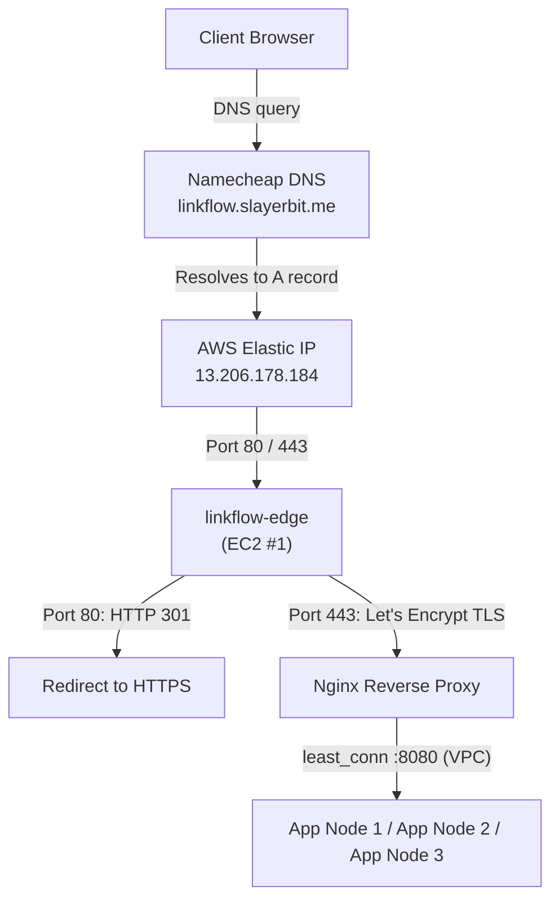
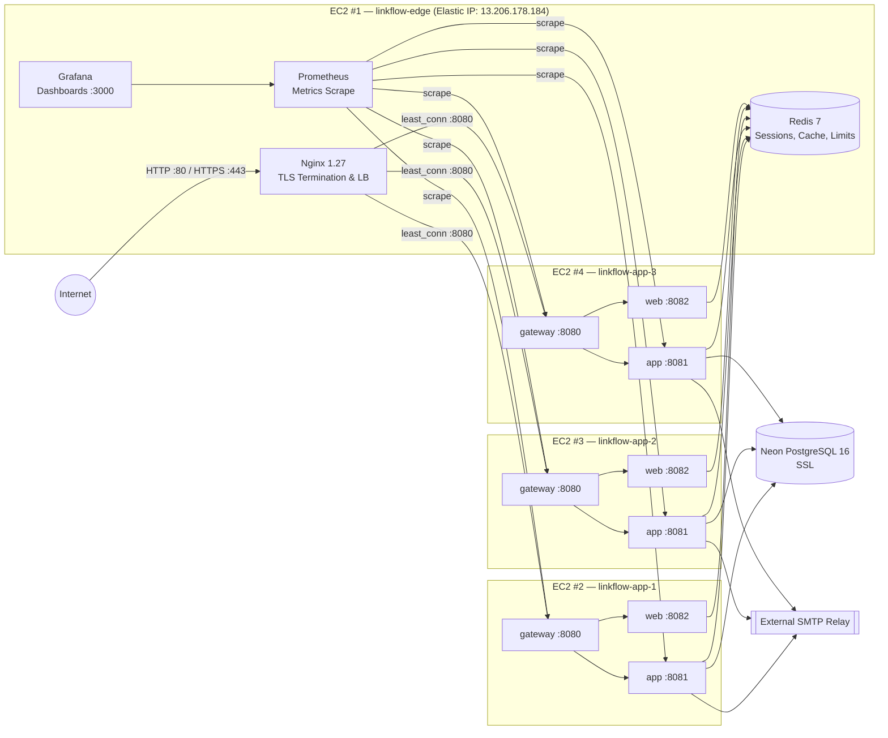
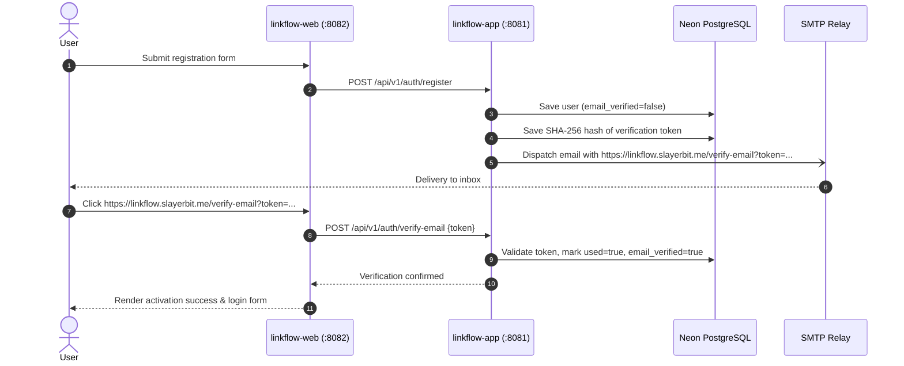
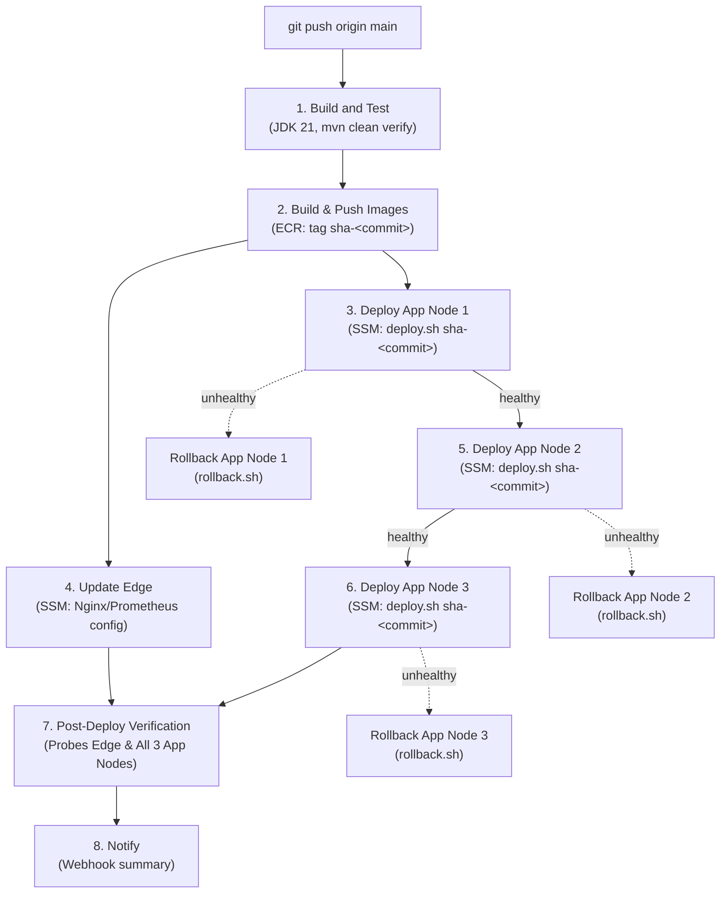

# LinkFlow Deployment

Run the application locally, on remote infrastructure, or via the automated CI/CD pipeline. Architecture details: [ARCHITECTURE.md](ARCHITECTURE.md). API endpoints: [API.md](API.md).

## Deployment Models

| Model | Compose File | When to Use |
|---|---|---|
| **Full local stack** | `docker-compose.yml` | Development — starts everything including PostgreSQL, Redis, MailHog |
| **Dev overlay** | `docker-compose.yml` + `docker-compose.dev.yml` | Hot-reload development with host JARs |
| **Host JARs** | none | Running JARs directly (IDE / debugging) |
| **4-EC2 production** | `docker-compose.ec2-edge.yml` + `docker-compose.ec2-app.yml` | **Hosted production cluster** |

---

## Production Architecture (4-EC2 Cluster)

LinkFlow is publicly served at **`https://linkflow.slayerbit.me`**.

> [!NOTE]
> The root domain `https://slayerbit.me` is **not** LinkFlow. It is reserved for a future personal/portfolio site. LinkFlow is strictly hosted under the `linkflow` subdomain: **`https://linkflow.slayerbit.me`**.

### Domain & Ingress Flow



### DNS & IP Configuration

- **DNS Provider**: Namecheap manages DNS for `slayerbit.me`.
  ```text
  @         A     13.206.178.184
  www       A     13.206.178.184
  linkflow  A     13.206.178.184
  ```
- **AWS Elastic IP**: `13.206.178.184` is allocated and associated with instance `linkflow-edge`. This provides a stable, static public IPv4 address that persists across EC2 stops, starts, and maintenance without requiring DNS updates.

### Topology Diagram



### Instance Inventory

| Instance Name | Role | Private IP | Instance ID | Compose File |
|---|---|---|---|---|
| `linkflow-edge` (EC2 #1) | Edge: Nginx (TLS + LB), Redis, Prometheus, Grafana | 172.31.4.98 | `i-09762b0270a4327dd` | `docker-compose.ec2-edge.yml` |
| `linkflow-app-1` (EC2 #2) | App node 1: gateway + app + web | 172.31.5.37 | `i-0c4f9bdb54bc90f35` | `docker-compose.ec2-app.yml` |
| `linkflow-app-2` (EC2 #3) | App node 2: gateway + app + web | 172.31.8.125 | `i-06b58e726a0c83746` | `docker-compose.ec2-app.yml` |
| `linkflow-app-3` (EC2 #4) | App node 3: gateway + app + web | 172.31.2.137 | `i-0016df717b7272284` | `docker-compose.ec2-app.yml` |

### Active AWS Infrastructure Resources

- **Region**: `ap-south-1`
- **AWS Account**: `625408983712`
- **ECR Registry**: `625408983712.dkr.ecr.ap-south-1.amazonaws.com`
  - `linkflow-app`
  - `linkflow-gateway`
  - `linkflow-web`
- **IAM Instance Profile**: `linkflow-ec2-instance` (attached to all 4 instances; enables SSM Run Command and ECR image pull)
- **GitHub Actions Role**: `arn:aws:iam::625408983712:role/linkflow-github-actions`
- **OIDC Provider**: `token.actions.githubusercontent.com` (federated with `repo:SlayerBit/linkflow`)

---

## Production TLS & Let's Encrypt

- **Certificate Authority**: Let's Encrypt.
- **Certificate Path**: `/etc/letsencrypt/live/linkflow.slayerbit.me/fullchain.pem`
- **Private Key Path**: `/etc/letsencrypt/live/linkflow.slayerbit.me/privkey.pem`
- **HTTP to HTTPS**: Port 80 redirects all requests to `https://linkflow.slayerbit.me/` with HTTP 301.
- **Automated Renewal**: Certbot renewal is enabled on `linkflow-edge` with webroot verification. Renewal dry-run verified successfully:
  ```bash
  sudo certbot renew --dry-run
  ```

> [!IMPORTANT]
> **Production vs CI Certificate Distinction**:
> - **Production**: Real Let's Encrypt certificates provisioned on `linkflow-edge` via Certbot. Never committed to Git.
> - **CI (`ci.yml`)**: GitHub Actions dynamically generates a temporary self-signed test certificate at `$WORK_DIR/letsencrypt/live/linkflow.slayerbit.me/` matching the exact path in `linkflow-ec2.conf`. This enables `nginx:1.27-alpine nginx -t` to validate the committed production Nginx configuration in CI without requiring or exposing production private keys.

---

## Email Verification Architecture

Registration and account security require email verification. Verification links are generated with the public production base URL:

```text
https://linkflow.slayerbit.me/verify-email?token=<secure-token>
```



### Configuration & Fallback Hierarchy
In `application.yml` and `application-docker.yml`:
```yaml
linkflow:
  mail:
    base-url: ${LINKFLOW_MAIL_BASE_URL:${linkflow.base-url}}
```
`LINKFLOW_MAIL_BASE_URL` falls back directly to `LINKFLOW_BASE_URL` (`https://linkflow.slayerbit.me`). If an unverified user attempts to log in before verifying, the system rejects the request with HTTP 401 and error code `EMAIL_NOT_VERIFIED`.

---

## Continuous Deployment (CI/CD) Pipeline

Continuous Deployment is triggered automatically on every push to `main` via `.github/workflows/deploy.yml`.



### Key Deployment Properties

1. **Immutable Image Tagging**:
   Every deployment uses an immutable, commit-derived image tag (e.g. `sha-e9d1420`). The exact tag is built by GitHub Actions, pushed to ECR, passed through SSM, and deployed by Docker Compose. The production deployment **never** relies on or falls back to `latest`.
2. **Keyless AWS Authentication**:
   GitHub Actions assumes the IAM role `linkflow-github-actions` via GitHub OIDC federation. No long-lived AWS credentials or SSH keys exist in GitHub Secrets.
3. **Sequential Rolling Deployment**:
   App Node 1 is deployed and must pass readiness health checks before App Node 2 begins, followed by App Node 3.
4. **Deployment Resiliency**:
   `scripts/deploy.sh` connects to GitHub with strict connect timeouts (`http.connectTimeout=10`) and low-speed limits (`http.lowSpeedLimit=1000 -c http.lowSpeedTime=15`) with a 3-attempt retry loop.
   - **Key Design Principle**: Because pre-built container images already reside in AWS ECR (`ap-south-1`), a temporary GitHub network blip should not block deployment. If GitHub is unreachable after 3 attempts, `deploy.sh` logs a warning and proceeds using the existing local compose file—**always deploying the exact requested `IMAGE_TAG`**.
   - **Safe Interpreter Re-Execution**: When repository synchronization succeeds, `deploy.sh` executes `LINKFLOW_DEPLOY_SYNCED=1 exec bash "$0" "$@"` to reload the updated script from byte 0, avoiding bash file descriptor offset corruption.
5. **Automated Rollback**:
   Before updating containers, `deploy.sh` saves the active tag to `.rollback-tag`. If readiness probes fail during deployment, `scripts/rollback.sh` is triggered automatically, pulling the previous known-good image from ECR and restoring service.

---

## First Deploy Checklist

1. ✅ AWS OIDC + IAM configured
2. ✅ GitHub Secrets configured
3. ✅ All 4 EC2 instances bootstrapped (`scripts/ec2-bootstrap.sh`)
4. ✅ `.env` configured on all 4 instances

**Edge (EC2 #1):**
```bash
# Obtain Let's Encrypt certificate
sudo certbot certonly --standalone -d linkflow.slayerbit.me

# Start edge stack
cd /opt/linkflow
sudo docker compose -f docker-compose.ec2-edge.yml up -d

# Verify
curl http://localhost/nginx-health
```

**App Nodes (EC2 #2–#4):**
```bash
cd /opt/linkflow
sudo ./scripts/deploy.sh sha-<commit-hash>
sudo ./scripts/health-check.sh
```

Subsequent deployments are 100% automated upon push to `main`.

---

## Health & Verification Endpoints

| Endpoint | Port | Expected Response | Node |
|---|---|---|---|
| `/nginx-health` | 80 / 443 | `ok\n` | `linkflow-edge` |
| `/actuator/health/readiness` | 8080 | `{"status":"UP"}` | `linkflow-gateway` |
| `/actuator/health/readiness` | 8081 | `{"status":"UP"}` | `linkflow-app` |
| `/actuator/health/readiness` | 8082 | `{"status":"UP"}` | `linkflow-web` |

### Live Verification Commands

```bash
# Public HTTP to HTTPS redirect
curl -i http://linkflow.slayerbit.me
# Expected: HTTP/1.1 301 Moved Permanently -> Location: https://linkflow.slayerbit.me/

# Public HTTPS 200 response
curl -sI https://linkflow.slayerbit.me
# Expected: HTTP/2 200

# Public Nginx health probe
curl -i https://linkflow.slayerbit.me/nginx-health
# Expected: HTTP/2 200 (content: ok)

# Actuator readiness on each app node (from VPC or internal SSH)
curl -s http://127.0.0.1:8080/actuator/health/readiness
curl -s http://127.0.0.1:8081/actuator/health/readiness
curl -s http://127.0.0.1:8082/actuator/health/readiness
```

---

## Production Environment Variables

See [.env.ec2.example](../.env.ec2.example) for reference. Critical production settings:

| Variable | Target Node | Purpose |
|---|---|---|
| `LINKFLOW_BASE_URL` | App nodes | Public base URL (`https://linkflow.slayerbit.me`) |
| `LINKFLOW_MAIL_BASE_URL` | App nodes | Email action base URL (`https://linkflow.slayerbit.me`) |
| `LINKFLOW_CORS_ALLOWED_ORIGINS` | App nodes | Allowed origins (`https://linkflow.slayerbit.me`) |
| `SERVER_SERVLET_SESSION_COOKIE_SECURE` | App nodes | `true` (enforces `Secure` flag on HTTPS cookies) |
| `SPRING_PROFILES_ACTIVE` | App nodes | `docker` (runtime container profile) |
| `REGISTRY` | App nodes | ECR registry URL with trailing slash |
| `IMAGE_TAG` | App nodes | Target container image tag (propagated by `deploy.sh`) |
| `AWS_REGION` | All nodes | AWS region (`ap-south-1`) |
| `APP_NODE_1_IP` / `2` / `3` | Edge | Private VPC IPs of the application nodes |
| `REDIS_BIND_ADDRESS` | Edge | EC2 #1 private IP (restricts Redis access to VPC) |
| `REDIS_HOST` | App nodes | EC2 #1 private IP (Redis connection) |

---

## Observability

### Prometheus
Scrapes all 6 application targets (3 app nodes × app + gateway) every 15 seconds over the private VPC.
- Access: `http://localhost:9090` on `linkflow-edge` (bound to localhost; access via SSH tunnel).

### Grafana
Dashboards visualize cluster health, JVM metrics, and redirect throughput.
- Access via SSH tunnel:
  ```bash
  ssh -L 3000:127.0.0.1:3000 ec2-user@13.206.178.184
  # Open http://localhost:3000 in your browser
  ```

---

## Troubleshooting Guide

| Problem | Cause | Resolution |
|---|---|---|
| Deploy fails "SSM command timed out" | SSM agent inactive or instance offline | Check `systemctl status amazon-ssm-agent` on target instance |
| Deploy fails "ECR login failed" | Missing IAM instance profile permissions | Verify `linkflow-ec2-instance` profile is attached to instance |
| Containers fail health check | Database/Redis unreachable or misconfigured `.env` | Check container logs: `docker compose -f docker-compose.ec2-app.yml logs --tail=50` |
| Nginx returns 502 Bad Gateway | App nodes down or private VPC ports blocked | Verify app nodes are healthy and security group allows inbound 8080 from edge |
| Redis connection refused | Wrong `REDIS_BIND_ADDRESS` or firewall | Verify `REDIS_BIND_ADDRESS` in edge `.env` matches private IP |
| TLS certificate expired | Let's Encrypt renewal needed | Run `sudo certbot renew` on `linkflow-edge` |
| Git fetch timeout during deploy | Transient GitHub connection drop | The updated `deploy.sh` retries 3 times and falls back to local compose with the requested `IMAGE_TAG` |
