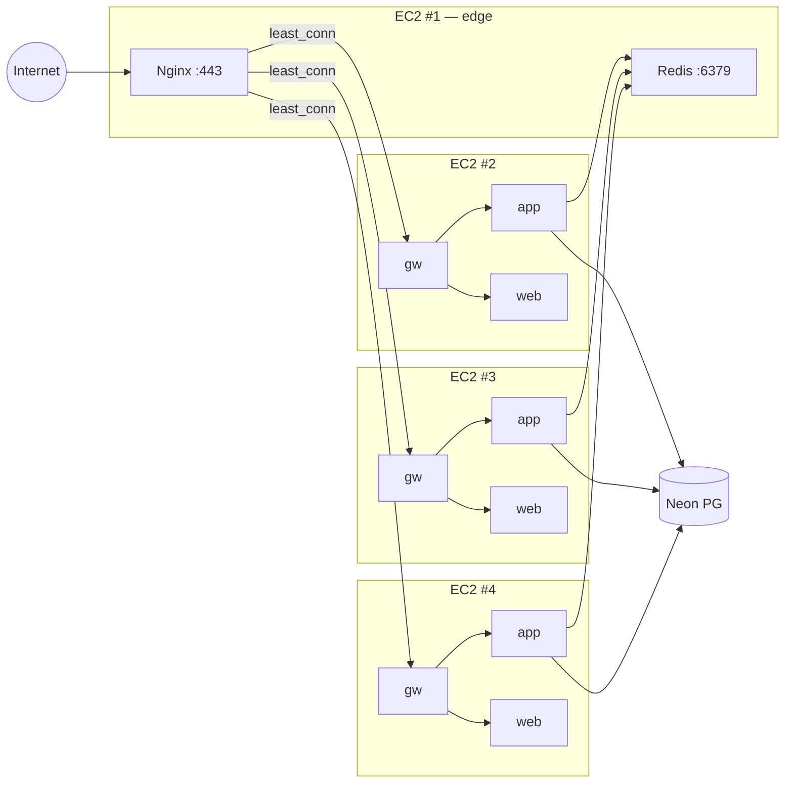
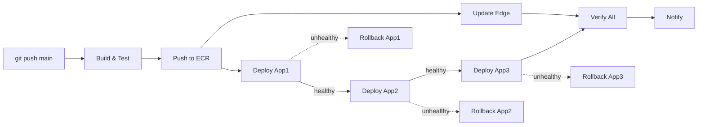

# LinkFlow deployment

Run the application locally, on remote infrastructure, or via the automated CI/CD pipeline. Architecture details: [ARCHITECTURE.md](ARCHITECTURE.md). API endpoints: [API.md](API.md).

## Deployment models

| Model | Compose file | When to use |
|-------|-------------|-------------|
| Full local stack | `docker-compose.yml` | Development — starts everything including PostgreSQL, Redis, MailHog |
| Dev overlay | `docker-compose.yml` + `docker-compose.dev.yml` | Hot-reload development |
| Host JARs | none | Running JARs directly (IDE / debugging) |
| **4-EC2 production** | `docker-compose.ec2-edge.yml` + `docker-compose.ec2-app.yml` | **Hosted production** |

---

## Production architecture (4 EC2)



| Instance | Role | Compose file |
|----------|------|--------------|
| EC2 #1 | Edge: Nginx (TLS + LB), Redis, Prometheus, Grafana | `docker-compose.ec2-edge.yml` |
| EC2 #2 | App node 1: gateway + app + web | `docker-compose.ec2-app.yml` |
| EC2 #3 | App node 2: gateway + app + web | `docker-compose.ec2-app.yml` |
| EC2 #4 | App node 3: gateway + app + web | `docker-compose.ec2-app.yml` |

---

## CI/CD pipeline

Every push to `main` triggers a fully automated pipeline. No manual steps required.



**Pipeline stages:**

1. **Build & Test** — `mvn clean verify` (unit + integration tests via Testcontainers)
2. **Build & Push** — builds `linux/amd64` images for app, gateway, web; pushes to ECR with SHA tag + `latest`
3. **Rolling Deploy** — deploys to app nodes sequentially via SSM Run Command. Each node: pull → restart → health check → proceed or rollback
4. **Edge Update** — `git fetch + reset` + `docker compose up -d` on EC2 #1 (only recreates changed services)
5. **Verify** — health checks all nodes from edge
6. **Notify** — optional Slack/Discord webhook

**Key properties:**
- No SSH keys or long-lived AWS credentials — GitHub OIDC + SSM
- Deployment concurrency lock — a running deploy is never interrupted
- Automatic rollback on health failure
- ECR lifecycle policy retains the 20 most recent images

---

## AWS prerequisites

### 1. Run the OIDC setup script

This creates the GitHub OIDC provider, IAM roles, and instance profiles:

```bash
./scripts/aws/github-oidc-setup.sh --region ap-south-1 --repo SlayerBit/linkflow
```

It creates:
- OIDC provider for `token.actions.githubusercontent.com`
- `linkflow-github-actions` role (trust policy scoped to `repo:SlayerBit/linkflow:ref:refs/heads/main`)
- `linkflow-ec2-instance` role + instance profile (SSM + ECR pull)

### 2. Create ECR repositories

```bash
./scripts/aws/create-ecr-repos.sh --region ap-south-1
```

Creates `linkflow-app`, `linkflow-gateway`, `linkflow-web` with lifecycle policies.

### 3. Attach instance profile to all 4 EC2 instances

```bash
aws ec2 associate-iam-instance-profile \
  --instance-id i-0xxxxxxxxxxxx \
  --iam-instance-profile Name=linkflow-ec2-instance
```

Repeat for all 4 instances.

### 4. Configure GitHub Secrets

| Secret | Value |
|--------|-------|
| `AWS_ROLE_ARN` | Output from OIDC setup script |
| `AWS_REGION` | e.g. `ap-south-1` |
| `ECR_REGISTRY` | e.g. `123456789012.dkr.ecr.ap-south-1.amazonaws.com` |
| `EC2_EDGE_INSTANCE_ID` | Instance ID of EC2 #1 |
| `EC2_APP1_INSTANCE_ID` | Instance ID of EC2 #2 |
| `EC2_APP2_INSTANCE_ID` | Instance ID of EC2 #3 |
| `EC2_APP3_INSTANCE_ID` | Instance ID of EC2 #4 |
| `DEPLOY_WEBHOOK_URL` | *(optional)* Slack/Discord webhook URL |

### 5. Create the `production` Deployment Environment

In GitHub: Settings → Environments → New → `production`. Optional: add required reviewers.

---

## EC2 bootstrap

Run on each fresh Amazon Linux 2023 instance:

```bash
# Copy the bootstrap script and run as root
curl -fsSL https://raw.githubusercontent.com/SlayerBit/linkflow/main/scripts/ec2-bootstrap.sh | sudo bash
```

Or clone manually:

```bash
sudo dnf install -y docker git
sudo systemctl enable --now docker
sudo mkdir -p /opt/linkflow
sudo git clone https://github.com/SlayerBit/linkflow.git /opt/linkflow
cd /opt/linkflow
sudo cp .env.ec2.example .env
sudo chmod +x scripts/*.sh scripts/aws/*.sh
```

Then edit `.env`:

- **Edge (EC2 #1)**: Section A — `REDIS_PASSWORD`, `REDIS_BIND_ADDRESS`, `APP_NODE_*_IP`, `GRAFANA_ADMIN_PASSWORD`
- **App nodes (EC2 #2–#4)**: Section B — `REGISTRY`, `AWS_REGION`, database, Redis host, JWT secret, SMTP

---

## First deploy checklist

1. ✅ AWS OIDC + IAM configured (step 1-3 above)
2. ✅ GitHub Secrets configured (step 4)
3. ✅ All 4 EC2 instances bootstrapped
4. ✅ `.env` edited on all 4 instances

**Edge (EC2 #1):**

```bash
# Obtain TLS certificate
sudo certbot certonly --standalone -d yourdomain.com

# Start edge stack
cd /opt/linkflow
sudo docker compose -f docker-compose.ec2-edge.yml up -d

# Verify
sudo docker compose -f docker-compose.ec2-edge.yml ps
curl http://localhost/nginx-health
```

**App nodes (EC2 #2–#4):**

```bash
# First deploy (manual)
cd /opt/linkflow
sudo ./scripts/deploy.sh latest

# Verify
sudo ./scripts/health-check.sh
```

**After first deploy**, all subsequent deployments are automatic via `git push origin main`.

---

## How deployment works

When you push to `main`:

1. GitHub Actions checks out the code and runs `mvn clean verify`
2. On success, it assumes the OIDC role and pushes 3 Docker images to ECR (tagged `sha-abc1234` + `latest`)
3. For each app node (sequentially):
   - Sends an SSM command: `./scripts/deploy.sh sha-abc1234`
   - `deploy.sh` on the EC2: syncs repo to `origin/main` (`git fetch + reset`) → saves the current tag for rollback → ECR login → pull images → restart containers → wait for health checks
   - If healthy: proceed to next node
   - If unhealthy: run `rollback.sh` → revert to previous tag → fail the workflow
4. Simultaneously, updates edge: `git fetch + reset` + `docker compose up -d` (picks up Nginx/Prometheus config changes)
5. Final verification: checks health on all nodes
6. Optional notification via webhook

**The deploy script syncs the EC2 to match `origin/main` exactly** (`git fetch origin && git reset --hard origin/main`), so compose file changes, script updates, and config changes are always picked up — even if someone modified files locally on the EC2.

---

## Rollback

### Automatic (during deployment)

If a node fails health check during deployment, `rollback.sh` runs automatically. It reads `.rollback-tag` (saved by `deploy.sh` before deploying) and reverts to that image.

### Manual

```bash
# On the affected EC2 instance:
cd /opt/linkflow

# Rollback to previous tag
sudo ./scripts/rollback.sh

# Or rollback to a specific tag
sudo ./scripts/rollback.sh sha-abc1234
```

### Full cluster rollback

```bash
# Get the desired tag from ECR
aws ecr describe-images --repository-name linkflow-app --query 'imageDetails[*].imageTags' --output table

# Deploy a specific tag to all nodes
for INSTANCE in i-app1 i-app2 i-app3; do
  aws ssm send-command \
    --instance-ids "$INSTANCE" \
    --document-name "AWS-RunShellScript" \
    --parameters "commands=['cd /opt/linkflow && sudo ./scripts/deploy.sh sha-abc1234']"
done
```

---

## Recovery guide

### Single node failure

If one app node goes down, Nginx automatically routes traffic to the remaining two (`max_fails=3 fail_timeout=10s`). To recover:

```bash
# Check node status via SSM
aws ssm send-command --instance-ids i-0xxx --document-name "AWS-RunShellScript" \
  --parameters 'commands=["cd /opt/linkflow && sudo ./scripts/health-check.sh"]'

# Restart containers
aws ssm send-command --instance-ids i-0xxx --document-name "AWS-RunShellScript" \
  --parameters 'commands=["cd /opt/linkflow && sudo docker compose -f docker-compose.ec2-app.yml restart"]'
```

### Edge failure

If EC2 #1 goes down, all traffic stops (single point of ingress). Redis-backed sessions and rate limits are lost until Redis recovers.

```bash
# Restart edge stack
cd /opt/linkflow
sudo docker compose -f docker-compose.ec2-edge.yml up -d
```

### Database recovery

Neon PostgreSQL is external and managed. Flyway migrations run on `linkflow-app` startup. If the database is restored from backup, restart all app nodes to re-run Flyway validation.

---

## Scaling (adding EC2 #5+)

1. Bootstrap the new EC2 (same process as above)
2. On EC2 #1, add to `.env`: `APP_NODE_4_IP=<new-private-ip>`
3. In `docker-compose.ec2-edge.yml`, add `extra_hosts` entries for nginx and prometheus: `"app4:${APP_NODE_4_IP}"`
4. In `infrastructure/nginx/linkflow-ec2.conf`, add: `server app4:8080 max_fails=3 fail_timeout=10s;`
5. In `infrastructure/prometheus/prometheus-ec2.yml`, add targets: `"app4:8081"`, `"app4:8080"`
6. In `.github/workflows/deploy.yml`, add a `deploy-app-4` job
7. Add `EC2_APP4_INSTANCE_ID` to GitHub Secrets
8. Commit, push, deploy

---

## Health endpoints

| Endpoint | Port | Expected |
|----------|------|----------|
| `/nginx-health` | 80/443 | `ok\n` (edge only) |
| `/actuator/health/readiness` | 8080 | `{"status":"UP"}` (gateway) |
| `/actuator/health/readiness` | 8081 | `{"status":"UP"}` (app) |
| `/actuator/health/readiness` | 8082 | `{"status":"UP"}` (web) |

Quick verification from edge:

```bash
curl -s http://localhost/nginx-health
curl -s http://app1:8081/actuator/health/readiness
curl -s http://app2:8081/actuator/health/readiness
curl -s http://app3:8081/actuator/health/readiness
```

---

## Environment variables

See [.env.ec2.example](../.env.ec2.example) for the complete template. Key variables:

| Variable | Where | Purpose |
|----------|-------|---------|
| `REGISTRY` | App nodes | ECR registry URL with trailing slash |
| `IMAGE_TAG` | App nodes | Container image tag (managed by deploy.sh) |
| `AWS_REGION` | App nodes | AWS region for ECR login |
| `APP_NODE_1_IP` / `2` / `3` | Edge | Private IPs of app nodes (for Nginx + Prometheus) |
| `REDIS_BIND_ADDRESS` | Edge | EC2 #1 private IP (limits Redis to VPC) |
| `REDIS_HOST` | App nodes | EC2 #1 private IP (Redis connection) |
| `SERVER_SERVLET_SESSION_COOKIE_SECURE` | App nodes | `true` when behind HTTPS |

---

## Observability

### Prometheus

Scrapes all 6 targets (3 app nodes × app + gateway) every 15 seconds. Alert rules in `infrastructure/prometheus/alerts.yml`.

Access: `http://localhost:9090` on EC2 #1 (not publicly exposed).

### Grafana

Access via SSH tunnel:

```bash
ssh -L 3000:127.0.0.1:3000 ec2-user@<edge-public-ip>
# Then open http://localhost:3000
```

Provisioned dashboards and Prometheus datasource are in `infrastructure/grafana/provisioning/`.

---

## CI (pull request validation)

The `ci.yml` workflow runs on every push and PR. It is separate from deployment:

- `mvn clean verify` (unit + integration tests)
- Docker image build validation (no push)
- Compose config syntax validation
- Nginx config syntax validation
- Trivy vulnerability scan (advisory, non-blocking)

---

## Troubleshooting

| Problem | Check |
|---------|-------|
| Deploy fails "SSM command timed out" | Verify SSM agent is running: `systemctl status amazon-ssm-agent` |
| Deploy fails "ECR login failed" | Verify instance profile is attached: `aws sts get-caller-identity` on EC2 |
| Containers start but fail health check | Check logs: `docker compose -f docker-compose.ec2-app.yml logs --tail=50` |
| Nginx 502 Bad Gateway | Verify app nodes are running and ports 8080 are reachable from edge |
| Redis connection refused | Verify `REDIS_BIND_ADDRESS` in edge `.env` matches the private IP |
| Session lost across requests | Verify `REDIS_HOST` on all app nodes points to EC2 #1 |
| TLS certificate expired | Run `sudo certbot renew` on EC2 #1 |
| Rollback fails "no rollback tag" | First deployment — there is nothing to roll back to. Deploy manually |
| GitHub Actions "no identity-based policy" | Verify OIDC trust policy allows the branch ref |
| Prometheus shows targets as DOWN | Verify app node security groups allow inbound 8080-8082 from EC2 #1 |
