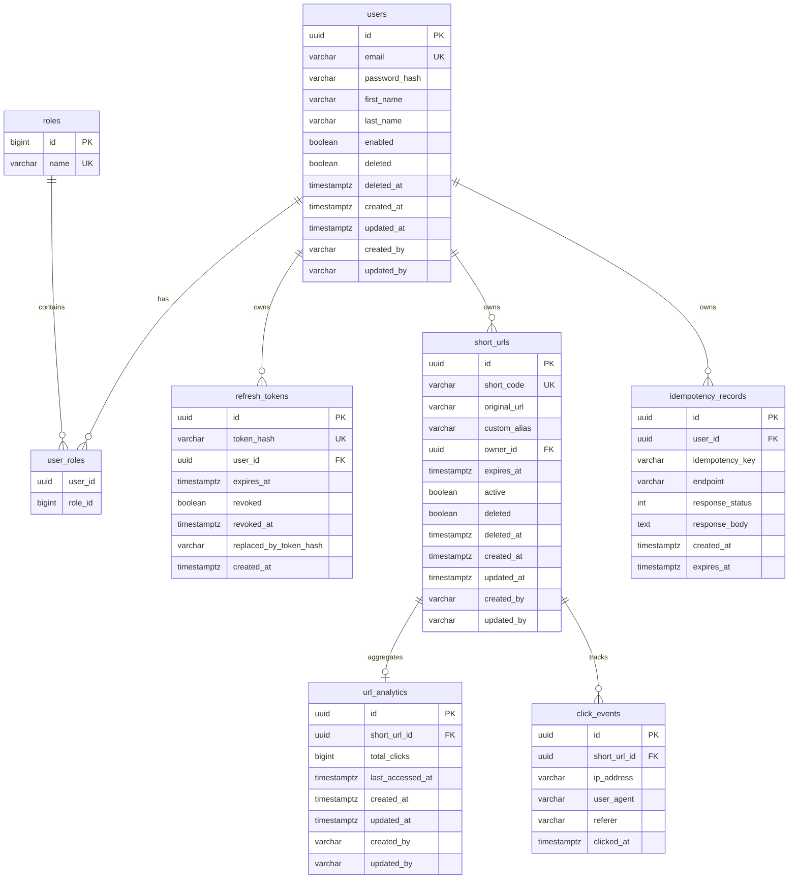

# LinkFlow Database Design

**Canonical data model document.** Source of truth: Flyway migrations in `linkflow-app/src/main/resources/db/migration/` and JPA entities under `com.linkflow.*.domain.entity`.

Schema management: Flyway on startup (`spring.flyway.enabled: true`), Hibernate `ddl-auto: validate`.

---

## ER diagram

---

## Flyway migrations

| Version | File | Purpose |
|---------|------|---------|
| V1 | `V1__create_users_and_roles.sql` | `roles`, `users`, `user_roles`; seed USER, ADMIN roles |
| V2 | `V2__create_refresh_tokens.sql` | Opaque refresh token storage |
| V3 | `V3__create_short_urls.sql` | Short URL table with indexes |
| V4 | `V4__create_click_events_and_analytics.sql` | Analytics aggregates + raw events |
| V5 | `V5__create_idempotency_records.sql` | Idempotent create replay |
| V6 | `V6__add_audit_columns_to_url_analytics.sql` | Add `created_by`, `updated_by` to `url_analytics` |

---

## Table reference

### `roles`

| Column | Type | Constraints |
|--------|------|-------------|
| `id` | BIGSERIAL | PK |
| `name` | VARCHAR(50) | NOT NULL, UNIQUE |

**Seed data:** `USER`, `ADMIN`

**JPA:** `RoleEntity` in `com.linkflow.user.infrastructure.adapter`

---

### `users`

| Column | Type | Constraints |
|--------|------|-------------|
| `id` | UUID | PK, default `gen_random_uuid()` |
| `email` | VARCHAR(255) | NOT NULL, UNIQUE |
| `password_hash` | VARCHAR(255) | NOT NULL |
| `first_name` | VARCHAR(100) | |
| `last_name` | VARCHAR(100) | |
| `enabled` | BOOLEAN | NOT NULL, default TRUE |
| `deleted` | BOOLEAN | NOT NULL, default FALSE |
| `deleted_at` | TIMESTAMPTZ | |
| `created_at` | TIMESTAMPTZ | NOT NULL, default NOW() |
| `updated_at` | TIMESTAMPTZ | NOT NULL, default NOW() |
| `created_by` | VARCHAR(255) | |
| `updated_by` | VARCHAR(255) | |

**Indexes:**

- `idx_users_email` on `(email) WHERE deleted = FALSE`
- `idx_users_deleted` on `(deleted)`

**JPA:** `User` extends `AuditableEntity` — `com.linkflow.user.domain.entity`  
**Repository:** `UserRepository`

**Role model (final decision):** JPA maps roles via `@ElementCollection Set<Long> roleIds` on `user_roles.role_id`. `RoleEntity` exists for ID ↔ name resolution. This is intentional for two fixed roles — see [system-design.md](system-design.md#role-model-final-decision).

---

### `user_roles`

| Column | Type | Constraints |
|--------|------|-------------|
| `user_id` | UUID | PK, FK → `users(id)` ON DELETE CASCADE |
| `role_id` | BIGINT | PK, FK → `roles(id)` ON DELETE CASCADE |

---

### `refresh_tokens`

| Column | Type | Constraints |
|--------|------|-------------|
| `id` | UUID | PK |
| `token_hash` | VARCHAR(255) | NOT NULL, UNIQUE |
| `user_id` | UUID | NOT NULL, FK → `users(id)` CASCADE |
| `expires_at` | TIMESTAMPTZ | NOT NULL |
| `revoked` | BOOLEAN | NOT NULL, default FALSE |
| `revoked_at` | TIMestamptz | |
| `replaced_by_token_hash` | VARCHAR(255) | rotation chain |
| `created_at` | TIMESTAMPTZ | NOT NULL |

**Indexes:** `user_id`, `token_hash`, partial on `expires_at WHERE revoked = FALSE`

**JPA:** `RefreshToken` — `com.linkflow.auth.domain.entity`  
**Repository:** `RefreshTokenRepository`

**Storage note:** Only SHA-256 hash stored; raw token returned once to client.

---

### `short_urls`

| Column | Type | Constraints |
|--------|------|-------------|
| `id` | UUID | PK |
| `short_code` | VARCHAR(100) | NOT NULL, UNIQUE |
| `original_url` | VARCHAR(2048) | NOT NULL |
| `custom_alias` | VARCHAR(100) | |
| `owner_id` | UUID | NOT NULL, FK → `users(id)` |
| `expires_at` | TIMESTAMPTZ | optional |
| `active` | BOOLEAN | NOT NULL, default TRUE |
| `deleted` | BOOLEAN | NOT NULL, default FALSE |
| `deleted_at` | TIMESTAMPTZ | |
| audit columns | | from `AuditableEntity` |

**Indexes:**

- `idx_short_urls_short_code` on `lower(short_code)`
- `idx_short_urls_owner_id`
- partial indexes on `expires_at`, `active`, `deleted`

**JPA:** `ShortUrl` — `com.linkflow.url.domain.entity`  
**Repository:** `ShortUrlRepository`

---

### `url_analytics`

| Column | Type | Constraints |
|--------|------|-------------|
| `id` | UUID | PK |
| `short_url_id` | UUID | NOT NULL, UNIQUE, FK → `short_urls(id)` CASCADE |
| `total_clicks` | BIGINT | NOT NULL, default 0 |
| `last_accessed_at` | TIMESTAMPTZ | |
| audit columns | | V4 + V6 |

**JPA:** `UrlAnalytics` — `com.linkflow.analytics.domain.entity`  
**Repository:** `UrlAnalyticsRepository`, `StatsRepository` (native aggregates)

---

### `click_events`

| Column | Type | Constraints |
|--------|------|-------------|
| `id` | UUID | PK |
| `short_url_id` | UUID | NOT NULL, FK → `short_urls(id)` CASCADE |
| `ip_address` | VARCHAR(45) | |
| `user_agent` | VARCHAR(512) | |
| `referer` | VARCHAR(2048) | |
| `clicked_at` | TIMESTAMPTZ | NOT NULL, default NOW() |

**Indexes:** `short_url_id`, `clicked_at`

**JPA:** `ClickEvent` — `com.linkflow.analytics.domain.entity`  
**Repository:** `ClickEventRepository`

**API note:** Recent click events are exposed via `GET /api/v1/urls/{id}/analytics/clicks` (owner) and `GET /api/v1/admin/analytics/urls/{id}/clicks` (admin). There is no time-series rollup or export API.

---

### `idempotency_records`

| Column | Type | Constraints |
|--------|------|-------------|
| `id` | UUID | PK |
| `user_id` | UUID | NOT NULL, FK → `users(id)` CASCADE |
| `idempotency_key` | VARCHAR(255) | NOT NULL |
| `endpoint` | VARCHAR(255) | NOT NULL |
| `response_status` | INT | NOT NULL |
| `response_body` | TEXT | NOT NULL (serialized JSON) |
| `created_at` | TIMESTAMPTZ | NOT NULL |
| `expires_at` | TIMESTAMPTZ | NOT NULL |

**Unique constraint:** `(user_id, endpoint, idempotency_key)`

**JPA:** `IdempotencyRecord` — `com.linkflow.url.domain.entity`  
**Service:** `IdempotencyService`, cleanup via `ExpiredUrlCleanupJob`

---

## Entity ↔ table mapping summary

| Entity | Table | Module |
|--------|-------|--------|
| `User` | `users` | linkflow-user |
| `RoleEntity` | `roles` | linkflow-user |
| `RefreshToken` | `refresh_tokens` | linkflow-auth |
| `ShortUrl` | `short_urls` | linkflow-url |
| `IdempotencyRecord` | `idempotency_records` | linkflow-url |
| `UrlAnalytics` | `url_analytics` | linkflow-analytics |
| `ClickEvent` | `click_events` | linkflow-analytics |
| `AuditableEntity` | mapped superclass | linkflow-common |

---

## Data flows

### Registration

`AuthService.register` → `UserLookupAdapter` → INSERT `users` + `user_roles`

### Login

Validate `users.password_hash` → INSERT `refresh_tokens` (hash only)

### URL create

INSERT `short_urls` → optional INSERT `idempotency_records`

### Redirect / analytics

1. Lookup `short_urls` (or Redis cache mirror)
2. Async INSERT `click_events`
3. UPSERT/increment `url_analytics`

### Soft delete

`users.deleted = true` or `short_urls.deleted = true` with `deleted_at` timestamp; partial indexes exclude deleted rows where applicable.

---

## Redis data (non-relational)

Not stored in PostgreSQL but part of the data plane:

| Key pattern | Purpose | TTL |
|-------------|---------|-----|
| `url:shortcode:{code}` | Cached redirect JSON | 15 min |
| `rate_limit:user:{id}:{minute}` | Rate counter | 60 s |
| `rate_limit:ip:{ip}:{minute}` | Rate counter | 60 s |
| `lock:alias:{alias}` | Creation lock | 10 s |

See [system-design.md](system-design.md#cache-strategy).

---

## Concise data model notes

- UUID primary keys throughout (except `roles.id`)
- Soft delete pattern on `users` and `short_urls`
- Role names stored in `roles`; user linkage via `user_roles`
- Analytics denormalized into `url_analytics` for fast reads; `click_events` for audit/raw data
- Idempotency scoped per user + endpoint + key
- Hibernate validates schema against migrations — no auto DDL in production

---

## Related documents

- [system-design.md](system-design.md) — cache and analytics flows
- [feature-matrix.md](feature-matrix.md) — feature → table mapping
- [security-review.md](security-review.md) — token and password storage
