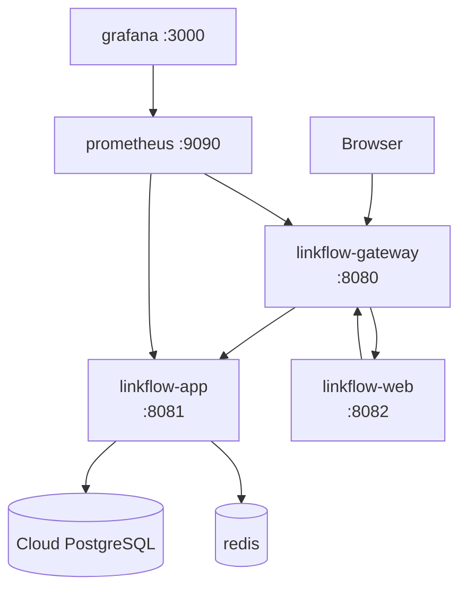

# Docker Guide

Canonical deployment topology: [system-design.md](system-design.md#deployment-topology)

## Full stack

```bash
cp .env.example .env
# Set LINKFLOW_JWT_SECRET in .env (Base64, ≥32 decoded bytes)
docker compose up --build
```

Open **http://localhost:8080** for the web UI and API through the gateway.

## Services

| Service | Port | Description |
|---------|------|-------------|
| linkflow-gateway | 8080 | Public entry — routes API, redirects, web UI |
| linkflow-web | 8082 | Thymeleaf UI (also proxied at `/` via gateway) |
| linkflow-app | 8081 | Backend API and redirect handler |
| redis | 6379 | Cache / rate limiting |
| prometheus | 9090 | Metrics scraper |
| grafana | 3000 | Dashboards (default admin/admin — change for shared use) |

## Build individual images

```bash
docker build -f docker/Dockerfile.app -t linkflow-app .
docker build -f docker/Dockerfile.gateway -t linkflow-gateway .
docker build -f docker/Dockerfile.web -t linkflow-web .
```

## Deployment diagram



## Environment variables (Compose)

| Variable | Service | Purpose |
|----------|---------|---------|
| `LINKFLOW_JWT_SECRET` | app | Required in prod profile |
| `LINKFLOW_METRICS_PUBLIC` | app | `true` in Compose enables Prometheus scrape |
| `LINKFLOW_BOOTSTRAP_ADMIN_*` | app | Creates initial admin user |
| `LINKFLOW_GATEWAY_URL` | web | Gateway URL for `RestClient` backend calls |
| `LINKFLOW_APP_URI` | gateway | Backend upstream |
| `LINKFLOW_WEB_URI` | gateway | Web UI upstream |

## Health checks

Compose services use `curl` against `/actuator/health`. Gateway waits for healthy app and web before starting.

## Related

- [deployment.md](deployment.md) — production checklist
- [setup.md](setup.md) — local non-Docker development
