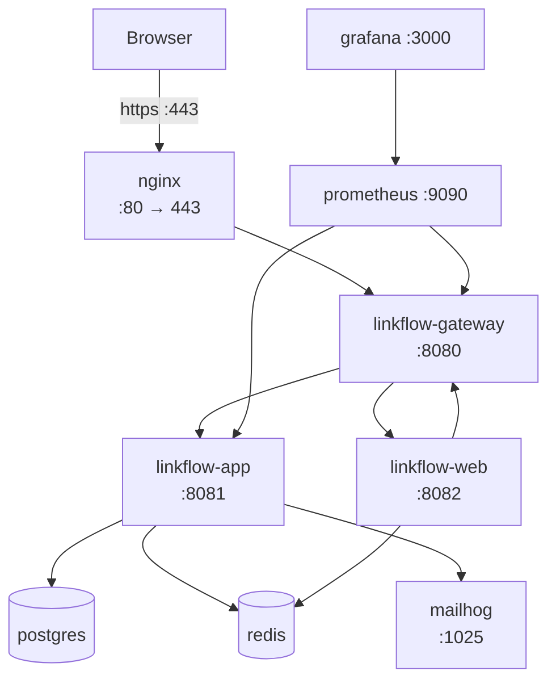

# Docker Guide

Canonical deployment topology: [system-design.md](system-design.md#deployment-topology)

## Full stack

```bash
./docker/nginx/generate-dev-certs.sh   # self-signed cert for local TLS
cp .env.example .env                   # then set LINKFLOW_JWT_SECRET
docker compose up --build
```

Open **https://localhost**. The browser will warn about the self-signed certificate; that is
expected and is the point — the stack exercises the real TLS path rather than pretending to.

Nothing external is required: PostgreSQL and Redis run as containers, and MailHog stands in for an
SMTP relay. Set `SPRING_DATASOURCE_*` in `.env` to use a managed database instead.

The stack runs the **`docker`** profile, not `prod`. The distinction is deliberate: `prod` requires
a real SMTP relay and an `https` base URL on a domain you control, neither of which exists on a
laptop, and pretending otherwise would defeat the production startup checks. The `docker` profile
keeps every hardening measure that can be reproduced locally — Redis authentication, non-root
containers, TLS at the edge, template caching, Swagger disabled — and relaxes only what genuinely
needs external infrastructure.

## Services

| Service | Published | Description |
|---------|-----------|-------------|
| nginx | 80, 443 | TLS termination, compression, edge rate limiting, reverse proxy |
| linkflow-gateway | — | Routes API, redirects, and web UI |
| linkflow-app | — | Backend API and redirect handler |
| linkflow-web | — | Thymeleaf UI |
| postgres | — | Database (Flyway migrates on app startup) |
| redis | — | Sessions, rate limiting, cache, click-event buffer |
| mailhog | 8025 | Captures outbound mail; web inbox |
| prometheus | 9090 | Metrics scraper |
| grafana | 3000 | Dashboards (default admin/admin — change for shared use) |

Only Nginx publishes application ports. The gateway, app, web, database, and Redis are reachable
only on the private Compose network, so there is exactly one way in. Prometheus, Grafana, and
MailHog publish ports for operator convenience in a local demo; a real deployment would not.

## Build individual images

One Dockerfile builds all three images, selected by target:

```bash
docker build -f docker/Dockerfile --target app     -t linkflow-app .
docker build -f docker/Dockerfile --target gateway -t linkflow-gateway .
docker build -f docker/Dockerfile --target web     -t linkflow-web .
```

They share a single build stage, so the reactor is compiled once and the second and third images
are essentially free.

Image properties:

- Non-root (`uid 1001`), so a container escape does not start as root
- Spring Boot layered jars — dependency layers are cached separately from application code, so a
  code change rewrites kilobytes rather than the whole ~70 MB jar
- `HEALTHCHECK` against `/actuator/health/readiness`, using busybox `wget` so nothing extra is
  installed
- `MaxRAMPercentage=75` so the heap tracks the container's memory limit, and
  `ExitOnOutOfMemoryError` so an OOM restarts the container instead of leaving a JVM that reports
  healthy while failing requests
- PID 1 is the JVM, so `SIGTERM` reaches it and Spring's graceful shutdown actually runs

## Deployment diagram



Prometheus scrapes the app and gateway directly over the private network, which is why Nginx can
deny `/actuator` to the public without breaking metrics collection.

## Environment variables (Compose)

| Variable | Service | Purpose |
|----------|---------|---------|
| `LINKFLOW_JWT_SECRET` | app | Required; must decode to ≥64 bytes |
| `POSTGRES_DB` / `POSTGRES_USER` / `POSTGRES_PASSWORD` | postgres, app | Bundled database credentials |
| `SPRING_DATASOURCE_*` | app | Overrides the bundled database when set |
| `REDIS_PASSWORD` | redis, app, web | Redis authentication |
| `REDIS_MAXMEMORY` | redis | Memory cap; eviction is disabled |
| `LINKFLOW_TRUSTED_PROXIES` | app | The two proxy hops, as `/32` addresses |
| `LINKFLOW_METRICS_PUBLIC` | app | `true` in Compose so Prometheus can scrape |
| `LINKFLOW_BOOTSTRAP_ADMIN_*` | app | Creates the initial admin user |
| `GRAFANA_ADMIN_USER` / `GRAFANA_ADMIN_PASSWORD` | grafana | Dashboard credentials |

### Why trusted proxies are `/32` addresses

Requests reach the app through two hops, so `X-Forwarded-For` arrives as
`client, nginx`. `ClientIpResolver` walks that list from the right, discarding hops it recognises as
proxies, and returns the first address it does not — the real client.

That only works if the trusted set contains the proxies and *not* the clients. A broad range like
`172.16.0.0/12` covers the whole Compose subnet, including the address host traffic arrives from, so
every visitor would be mistaken for a proxy and all traffic would collapse into a single rate-limit
bucket. Compose therefore gives Nginx and the gateway fixed addresses
(`172.28.0.10`, `172.28.0.11`) and trusts exactly those.

Nginx also *replaces* rather than appends `X-Forwarded-For`, since it is the edge — anything a
client put there was invented, so it never enters the chain at all.

## Health checks

Each image declares its own `HEALTHCHECK` against `/actuator/health/readiness`. Readiness rather
than plain health, because it reports whether the instance can actually serve: the app's readiness
group includes the database and Redis, so dependents wait for a genuinely usable instance. Liveness
deliberately excludes them — a database blip should not cause the orchestrator to kill an otherwise
healthy process.

`stop_grace_period` is 40s, above the 25s graceful shutdown budget. Docker's 10s default would
send `SIGKILL` mid-drain and make graceful shutdown pointless.

## Related

- [deployment.md](deployment.md) — production checklist, TLS, Nginx
- [setup.md](setup.md) — local non-Docker development
