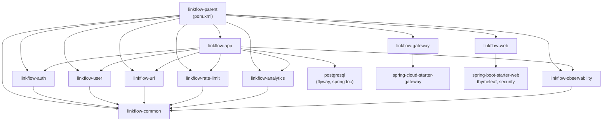
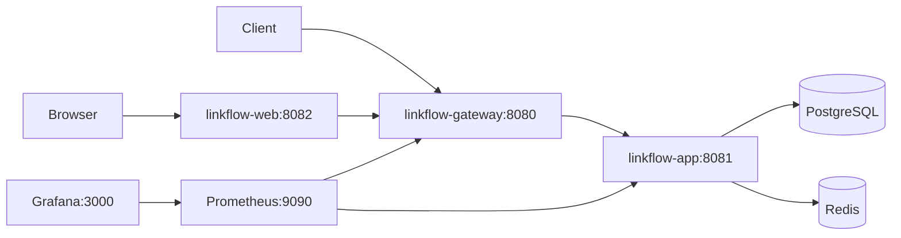
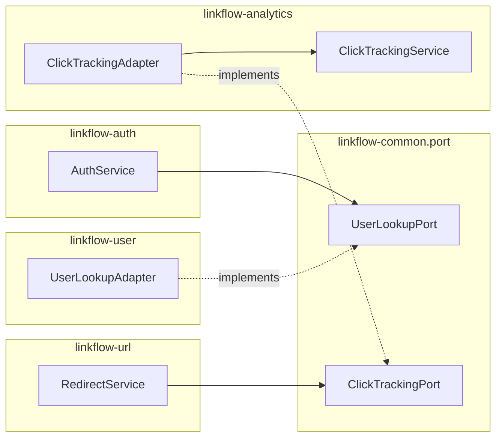

# LinkFlow Module Dependency Map

Maven compile dependencies, runtime wiring, and infrastructure dependencies.

---

## Maven module graph

**Rule:** Feature modules never depend on each other — only `linkflow-common`.

---

## Module responsibilities and artifacts

| Module | Packaging | Runnable | Depends on |
|--------|-----------|----------|------------|
| `linkflow-common` | jar | No | Spring Web, JPA, Redis, Security, Logstash encoder |
| `linkflow-auth` | jar | No | common, Security, JPA, jjwt |
| `linkflow-user` | jar | No | common, JPA, Security |
| `linkflow-url` | jar | No | common, JPA, Security, ZXing, Caffeine |
| `linkflow-rate-limit` | jar | No | common, Redis, Security |
| `linkflow-analytics` | jar | No | common, JPA, Security |
| `linkflow-observability` | jar | No | common, Actuator, Prometheus registry |
| `linkflow-app` | jar (boot) | Yes :8081 | all feature modules + PostgreSQL driver + Flyway + springdoc |
| `linkflow-gateway` | jar (boot) | Yes :8080 | Spring Cloud Gateway + Actuator |
| `linkflow-web` | jar (boot) | Yes :8082 | Web, Thymeleaf, Security (no com.linkflow deps) |

---

## Runtime dependency graph

---

## Package-level port wiring (cross-module)

Ports defined in `linkflow-common`, implemented in feature modules, consumed at runtime by `linkflow-app` classpath:

---

## Spring component scan boundaries

| Application | Scan base | JPA entities/repos |
|-------------|-----------|-------------------|
| `LinkFlowApplication` | `com.linkflow` | `com.linkflow` |
| `LinkFlowGatewayApplication` | `com.linkflow.gateway` | None |
| `LinkFlowWebApplication` | `com.linkflow.web` | None |

---

## External runtime dependencies

| Dependency | Version (Compose) | Used by |
|------------|-------------------|---------|
| PostgreSQL | 16-alpine | linkflow-app |
| Redis | 7-alpine | linkflow-app |
| Prometheus | v2.54.1 | Scrapes app + gateway |
| Grafana | 11.2.0 | Dashboards |
| Eclipse Temurin | 21 (Dockerfiles) | Build/runtime |

---

## CI dependencies

`.github/workflows/ci.yml` — Maven verify with `LINKFLOW_JWT_SECRET` set for builds.

---

## Related documents

- [system-design.md](system-design.md)
- [adr/001-modular-monolith.md](adr/001-modular-monolith.md)
