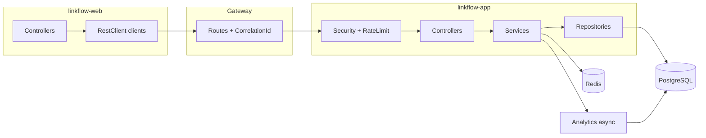

# LinkFlow Project Deep Dive

## What the system does

LinkFlow is a multi-user URL shortener. Registered users create short links through a REST API or web UI. Anonymous visitors follow `GET /r/{shortCode}` and are redirected to the original URL while click analytics are recorded asynchronously. Administrators can list users and URLs, deactivate links, and view system-wide statistics. The backend is a modular monolith (`linkflow-app`) fronted by an optional gateway and supported by PostgreSQL, Redis, and (in Docker) Prometheus/Grafana.

---

## Gateway subsystem

**What:** Single HTTP entry point for API, redirects, Swagger, and the web UI at one host (`:8080`).

**Why:** Separates routing/correlation from business logic; allows independent scaling and TLS termination at the edge.

**How:** Spring Cloud Gateway YAML routes in `linkflow-gateway/src/main/resources/application.yml`. Backend paths (`/api/**`, `/r/**`, docs) go to `linkflow-app`; static assets and pages go to `linkflow-web`. Gateway `/actuator/**` is local only — app health/metrics stay on `:8081`. `CorrelationIdGatewayFilter` adds `X-Correlation-ID`.

**Starts in code:** `LinkFlowGatewayApplication.main`

**Interview questions:**

- Why not call `linkflow-app` directly? — You can for dev; gateway models production edge routing and unifies browser + API entry.
- Does gateway authenticate? — No; JWT validation happens in the app.
- Why not proxy app actuator? — Prometheus scrapes the app directly; keeps gateway health independent of backend failures.

---

## Security subsystem

**What:** JWT access tokens, opaque refresh tokens, role-based access, servlet filters.

**Why:** Stateless API scaling; refresh rotation limits stolen-token window.

**How:** `SecurityConfig` + `JwtAuthenticationFilter` + `JwtService` + `RefreshTokenService`. Passwords BCrypt-strength 12.

**Starts in code:** `SecurityConfig.securityFilterChain`

**Interview questions:**

- Why opaque refresh tokens? — Revocable server-side; rotation detects reuse.
- Where is ADMIN enforced? — HTTP matcher + `@PreAuthorize` on admin controllers.

See [security-review.md](security-review.md).

---

## User subsystem

**What:** User persistence, profile API, admin user listing, `UserLookupPort` for auth.

**Why:** Decouple auth module from user persistence details.

**How:** `User` entity, `UserRepository`, `UserService`, `UserLookupAdapter` implementing `UserLookupPort`.

**Starts in code:** `UserController`, `AdminUserController`

**Tables:** `users`, `roles`, `user_roles`

---

## URL subsystem

**What:** Create/list/update/delete short URLs, public redirects, QR codes, idempotency.

**Why:** Core product value — link shortening with ownership and lifecycle.

**How:**

- `UrlService` — CRUD, validation, alias locks
- `RedirectService` — cache-aside + click tracking trigger
- `ShortCodeGenerator` — Base62 codes
- `QrCodeService` — ZXing PNG
- `IdempotencyService` — replay protection

**Starts in code:** `UrlController`, `RedirectController`

**Redis:** `UrlCacheService`, `RedisLockService`

**Tables:** `short_urls`, `idempotency_records`

---

## Rate limiting subsystem

**What:** Per-user and per-IP request quotas via Redis Lua script.

**Why:** Protect auth and redirect endpoints from abuse.

**How:** `RateLimitFilter` → `RateLimitService` → `rate_limiter.lua`

**Starts in code:** `RateLimitFilter.doFilterInternal`

**Interview questions:**

- Why fail-open for non-auth paths? — Redirects and general API remain available if Redis blips. Auth paths fail closed (503).
- Why after JWT filter? — Authenticated users get per-user bucket.

---

## Analytics subsystem

**What:** Record clicks on redirect; expose aggregate stats.

**Why:** Users want click counts without slowing redirects.

**How:** `ClickTrackingPort` / `ClickTrackingAdapter` / `ClickTrackingService` (@Async). Queries via `AnalyticsQueryService`.

**Starts in code:** `RedirectService.trackClick` (write), `AnalyticsController` (read)

**Tables:** `click_events`, `url_analytics`

**Limitation:** No time-series rollup API (hourly/daily charts) — v1 exposes aggregate totals, `lastAccessedAt`, and paginated recent click events via `/analytics/clicks`.

---

## Observability subsystem

**What:** Health checks, Prometheus metrics, structured logging.

**Why:** Production operability and interview-grade completeness.

**How:** `linkflow-observability` module — `RedisHealthIndicator`; Micrometer via Spring Boot Actuator; Prometheus/Grafana in Compose.

**Starts in code:** Actuator auto-config + custom health indicator bean

---

## Web UI subsystem

**What:** Thymeleaf SSR application consuming gateway API.

**Why:** Demonstrate BFF pattern; keep JWTs off the browser.

**How:** Controllers → `*ApiClient` → `RestClient` → gateway. `SessionManager` stores `AuthState`.

**Starts in code:** `LinkFlowWebApplication`, `WebSecurityConfig`

**Included in Docker Compose** — gateway proxies web UI at `:8080`; direct access on `:8082` for debugging.

---

## End-to-end connected flow

**Redirect path (no web):** Visitor → Gateway → `RedirectController` → `RedirectService` → Redis/PostgreSQL → async analytics.

**Authenticated API path:** Client → Gateway → JWT → Rate limit → Controller → Service → DB/Redis.

**Web path:** Browser → Web controller → RestClient → Gateway → (same as API).

---

## Common interview questions by theme

| Theme | Repo-specific answer anchor |
|-------|----------------------------|
| Modular monolith | Feature JARs + `UserLookupPort` / `ClickTrackingPort` |
| Caching | `UrlCacheService` 15-min TTL, evict on mutation |
| Idempotency | `idempotency_records` unique on user+endpoint+key |
| Testing | Testcontainers in `AbstractIntegrationTest` |
| QR codes | `QrCodeService` + `GET /api/v1/urls/{id}/qr` |
| Admin bootstrap | `AdminBootstrap` + env vars |

Full Q&A set: [interview-prep.md](interview-prep.md)

---

## Related documents

- [system-design.md](system-design.md)
- [code-walkthrough.md](code-walkthrough.md)
- [feature-matrix.md](feature-matrix.md)
