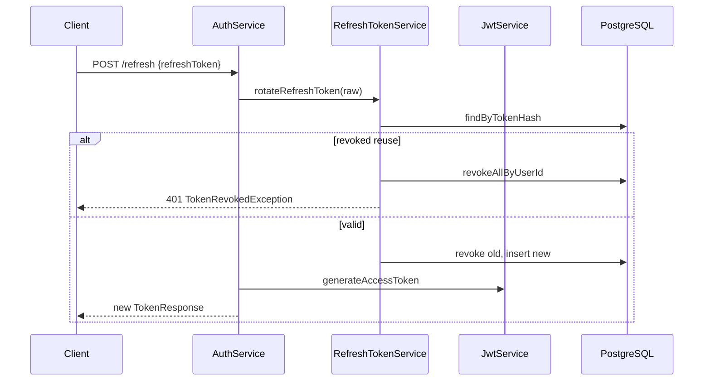

# LinkFlow Security Review

**Canonical security document.** Implementation references: `SecurityConfig`, `JwtService`, `RefreshTokenService`, `RateLimitFilter`, `WebSecurityConfig` (web module).

---

## Authentication flow

### API (stateless JWT)

1. Client sends `Authorization: Bearer {accessToken}` (header name from `SecurityConstants.AUTH_HEADER`)
2. `JwtAuthenticationFilter` extracts token, validates via `JwtService.validateToken`
3. Claims parsed → `UserPrincipal` placed in `SecurityContext`
4. Controller/service methods use `SecurityContextHolder` or `@PreAuthorize`

**Entry point for missing/invalid token:** `JwtAuthenticationEntryPoint` → HTTP 401 JSON (`AUTHENTICATION_REQUIRED`)

### Registration and login

| Step | Class | Detail |
|------|-------|--------|
| Register | `AuthService.register` | BCrypt hash via `PasswordEncoder`, default role `USER` |
| Login | `AuthService.login` | Constant-time failure via `InvalidCredentialsException` (no user enumeration in message) |
| Disabled user | `AuthService.login` | Treated as invalid credentials |

---

## Authorization model

| Layer | Mechanism |
|-------|-----------|
| HTTP matchers | `SecurityConfig` — `/api/v1/admin/**` requires `ROLE_ADMIN` |
| Method security | `@PreAuthorize("hasRole('ADMIN')")` on admin controllers |
| Resource ownership | Service-layer checks in `UrlService.findOwnedUrl`, `AnalyticsQueryService.getUrlAnalytics` |

**Roles:** Stored as `USER`, `ADMIN` in `roles` table; Spring authorities prefixed with `ROLE_` (`UserPrincipal`).

**Public endpoints (dev defaults):**

- `/api/v1/auth/**`
- `/r/**` (redirects)
- `/swagger-ui/**`, `/v3/api-docs/**` — **denied in prod** (`linkflow.security.swagger-public=false`)
- `/actuator/health` — public in prod; other actuator paths denied unless `LINKFLOW_METRICS_PUBLIC=true`

Controlled by `LinkflowSecurityProperties` — see [system-design.md](system-design.md#security-and-actuator-exposure).

---

## JWT lifecycle

### Access token

| Property | Value |
|----------|-------|
| Algorithm | HMAC-SHA512 (`JwtService`, jjwt) |
| Secret | `LINKFLOW_JWT_SECRET` — Base64-decoded in constructor |
| Default TTL | 900000 ms (15 minutes) |
| Claims | `sub` (email), `userId`, `email`, `roles`, `tokenType=access`, `jti` |

### Refresh token

| Property | Value |
|----------|-------|
| Format | Opaque random token (not JWT) |
| Storage | SHA-256 hash in `refresh_tokens.token_hash` |
| Default TTL | 2592000000 ms (30 days) |
| Rotation | Old token revoked with `replaced_by_token_hash` link |
| Reuse detection | Revokes **all** user refresh tokens (`RefreshTokenService`) |

### Sequence: refresh

### Logout

`AuthService.logout` → `RefreshTokenService.revokeToken` — marks token revoked in DB.

---

## Password handling

| Aspect | Implementation |
|--------|----------------|
| Algorithm | BCrypt (`BCryptPasswordEncoder(12)`) |
| Storage | `users.password_hash` only |
| Registration rules | Min 8 chars; upper, lower, digit, special required (`RegisterRequest`) |
| Transmission | HTTPS assumed in production; not enforced in code |

---

## Secrets management

| Secret | Config | Notes |
|--------|--------|-------|
| JWT signing key | `LINKFLOW_JWT_SECRET` | Required in prod; `JwtSecretValidator` fails fast if missing |
| Dev fallback | `application-dev.yml` | Default secret for local only |
| DB credentials | `SPRING_DATASOURCE_*` | Default `linkflow/linkflow` — change in prod |
| Grafana | `docker-compose.yml` | Default admin/admin |

**Recommendation:** Use secret manager / K8s secrets in production; never commit `.env`.

---

## CORS

Configured in `com.linkflow.app.config.WebMvcConfig`:

- Property: `linkflow.cors.allowed-origins` (default `*`)
- Applies to API controllers in `linkflow-app`

**Risk:** Wildcard origin with credentials-sensitive clients — tighten for production.

---

## CSRF considerations

| Application | CSRF |
|-------------|------|
| `linkflow-app` (API) | **Disabled** (`AbstractHttpConfigurer::disable`) — appropriate for Bearer token API |
| `linkflow-web` | **Enabled** (Spring Security default); exception for `POST /tools/rate-limit/probe` |

Web forms include CSRF tokens via Thymeleaf/Spring Security.

---

## Rate limiting protections

- Mitigates brute-force and abuse on public endpoints (register, login, redirect)
- Authenticated users limited per `userId`
- **Auth paths fail closed** when Redis is unavailable (HTTP 503)
- Other paths fail open — availability tradeoff documented in [system-design.md](system-design.md#rate-limiting-decision-flow)

---

## Attack surfaces

| Surface | Exposure | Mitigation in code |
|---------|----------|-------------------|
| Public auth endpoints | Register/login flood | IP rate limit |
| Public redirects | Scraping, enumeration | IP rate limit; short codes are opaque |
| JWT | Forgery | HMAC signature validation |
| Refresh token theft | Session hijack | Rotation + reuse revocation |
| Admin API | Privilege escalation | `@PreAuthorize` + role checks |
| Actuator | Info disclosure | Profile-based exposure; health public in prod |
| Swagger UI | API discovery | Public in dev; restrict in prod |
| Idempotency replay | Cross-user replay | Scoped by `user_id` |
| SQL injection | ORM queries | JPA parameterized queries |
| XSS (web) | Template injection | Thymeleaf auto-escaping; minimal JS |

---

## Security tradeoffs

| Tradeoff | Choice | Consequence |
|----------|--------|-------------|
| Actuator in prod | Health public; metrics gated | Misconfiguration if `actuator-public=true` in prod |
| CORS `*` default | Easy local dev | Over-permissive if unchanged |
| Rate limit fail-open (non-auth) | Uptime | Weaker abuse protection during Redis outage; auth paths fail closed |
| Async click tracking | Performance | Events may be lost on crash before persist |
| JWT in web session | Tokens not in browser | Server must protect session; session fixation mitigated by login flow |
| No email verification | Simpler registration | Unverified email ownership |

---

## Identified risks and mitigations

### Critical

| Risk | Evidence | Mitigation |
|------|----------|------------|
| Public actuator beyond health | Misconfiguration in prod | Use `linkflow.security.actuator-public=false`; set `LINKFLOW_METRICS_PUBLIC` only on trusted networks |

### High

| Risk | Evidence | Mitigation |
|------|----------|------------|
| Default DB/Grafana credentials in Compose | `docker-compose.yml` | Override in prod; use secrets |
| CORS wildcard | `linkflow.cors.allowed-origins: *` | Set explicit origins |
| JWT secret missing in prod | Empty default in `application.yml` | `JwtSecretValidator` fails fast in prod profile |

### Medium

| Risk | Evidence | Mitigation |
|------|----------|------------|
| No account lockout after failed logins | `AuthService.login` | Add lockout or CAPTCHA |
| Click events store IP/UA without retention policy | `click_events` table | Data retention job / GDPR policy |
| Web session in-memory only | No Spring Session Redis | Session affinity or external store for scale |
| `X-Forwarded-For` spoofing for rate limits | `RateLimitFilter.resolveClientIp` | Trust only at gateway/load balancer |

### Low

| Risk | Evidence | Mitigation |
|------|----------|------------|
| Swagger in prod | Disabled via springdoc + denyAll | Keep `swagger-public=false` |
| Password special char set limited | `RegisterRequest` regex | Document allowed characters |

---

## Web module security summary

| Component | Role |
|-----------|------|
| `WebSecurityConfig` | URL authorization, CSRF, login redirect |
| `SessionAuthFilter` | Session → SecurityContext |
| `SessionManager` | AuthState in HttpSession |
| `ApiCallHelper` | Token refresh on 401 |

Session cookie: `SameSite=strict`, 30-minute timeout (`application.yml`).

---

## Related documents

- [system-design.md](system-design.md) — auth and rate limit architecture
- [api-inventory.md](api-inventory.md) — per-endpoint auth requirements
- [production-readiness-audit.md](production-readiness-audit.md) — prioritized gaps
