# LinkFlow System Design

**Canonical architecture document.** Other architecture summaries cross-link here.

LinkFlow is a production-style URL shortener implemented as a **modular monolith** with a **Spring Cloud Gateway** entry point and a **server-rendered web UI**. Source of truth: Maven modules under `com.linkflow`, Flyway migrations in `linkflow-app/src/main/resources/db/migration/`, and runtime configs in `application.yml` files.

---

## System overview

LinkFlow provides:

1. **User authentication** — register, login, JWT access tokens, opaque refresh tokens with rotation
2. **URL management** — create, bulk create, list, update, soft-delete short URLs with optional custom aliases and expiry
3. **Public redirects** — `GET /r/{shortCode}` returns HTTP 302 to the original URL
4. **Analytics** — async click tracking, aggregate counters, recent click event listing per URL
5. **Rate limiting** — Redis Lua counter per authenticated user or anonymous IP; auth paths fail closed when Redis is down
6. **Admin operations** — list users, disable/enable/soft-delete users, deactivate URLs, system-wide analytics
7. **Observability** — profile-based actuator exposure, Prometheus scrape, Grafana dashboards (Docker stack)

### Runnable processes

| Application | Main class | Port | Config file |
|-------------|------------|------|-------------|
| `linkflow-app` | `com.linkflow.app.LinkFlowApplication` | 8081 | `linkflow-app/src/main/resources/application.yml` |
| `linkflow-gateway` | `com.linkflow.gateway.LinkFlowGatewayApplication` | 8080 | `linkflow-gateway/src/main/resources/application.yml` |
| `linkflow-web` | `com.linkflow.web.LinkFlowWebApplication` | 8082 | `linkflow-web/src/main/resources/application.yml` |

**User-facing entry point:** `http://localhost:8080` (gateway) serves the web UI at `/`, API at `/api/**`, and redirects at `/r/**`.

---

## System context diagram

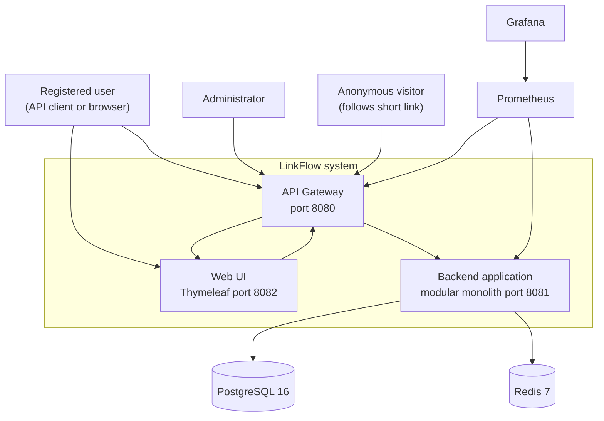

---

## Container diagram

```mermaid
flowchart LR
    subgraph GatewayContainer["Gateway :8080"]
        RouteTable["Route table\n/api, /r, /swagger, /css, /js, /**"]
        CorrelationFilter["Correlation ID filter"]
    end

    subgraph BackendContainer["Backend app :8081"]
        AuthModule["Authentication"]
        UserModule["Users"]
        UrlModule["URLs and redirects"]
        RateLimitModule["Rate limiting"]
        AnalyticsModule["Analytics"]
        ObservabilityModule["Observability"]
    end

    subgraph WebContainer["Web UI :8082"]
        PageControllers["Page controllers"]
        ApiClients["HTTP clients to gateway"]
        HttpSession["HttpSession auth state"]
    end

    GatewayContainer --> BackendContainer
    GatewayContainer --> WebContainer
    WebContainer --> GatewayContainer
    BackendContainer --> PostgreSQL[(PostgreSQL)]
    BackendContainer --> Redis[(Redis)]
```

Gateway contains **no business logic** — only routing and `CorrelationIdGatewayFilter`.

Web module has **zero compile-time dependency** on other `com.linkflow.*` modules; it consumes the gateway over HTTP.

---

## Gateway routing diagram

Routes are defined in `linkflow-gateway/src/main/resources/application.yml`. **First match wins** — specific API paths precede the web catch-all.

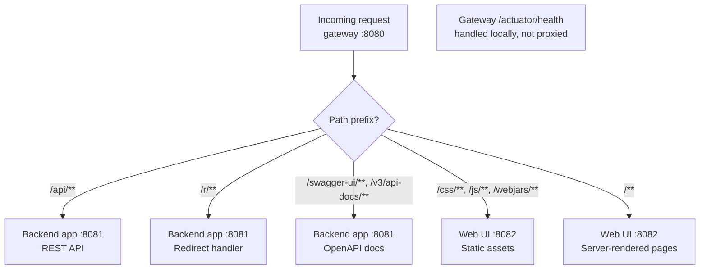

**Deliberate non-routes:**

- **App actuator** is not proxied through the gateway. Prometheus scrapes `linkflow-app:8081/actuator/prometheus` directly inside Docker. This keeps gateway `/actuator/**` reserved for gateway health only.

---

## Module dependency diagram

Feature modules depend **only** on `linkflow-common`. Cross-module integration uses port interfaces:

| Port | Implemented by | Used by |
|------|----------------|---------|
| `UserLookupPort` | `UserLookupAdapter` | `AuthService` |
| `ClickTrackingPort` | `ClickTrackingAdapter` | `RedirectService` |

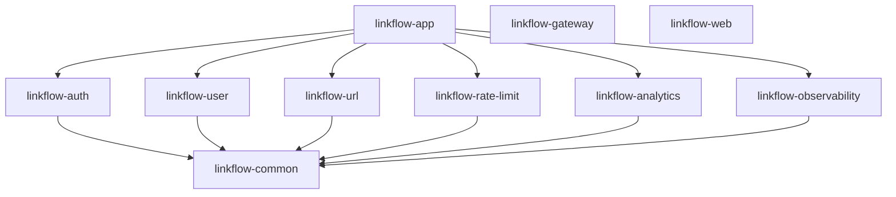

See [module-dependency-map.md](module-dependency-map.md) for Maven detail.

---

## Backend component diagram

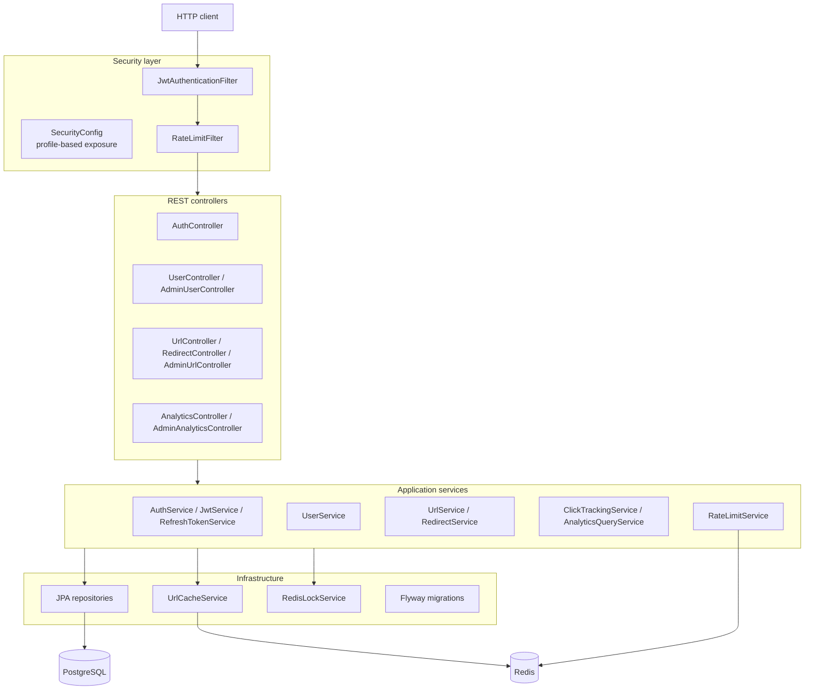

---

## Authentication sequence

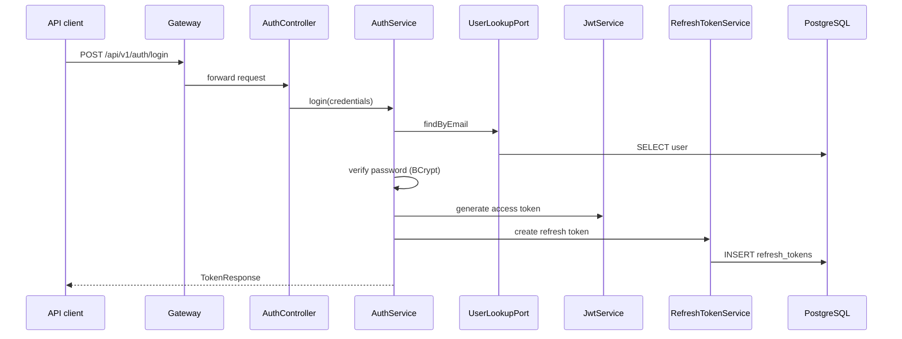

**Web UI:** JWTs stored in `HttpSession` as `AuthState` — never in browser `localStorage`. See [linkflow-web-architecture.md](linkflow-web-architecture.md).

---

## URL create and redirect sequence

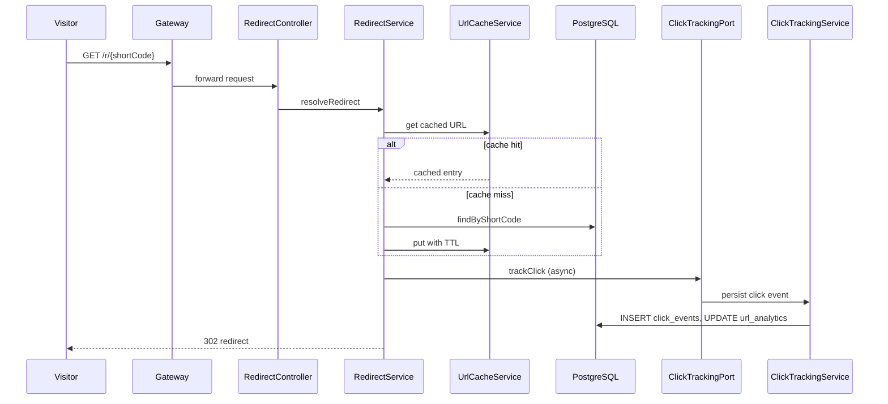

---

## Rate limiting decision flow

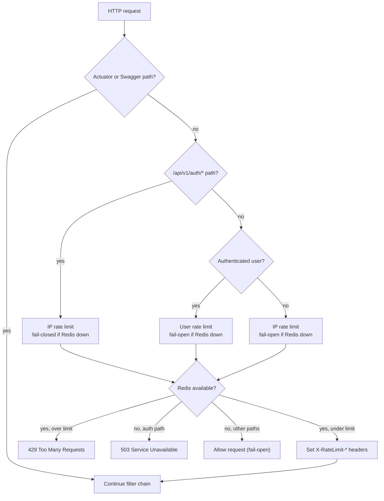

Configuration: `linkflow.rate-limit.auth-fail-closed` (default `true`).

---

## Analytics flow

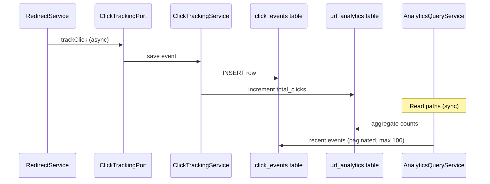

**Product decision:** Aggregate counts plus **recent click listing** are exposed. Time-series rollups, geo breakdown, and referer analytics dashboards are **deliberate non-goals** for v1. See [feature-matrix.md](feature-matrix.md).

---

## Role model (final decision)

Roles are stored in a normalized `roles` table (`USER`, `ADMIN`) seeded by Flyway V1. Users reference roles via `user_roles.role_id` using `@ElementCollection Set<Long> roleIds` on the `User` entity. `RoleEntity` and `RoleService` resolve IDs ↔ names at runtime.

**Why this design:** Only two fixed roles exist. A full `@ManyToMany` entity graph adds complexity without benefit at this scale. JWT claims embed role names at login/refresh; admin role assignment at runtime is a **deliberate non-goal** (roles set at registration or bootstrap only).

---

## Security and actuator exposure

Controlled by `linkflow.security.*` properties (`LinkflowSecurityProperties`):

| Profile | swagger-public | actuator-public | metrics-public |
|---------|----------------|-----------------|----------------|
| default / dev | `true` | `true` | `false` |
| prod | `false` | `false` | `${LINKFLOW_METRICS_PUBLIC:false}` |

In **prod**: only `/actuator/health` is public on the backend. Swagger is denied. Prometheus metrics are public only when `LINKFLOW_METRICS_PUBLIC=true` (set in Docker Compose for the demo stack).

`JwtSecretValidator` fails fast on startup if `prod` profile is active and JWT secret is missing or too short.

Full threat analysis: [security-review.md](security-review.md)

---

## Web session strategy (final decision)

`linkflow-web` uses **in-memory `HttpSession`** with `http-only`, `same-site=strict` cookies. Session stores access/refresh tokens server-side.

**Operational implication:** Horizontal scaling of the web tier requires **sticky sessions** or a future migration to Spring Session Redis. Redis-backed sessions are a **deliberate non-goal** for the current Compose-first scope.

---

## Deployment topology

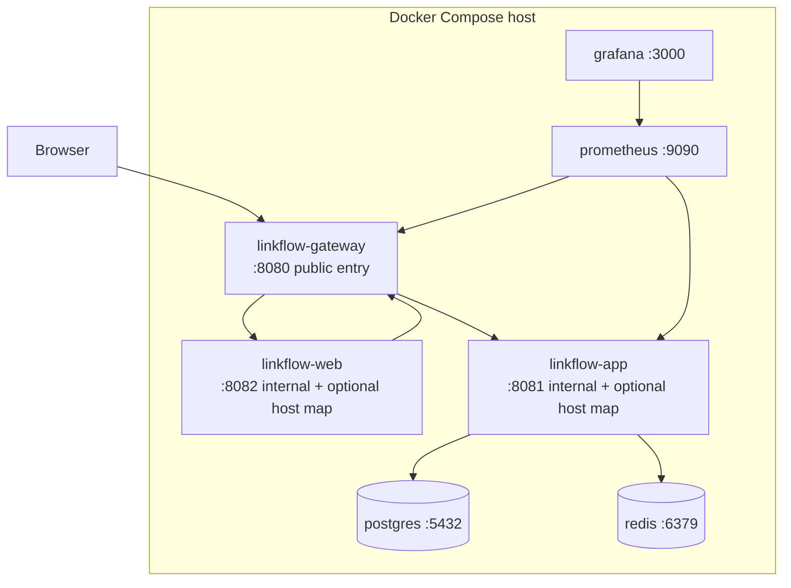

Dockerfiles: `docker/Dockerfile.app`, `docker/Dockerfile.gateway`, `docker/Dockerfile.web`.

**Kubernetes:** Out of scope for this repository. See [deployment.md](deployment.md) for a reference outline only.

---

## Entity relationship diagram

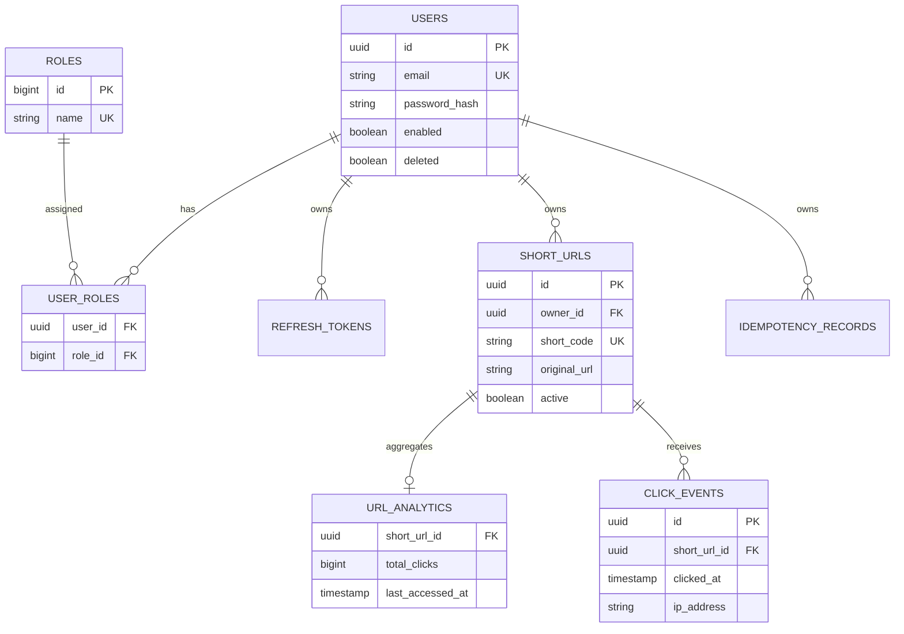

Schema detail: [database-design.md](database-design.md)

---

## Deliberate non-goals

| Item | Rationale |
|------|-----------|
| Kubernetes manifests | Compose-first local/demo deployment; K8s left to consumer environments |
| Spring Session Redis | In-memory sessions sufficient for single-instance web; document sticky-session requirement |
| Runtime role assignment API | Two fixed roles; set at registration/bootstrap only |
| Time-series analytics API | Aggregate + recent clicks cover v1; rollups add scope without demo value |
| Email verification / OAuth | Out of scope for architecture demo |
| HTTPS in repository | Terminate TLS at load balancer or reverse proxy |

---

## Known intentional limitations

| Limitation | Mitigation |
|------------|------------|
| Rate limit fail-open for non-auth paths | Availability over strict throttling; auth paths fail closed |
| JWT role snapshot until refresh | Acceptable for two-role model; refresh reloads from DB |
| Soft-deleted emails block re-registration | Unique email constraint is global by design |
| Click events grow unbounded | Retention/purge job is future ops work; document in security review |

---

## Related documents

- [api-inventory.md](api-inventory.md) — endpoints
- [database-design.md](database-design.md) — schema
- [deployment.md](deployment.md) — production checklist
- [docker.md](docker.md) — Compose guide
- [security-review.md](security-review.md) — threat analysis
- [production-readiness-audit.md](production-readiness-audit.md) — audit status
- [adr/](adr/) — decision records
