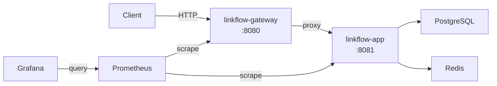
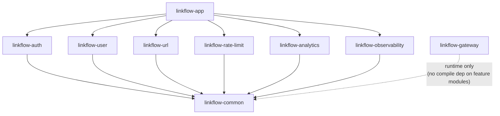
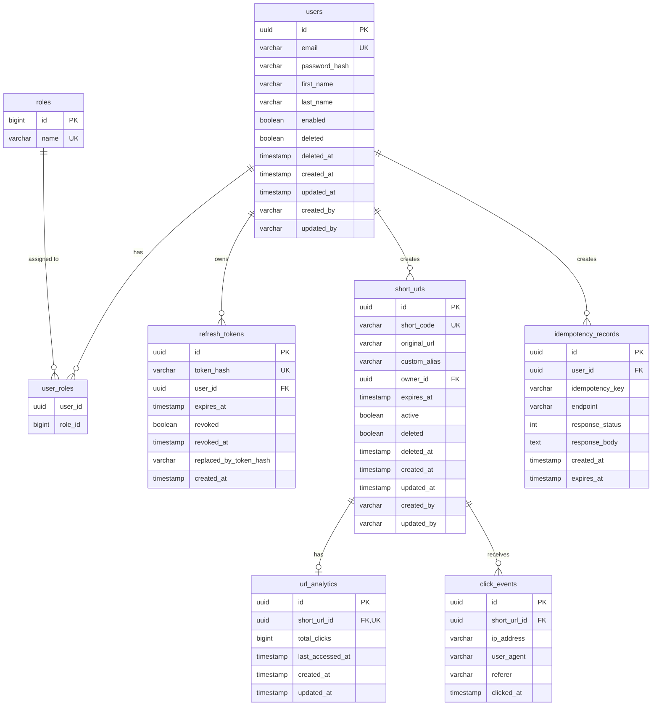

# LinkFlow — Phase 1: Complete Architecture & Design

> **Archival notice:** This file is the original Phase 1 specification. **`linkflow-web` is now implemented** (not merely planned). For accurate, maintained documentation use [docs/system-design.md](docs/system-design.md) and [docs/index.md](docs/index.md). Verify any claim here against source code before trusting it.

## 1. Architecture Overview

> **Superseded:** This section describes the original two-app design. The current system has **three** runnable applications (`linkflow-gateway`, `linkflow-app`, `linkflow-web`). See [docs/system-design.md](docs/system-design.md).

LinkFlow is a **modular monolith** URL shortener built with Java 21 and Spring Boot 3.x. It consists of two runnable Spring Boot applications:

1. **linkflow-gateway** — A Spring Cloud Gateway application that acts as the single entry point. It routes requests to `linkflow-app`, applies correlation-ID propagation, and handles cross-cutting concerns (CORS, request logging). It contains **zero** business logic.
2. **linkflow-app** — The main backend application that assembles all feature modules into a single deployable unit.

### High-Level Request Flow



### Module Dependency Graph



> **Key rule:** Feature modules depend **only** on `linkflow-common`. They never depend on each other. `linkflow-app` depends on all feature modules and wires them together. `linkflow-gateway` is an independent Spring Boot app with no dependency on feature modules.

---

## 2. Maven Multi-Module Structure

### 2.1 Repository Layout

```
linkflow/
├── pom.xml                          # linkflow-parent (BOM + plugin management)
├── linkflow-common/
│   └── pom.xml
├── linkflow-auth/
│   └── pom.xml
├── linkflow-user/
│   └── pom.xml
├── linkflow-url/
│   └── pom.xml
├── linkflow-rate-limit/
│   └── pom.xml
├── linkflow-analytics/
│   └── pom.xml
├── linkflow-observability/
│   └── pom.xml
├── linkflow-app/
│   └── pom.xml
├── linkflow-gateway/
│   └── pom.xml
├── docker/
│   ├── Dockerfile.app
│   ├── Dockerfile.gateway
│   └── prometheus/
│       └── prometheus.yml
├── docker-compose.yml
├── .env.example
├── .github/
│   └── workflows/
│       └── ci.yml
├── docs/
│   ├── architecture.md
│   ├── api.md
│   ├── setup.md
│   ├── docker.md
│   ├── environment.md
│   ├── testing.md
│   └── deployment.md
└── README.md
```

### 2.2 Parent POM Dependency Management

| Dependency | Version | Scope | Used By |
|---|---|---|---|
| Spring Boot Starter Parent | 3.4.1 | parent | all |
| Spring Cloud (BOM) | 2024.0.0 | import | gateway |
| Spring Boot Starter Web | — | compile | common, feature modules |
| Spring Boot Starter Data JPA | — | compile | auth, user, url, analytics |
| Spring Boot Starter Data Redis | — | compile | common (shared), url, rate-limit |
| Spring Boot Starter Validation | — | compile | common |
| Spring Boot Starter Security | — | compile | auth, app |
| Spring Boot Starter Actuator | — | compile | observability, app, gateway |
| Spring Cloud Gateway (reactive) | — | compile | gateway only |
| Flyway Core | — | compile | app |
| Flyway PostgreSQL | — | compile | app |
| PostgreSQL Driver | — | runtime | app |
| JJWT (io.jsonwebtoken) | 0.12.6 | compile | auth |
| SpringDoc OpenAPI Starter WebMVC UI | 2.8.3 | compile | app |
| ZXing (core + javase) | 3.5.3 | compile | url |
| Micrometer Prometheus Registry | — | compile | observability |
| Logback JSON (logstash-logback-encoder) | 8.0 | compile | common |
| Caffeine | — | compile | url (QR cache) |
| JUnit 5 | — | test | all |
| Mockito | — | test | all |
| Spring Boot Starter Test | — | test | all |
| Spring Security Test | — | test | auth, app |
| Testcontainers (PostgreSQL, JUnit 5) | — | test | app |
| Testcontainers (Redis / GenericContainer) | — | test | app |
| H2 Database | — | test | feature module unit tests |
| Lombok | 1.18.34 | provided | all |

> **Assumption:** Lombok is used to reduce boilerplate for entities and DTOs. Constructor injection is enforced via `@RequiredArgsConstructor`. Immutable request/response DTOs use `@Builder` + `@Value` or Java records where practical.

### 2.3 Module → Dependency Mapping

| Module | Compile Dependencies | Notes |
|---|---|---|
| **linkflow-common** | starter-web, starter-validation, starter-data-redis, logstash-logback-encoder, lombok | Shared DTOs, exceptions, filters, Redis config, correlation-ID |
| **linkflow-auth** | linkflow-common, starter-data-jpa, starter-security, jjwt-api/impl/jackson | JWT, BCrypt, refresh tokens |
| **linkflow-user** | linkflow-common, starter-data-jpa | User CRUD |
| **linkflow-url** | linkflow-common, starter-data-jpa, zxing-core, zxing-javase, caffeine | URL shortening, QR codes |
| **linkflow-rate-limit** | linkflow-common, starter-data-redis | Lua-based rate limiter |
| **linkflow-analytics** | linkflow-common, starter-data-jpa | Click tracking |
| **linkflow-observability** | linkflow-common, starter-actuator, micrometer-registry-prometheus | Metrics, health |
| **linkflow-app** | all feature modules, flyway-core, flyway-database-postgresql, postgresql (runtime) | Assembler — runs Flyway, Spring Security filter chain |
| **linkflow-gateway** | starter-gateway (reactive), starter-actuator, micrometer-registry-prometheus | Standalone reactive gateway |

---

## 3. Package Structure Per Module

### 3.1 linkflow-common

```
com.linkflow.common
├── api
│   ├── ApiResponse.java              # standard success wrapper
│   ├── ApiErrorResponse.java         # standard error wrapper
│   └── PagedResponse.java            # paginated wrapper
├── exception
│   ├── BaseException.java            # abstract with errorCode
│   ├── ResourceNotFoundException.java
│   ├── ConflictException.java
│   ├── ValidationException.java
│   ├── RateLimitExceededException.java
│   ├── GoneException.java
│   └── GlobalExceptionHandler.java   # @RestControllerAdvice
├── filter
│   └── CorrelationIdFilter.java      # servlet filter: generate/propagate X-Correlation-ID
├── logging
│   └── CorrelationIdContext.java     # MDC helper
├── audit
│   ├── AuditableEntity.java          # @MappedSuperclass with createdAt/updatedAt/createdBy/updatedBy
│   └── AuditorAwareImpl.java         # reads current user from SecurityContext
├── config
│   └── RedisConfig.java              # shared RedisTemplate/StringRedisTemplate beans
├── security
│   └── SecurityConstants.java        # role names, header names
└── util
    └── Base62.java                    # Base62 encoder
```

### 3.2 linkflow-auth

```
com.linkflow.auth
├── api
│   ├── controller
│   │   └── AuthController.java
│   ├── dto
│   │   ├── RegisterRequest.java
│   │   ├── LoginRequest.java
│   │   ├── TokenResponse.java
│   │   ├── RefreshTokenRequest.java
│   │   └── LogoutRequest.java
├── application
│   └── service
│       ├── AuthService.java
│       ├── JwtService.java
│       └── RefreshTokenService.java
├── domain
│   ├── entity
│   │   ├── Role.java
│   │   └── RefreshToken.java
│   ├── enums
│   │   └── RoleName.java             # USER, ADMIN
│   ├── exception
│   │   ├── InvalidCredentialsException.java
│   │   ├── TokenExpiredException.java
│   │   └── TokenRevokedException.java
│   └── repository
│       ├── RoleRepository.java
│       └── RefreshTokenRepository.java
├── infrastructure
│   ├── config
│   │   └── JwtProperties.java        # @ConfigurationProperties
│   └── security
│       ├── SecurityConfig.java        # SecurityFilterChain
│       ├── JwtAuthenticationFilter.java
│       ├── JwtAuthenticationEntryPoint.java
│       ├── CustomAccessDeniedHandler.java
│       └── UserDetailsServiceImpl.java
└── bootstrap
    └── AdminBootstrap.java            # ApplicationRunner for first admin
```

> **Note on User entity ownership:** The `User` JPA entity lives in `linkflow-user`. The auth module references users through the `UserRepository` interface exposed by `linkflow-user` via `linkflow-common`. Specifically, `linkflow-common` will define a `UserPrincipal` interface and a `UserLookupPort` (port interface). `linkflow-user` implements this port. `linkflow-auth` depends only on the port in `linkflow-common`. At runtime, Spring wires the `linkflow-user` implementation. This avoids a direct module-to-module dependency.

### 3.3 linkflow-user

```
com.linkflow.user
├── api
│   ├── controller
│   │   ├── UserController.java        # user self-service
│   │   └── AdminUserController.java   # admin user management
│   └── dto
│       ├── UserResponse.java
│       ├── UpdateProfileRequest.java
│       └── AdminUserResponse.java
├── application
│   └── service
│       └── UserService.java
├── domain
│   ├── entity
│   │   └── User.java                  # owns User entity
│   ├── exception
│   │   ├── UserNotFoundException.java
│   │   └── EmailAlreadyExistsException.java
│   └── repository
│       └── UserRepository.java
└── infrastructure
    └── adapter
        └── UserLookupAdapter.java     # implements UserLookupPort from common
```

### 3.4 linkflow-url

```
com.linkflow.url
├── api
│   ├── controller
│   │   ├── UrlController.java         # CRUD for URLs
│   │   ├── RedirectController.java    # /r/{shortCode}
│   │   ├── QrCodeController.java      # QR code generation
│   │   └── AdminUrlController.java    # admin URL management
│   └── dto
│       ├── CreateUrlRequest.java
│       ├── BulkCreateUrlRequest.java
│       ├── UrlResponse.java
│       ├── BulkCreateUrlResponse.java
│       └── UpdateUrlRequest.java
├── application
│   └── service
│       ├── UrlService.java
│       ├── ShortCodeGenerator.java
│       ├── RedirectService.java
│       ├── QrCodeService.java
│       └── IdempotencyService.java
├── domain
│   ├── entity
│   │   ├── ShortUrl.java
│   │   └── IdempotencyRecord.java
│   ├── exception
│   │   ├── AliasCollisionException.java
│   │   ├── UrlExpiredException.java
│   │   ├── UrlDeactivatedException.java
│   │   └── InvalidUrlException.java
│   └── repository
│       ├── ShortUrlRepository.java
│       └── IdempotencyRecordRepository.java
└── infrastructure
    ├── cache
    │   └── UrlCacheService.java       # Redis cache-aside for lookups
    └── lock
        └── RedisLockService.java      # distributed lock for alias creation
```

### 3.5 linkflow-rate-limit

```
com.linkflow.ratelimit
├── api
│   └── dto
│       └── RateLimitInfo.java         # remaining, limit, reset metadata
├── application
│   └── service
│       └── RateLimitService.java      # Lua-script-based rate limiter
├── infrastructure
│   ├── config
│   │   └── RateLimitProperties.java   # @ConfigurationProperties
│   ├── filter
│   │   └── RateLimitFilter.java       # servlet filter — checks limits
│   └── lua
│       └── rate_limiter.lua           # Lua script for atomic increment
```

### 3.6 linkflow-analytics

```
com.linkflow.analytics
├── api
│   ├── controller
│   │   ├── AnalyticsController.java
│   │   └── AdminAnalyticsController.java
│   └── dto
│       ├── UrlAnalyticsResponse.java
│       ├── TopUrlResponse.java
│       └── SystemStatsResponse.java
├── application
│   └── service
│       ├── ClickTrackingService.java
│       └── AnalyticsQueryService.java
├── domain
│   ├── entity
│   │   ├── ClickEvent.java
│   │   └── UrlAnalytics.java
│   └── repository
│       ├── ClickEventRepository.java
│       └── UrlAnalyticsRepository.java
```

### 3.7 linkflow-observability

```
com.linkflow.observability
├── config
│   ├── ActuatorConfig.java
│   └── MetricsConfig.java            # custom MeterBinder beans
├── health
│   └── RedisHealthIndicator.java     # custom health indicator (if needed beyond auto-config)
```

### 3.8 linkflow-app

```
com.linkflow.app
├── LinkFlowApplication.java          # @SpringBootApplication
├── config
│   ├── FlywayConfig.java             # Flyway config
│   ├── OpenApiConfig.java            # Swagger/OpenAPI with JWT security scheme
│   ├── WebMvcConfig.java             # CORS, interceptors
│   └── SchedulingConfig.java         # @EnableScheduling
├── scheduler
│   └── ExpiredUrlCleanupJob.java     # @Scheduled hourly
└── resources/
    ├── application.yml
    ├── application-dev.yml
    ├── application-prod.yml
    └── db/migration/
        ├── V1__create_users_and_roles.sql
        ├── V2__create_refresh_tokens.sql
        ├── V3__create_short_urls.sql
        ├── V4__create_click_events_and_analytics.sql
        └── V5__create_idempotency_records.sql
```

### 3.9 linkflow-gateway

```
com.linkflow.gateway
├── LinkFlowGatewayApplication.java   # @SpringBootApplication
├── config
│   └── GatewayRoutesConfig.java      # route definitions
├── filter
│   └── CorrelationIdGatewayFilter.java # reactive filter for X-Correlation-ID
└── resources/
    ├── application.yml
    └── application-dev.yml
```

---

## 4. Database Schema

### 4.1 Entity-Relationship Diagram



### 4.2 Flyway Migration Scripts

#### V1 — Users & Roles

```sql
-- V1__create_users_and_roles.sql

CREATE TABLE roles (
    id          BIGSERIAL    PRIMARY KEY,
    name        VARCHAR(50)  NOT NULL UNIQUE
);

INSERT INTO roles (name) VALUES ('USER'), ('ADMIN');

CREATE TABLE users (
    id             UUID         PRIMARY KEY DEFAULT gen_random_uuid(),
    email          VARCHAR(255) NOT NULL,
    password_hash  VARCHAR(255) NOT NULL,
    first_name     VARCHAR(100),
    last_name      VARCHAR(100),
    enabled        BOOLEAN      NOT NULL DEFAULT TRUE,
    deleted        BOOLEAN      NOT NULL DEFAULT FALSE,
    deleted_at     TIMESTAMPTZ,
    created_at     TIMESTAMPTZ  NOT NULL DEFAULT NOW(),
    updated_at     TIMESTAMPTZ  NOT NULL DEFAULT NOW(),
    created_by     VARCHAR(255),
    updated_by     VARCHAR(255),

    CONSTRAINT uq_users_email UNIQUE (email)
);

CREATE INDEX idx_users_email ON users (email) WHERE deleted = FALSE;
CREATE INDEX idx_users_deleted ON users (deleted);

CREATE TABLE user_roles (
    user_id  UUID   NOT NULL REFERENCES users(id) ON DELETE CASCADE,
    role_id  BIGINT NOT NULL REFERENCES roles(id) ON DELETE CASCADE,
    PRIMARY KEY (user_id, role_id)
);
```

#### V2 — Refresh Tokens

```sql
-- V2__create_refresh_tokens.sql

CREATE TABLE refresh_tokens (
    id                      UUID         PRIMARY KEY DEFAULT gen_random_uuid(),
    token_hash              VARCHAR(255) NOT NULL UNIQUE,
    user_id                 UUID         NOT NULL REFERENCES users(id) ON DELETE CASCADE,
    expires_at              TIMESTAMPTZ  NOT NULL,
    revoked                 BOOLEAN      NOT NULL DEFAULT FALSE,
    revoked_at              TIMESTAMPTZ,
    replaced_by_token_hash  VARCHAR(255),
    created_at              TIMESTAMPTZ  NOT NULL DEFAULT NOW()
);

CREATE INDEX idx_refresh_tokens_user_id ON refresh_tokens (user_id);
CREATE INDEX idx_refresh_tokens_token_hash ON refresh_tokens (token_hash);
CREATE INDEX idx_refresh_tokens_expires_at ON refresh_tokens (expires_at) WHERE revoked = FALSE;
```

#### V3 — Short URLs

```sql
-- V3__create_short_urls.sql

CREATE TABLE short_urls (
    id            UUID          PRIMARY KEY DEFAULT gen_random_uuid(),
    short_code    VARCHAR(100)  NOT NULL,
    original_url  VARCHAR(2048) NOT NULL,
    custom_alias  VARCHAR(100),
    owner_id      UUID          NOT NULL REFERENCES users(id),
    expires_at    TIMESTAMPTZ,
    active        BOOLEAN       NOT NULL DEFAULT TRUE,
    deleted       BOOLEAN       NOT NULL DEFAULT FALSE,
    deleted_at    TIMESTAMPTZ,
    created_at    TIMESTAMPTZ   NOT NULL DEFAULT NOW(),
    updated_at    TIMESTAMPTZ   NOT NULL DEFAULT NOW(),
    created_by    VARCHAR(255),
    updated_by    VARCHAR(255),

    CONSTRAINT uq_short_urls_short_code UNIQUE (short_code)
);

CREATE INDEX idx_short_urls_short_code ON short_urls (lower(short_code));
CREATE INDEX idx_short_urls_owner_id ON short_urls (owner_id);
CREATE INDEX idx_short_urls_expires_at ON short_urls (expires_at) WHERE deleted = FALSE AND active = TRUE;
CREATE INDEX idx_short_urls_deleted ON short_urls (deleted);
CREATE INDEX idx_short_urls_active ON short_urls (active) WHERE deleted = FALSE;
```

#### V4 — Click Events & Analytics

```sql
-- V4__create_click_events_and_analytics.sql

CREATE TABLE url_analytics (
    id               UUID       PRIMARY KEY DEFAULT gen_random_uuid(),
    short_url_id     UUID       NOT NULL UNIQUE REFERENCES short_urls(id) ON DELETE CASCADE,
    total_clicks     BIGINT     NOT NULL DEFAULT 0,
    last_accessed_at TIMESTAMPTZ,
    created_at       TIMESTAMPTZ NOT NULL DEFAULT NOW(),
    updated_at       TIMESTAMPTZ NOT NULL DEFAULT NOW()
);

CREATE TABLE click_events (
    id            UUID         PRIMARY KEY DEFAULT gen_random_uuid(),
    short_url_id  UUID         NOT NULL REFERENCES short_urls(id) ON DELETE CASCADE,
    ip_address    VARCHAR(45),
    user_agent    VARCHAR(512),
    referer       VARCHAR(2048),
    clicked_at    TIMESTAMPTZ  NOT NULL DEFAULT NOW()
);

CREATE INDEX idx_click_events_short_url_id ON click_events (short_url_id);
CREATE INDEX idx_click_events_clicked_at ON click_events (clicked_at);
```

#### V5 — Idempotency Records

```sql
-- V5__create_idempotency_records.sql

CREATE TABLE idempotency_records (
    id              UUID          PRIMARY KEY DEFAULT gen_random_uuid(),
    user_id         UUID          NOT NULL REFERENCES users(id) ON DELETE CASCADE,
    idempotency_key VARCHAR(255)  NOT NULL,
    endpoint        VARCHAR(255)  NOT NULL,
    response_status INT           NOT NULL,
    response_body   TEXT          NOT NULL,
    created_at      TIMESTAMPTZ   NOT NULL DEFAULT NOW(),
    expires_at      TIMESTAMPTZ   NOT NULL,

    CONSTRAINT uq_idempotency_user_endpoint_key UNIQUE (user_id, endpoint, idempotency_key)
);

CREATE INDEX idx_idempotency_expires_at ON idempotency_records (expires_at);
```

---

## 5. API Contract

### 5.1 Authentication APIs — `linkflow-auth`

| Method | Path | Auth | Description |
|---|---|---|---|
| POST | `/api/v1/auth/register` | none | Register a new user |
| POST | `/api/v1/auth/login` | none | Login, receive access + refresh tokens |
| POST | `/api/v1/auth/refresh` | none | Exchange refresh token for new token pair |
| POST | `/api/v1/auth/logout` | Bearer | Revoke refresh token |

#### POST `/api/v1/auth/register`
**Request:**
```json
{
  "email": "user@example.com",
  "password": "StrongP@ss1",
  "firstName": "John",
  "lastName": "Doe"
}
```
**Validations:** email required + valid format, password required + min 8 chars, firstName required  
**Response (201):**
```json
{
  "success": true,
  "timestamp": "2026-06-07T13:00:00Z",
  "correlationId": "abc-123",
  "data": {
    "id": "uuid",
    "email": "user@example.com",
    "firstName": "John",
    "lastName": "Doe",
    "roles": ["USER"],
    "createdAt": "..."
  }
}
```

#### POST `/api/v1/auth/login`
**Request:**
```json
{
  "email": "user@example.com",
  "password": "StrongP@ss1"
}
```
**Response (200):**
```json
{
  "success": true,
  "timestamp": "...",
  "correlationId": "...",
  "data": {
    "accessToken": "eyJ...",
    "refreshToken": "opaque-token-string",
    "tokenType": "Bearer",
    "expiresIn": 900
  }
}
```

#### POST `/api/v1/auth/refresh`
**Request:**
```json
{
  "refreshToken": "opaque-token-string"
}
```
**Response (200):** Same shape as login response (new token pair issued, old refresh token revoked).

#### POST `/api/v1/auth/logout`
**Headers:** `Authorization: Bearer <accessToken>`  
**Request:**
```json
{
  "refreshToken": "opaque-token-string"
}
```
**Response (200):**
```json
{
  "success": true,
  "timestamp": "...",
  "correlationId": "...",
  "data": {
    "message": "Logged out successfully"
  }
}
```

---

### 5.2 User APIs — `linkflow-user`

| Method | Path | Auth | Description |
|---|---|---|---|
| GET | `/api/v1/users/me` | Bearer | Get current user profile |
| PUT | `/api/v1/users/me` | Bearer | Update current user profile |
| GET | `/api/v1/admin/users` | ADMIN | List all users (paginated) |
| GET | `/api/v1/admin/users/{id}` | ADMIN | Get user by ID |

#### GET `/api/v1/users/me`
**Response (200):**
```json
{
  "success": true,
  "timestamp": "...",
  "correlationId": "...",
  "data": {
    "id": "uuid",
    "email": "user@example.com",
    "firstName": "John",
    "lastName": "Doe",
    "roles": ["USER"],
    "createdAt": "...",
    "updatedAt": "..."
  }
}
```

#### PUT `/api/v1/users/me`
**Request:**
```json
{
  "firstName": "Jane",
  "lastName": "Smith"
}
```
**Response (200):** Updated user profile (same shape as GET).

#### GET `/api/v1/admin/users?page=0&size=20&sort=createdAt,desc`
**Response (200):**
```json
{
  "success": true,
  "timestamp": "...",
  "correlationId": "...",
  "data": {
    "content": [ /* user objects */ ],
    "page": 0,
    "size": 20,
    "totalElements": 150,
    "totalPages": 8
  }
}
```

---

### 5.3 URL APIs — `linkflow-url`

| Method | Path | Auth | Headers | Description |
|---|---|---|---|---|
| POST | `/api/v1/urls` | Bearer | Idempotency-Key (optional) | Create short URL |
| POST | `/api/v1/urls/bulk` | Bearer | Idempotency-Key (required) | Bulk create short URLs |
| GET | `/api/v1/urls` | Bearer | — | List user's URLs (paginated) |
| GET | `/api/v1/urls/{id}` | Bearer | — | Get URL details |
| PATCH | `/api/v1/urls/{id}` | Bearer | — | Update URL (expiry, active status) |
| DELETE | `/api/v1/urls/{id}` | Bearer | — | Soft-delete URL |
| GET | `/api/v1/urls/{id}/qr` | Bearer | — | Get QR code (image/png) |
| GET | `/r/{shortCode}` | none | — | Redirect to original URL |
| GET | `/api/v1/admin/urls` | ADMIN | — | List all URLs (paginated) |
| PATCH | `/api/v1/admin/urls/{id}/deactivate` | ADMIN | — | Admin deactivate URL |

#### POST `/api/v1/urls`
**Request:**
```json
{
  "originalUrl": "https://example.com/very/long/path",
  "customAlias": "my-link",
  "expiresAt": "2026-12-31T23:59:59Z"
}
```
**Validations:** originalUrl required + valid URL + max 2048 chars, customAlias optional + max 100 chars + alphanumeric/hyphen/underscore, expiresAt optional + must be future  
**Response (201):**
```json
{
  "success": true,
  "timestamp": "...",
  "correlationId": "...",
  "data": {
    "id": "uuid",
    "shortCode": "my-link",
    "shortUrl": "http://localhost:8080/r/my-link",
    "originalUrl": "https://example.com/very/long/path",
    "expiresAt": "2026-12-31T23:59:59Z",
    "active": true,
    "createdAt": "..."
  }
}
```

#### POST `/api/v1/urls/bulk`
**Headers:** `Idempotency-Key: unique-key-123`  
**Request:**
```json
{
  "urls": [
    { "originalUrl": "https://example.com/1", "customAlias": null, "expiresAt": null },
    { "originalUrl": "https://example.com/2", "customAlias": "custom2", "expiresAt": "2027-01-01T00:00:00Z" }
  ]
}
```
**Validations:** All items validated before any insert. If any fail, entire batch rejected.  
**Response (201):**
```json
{
  "success": true,
  "timestamp": "...",
  "correlationId": "...",
  "data": {
    "urls": [ /* UrlResponse objects */ ],
    "count": 2
  }
}
```

#### GET `/r/{shortCode}`
**Success Response:** HTTP 302 redirect with `Location` header.  
**Expired/Deleted/Deactivated:** HTTP 410 Gone (JSON error body).  
**Not Found:** HTTP 404 Not Found (JSON error body).

#### GET `/api/v1/urls/{id}/qr`
**Response:** `Content-Type: image/png` — raw PNG bytes of QR code.

---

### 5.4 Analytics APIs — `linkflow-analytics`

| Method | Path | Auth | Description |
|---|---|---|---|
| GET | `/api/v1/urls/{id}/analytics` | Bearer | Get analytics for a specific URL (owner only) |
| GET | `/api/v1/analytics/top?limit=10` | Bearer | Get user's top URLs by clicks |
| GET | `/api/v1/admin/analytics/top?limit=10` | ADMIN | Get system-wide top URLs |
| GET | `/api/v1/admin/analytics/stats` | ADMIN | Get system-wide stats |

#### GET `/api/v1/urls/{id}/analytics`
**Response (200):**
```json
{
  "success": true,
  "timestamp": "...",
  "correlationId": "...",
  "data": {
    "shortUrlId": "uuid",
    "shortCode": "abc1234",
    "totalClicks": 1542,
    "lastAccessedAt": "2026-06-07T12:30:00Z"
  }
}
```

#### GET `/api/v1/admin/analytics/stats`
**Response (200):**
```json
{
  "success": true,
  "timestamp": "...",
  "correlationId": "...",
  "data": {
    "totalUsers": 500,
    "totalUrls": 12000,
    "totalClicks": 5000000,
    "activeUrls": 11500,
    "expiredUrls": 300,
    "deletedUrls": 200
  }
}
```

---

### 5.5 Rate Limiting Response Headers

All responses include (when rate-limit filter is active):

```
X-RateLimit-Limit: 100
X-RateLimit-Remaining: 87
X-RateLimit-Reset: 1717776060
```

When limit exceeded, HTTP 429 is returned:
```json
{
  "success": false,
  "timestamp": "...",
  "correlationId": "...",
  "errorCode": "RATE_LIMIT_EXCEEDED",
  "message": "Too many requests. Please try again later.",
  "details": []
}
```

---

## 6. Cross-Cutting Concerns Design

### 6.1 Auth ↔ User Module Communication

The `User` entity lives in `linkflow-user`. The auth module needs to look up users for login and registration.

**Solution — Port/Adapter via `linkflow-common`:**

```java
// In linkflow-common
public interface UserLookupPort {
    Optional<UserPrincipalData> findByEmail(String email);
    UserPrincipalData createUser(CreateUserCommand command);
    boolean existsByEmail(String email);
}

// UserPrincipalData is a record in common (not a JPA entity)
public record UserPrincipalData(
    UUID id, String email, String passwordHash,
    Set<String> roles, boolean enabled
) {}
```

`linkflow-user` provides the implementation (`UserLookupAdapter`). `linkflow-auth` injects `UserLookupPort`. No cyclic dependency — both depend only on `linkflow-common`.

### 6.2 URL ↔ Analytics Module Communication

When a redirect happens in `linkflow-url`, a click must be tracked by `linkflow-analytics`.

**Solution — Port/Adapter via `linkflow-common`:**

```java
// In linkflow-common
public interface ClickTrackingPort {
    void trackClick(ClickTrackingCommand command);
}

public record ClickTrackingCommand(
    UUID shortUrlId, String ipAddress,
    String userAgent, String referer
) {}
```

`linkflow-analytics` provides the implementation. `linkflow-url` injects the port. The implementation uses `@Async` to ensure click tracking doesn't block the redirect response.

### 6.3 Correlation ID Flow

```
Client → Gateway (generate X-Correlation-ID if absent) → App (read from header, store in MDC) → logs/response
```

- **Gateway:** `CorrelationIdGatewayFilter` (reactive `GlobalFilter`) — generates UUID if `X-Correlation-ID` is missing, adds to downstream headers.
- **App:** `CorrelationIdFilter` (servlet `OncePerRequestFilter`) — reads `X-Correlation-ID`, stores in MDC (`correlationId`), adds to response headers.
- **Logback:** Pattern includes `%X{correlationId}` via logstash-logback-encoder structured JSON.

### 6.4 Rate Limiting Design

**Strategy:** Fixed-window counter using Redis Lua script.

```lua
-- rate_limiter.lua
local key = KEYS[1]
local limit = tonumber(ARGV[1])
local window = tonumber(ARGV[2])

local current = redis.call('INCR', key)
if current == 1 then
    redis.call('EXPIRE', key, window)
end

if current > limit then
    return {0, current, redis.call('TTL', key)}  -- denied
end

return {1, current, redis.call('TTL', key)}  -- allowed
```

**Key format:**
- Authenticated: `rate_limit:user:{userId}:{minuteTimestamp}`
- Unauthenticated: `rate_limit:ip:{clientIp}:{minuteTimestamp}`

**Filter order:** `RateLimitFilter` runs after JWT authentication filter (so `SecurityContext` is available) but before controller dispatch.

**Redis unavailable:** Log a warning, allow the request through (fail-open). This is a deliberate trade-off — a brief Redis outage shouldn't take down the entire service.

### 6.5 Caching Design

**Pattern:** Cache-aside with Redis.

```
Redirect request → check Redis → HIT → redirect
                                → MISS → query DB → populate Redis (TTL 15 min) → redirect
```

**Invalidation triggers:** URL update, deactivation, soft-delete, expiry cleanup job → evict Redis key.

**Key format:** `url:shortcode:{normalizedShortCode}` (lowercased for case-insensitive matching).

**Value:** JSON string of `{originalUrl, active, expiresAt, deleted}` — minimal data needed for redirect decisions.

### 6.6 JWT Design

| Claim | Description |
|---|---|
| `sub` | user email |
| `userId` | user UUID |
| `email` | user email |
| `roles` | list of role names |
| `tokenType` | `ACCESS` |
| `jti` | unique token ID (UUID) |
| `iat` | issued at |
| `exp` | expiration |

- **Signing:** HMAC-SHA512 with a configurable secret.
- **Access token TTL:** 15 minutes.
- **Refresh token:** Opaque random string (64 chars), stored as SHA-256 hash in `refresh_tokens` table. TTL: 30 days. Rotation on every refresh.

### 6.7 QR Code Design

- **Library:** Google ZXing.
- **On-demand generation:** QR code is generated when `GET /api/v1/urls/{id}/qr` is called.
- **Caching:** Caffeine in-memory cache (keyed by short code, max 1000 entries, TTL 1 hour). QR images are small (~few KB) so in-memory caching is appropriate.
- **Cache invalidation:** Evict on URL update/deactivation/deletion.
- **Format:** 250×250 PNG.

### 6.8 Idempotency Design

1. Client sends `Idempotency-Key` header.
2. Service computes composite key: `(userId, endpoint, idempotencyKey)`.
3. Check `idempotency_records` table for existing record.
4. If found and not expired → return stored response (same status + body).
5. If not found → execute operation, store result in `idempotency_records` with 24h expiry.
6. Expired records cleaned up by the same hourly scheduled job.

### 6.9 Scheduled Jobs

| Job | Schedule | Description |
|---|---|---|
| `ExpiredUrlCleanupJob` | Every hour (`0 0 * * * *`) | Finds URLs where `expires_at < now()` and `active = true`, sets `active = false`. Also invalidates their Redis cache entries. Idempotent. |
| Idempotency record cleanup | Same job or separate | Deletes `idempotency_records` where `expires_at < now()`. |

---

## 7. Gateway Configuration

The gateway is a **Spring Cloud Gateway** (reactive) application. It performs:

1. **Route proxying:** `/api/v1/**` and `/r/**` → `http://linkflow-app:8081`
2. **Correlation ID injection** (if missing)
3. **Request/response logging** (minimal)

```yaml
spring:
  cloud:
    gateway:
      routes:
        - id: linkflow-api
          uri: http://linkflow-app:8081
          predicates:
            - Path=/api/**
        - id: linkflow-redirect
          uri: http://linkflow-app:8081
          predicates:
            - Path=/r/**
        - id: linkflow-actuator
          uri: http://linkflow-app:8081
          predicates:
            - Path=/actuator/**
        - id: linkflow-swagger
          uri: http://linkflow-app:8081
          predicates:
            - Path=/swagger-ui/**,/v3/api-docs/**
```

No business logic, no auth validation, no rate limiting at gateway level — all of that lives in `linkflow-app`.

---

## 8. Docker Compose Topology

```yaml
services:
  postgres:     # PostgreSQL 16, port 5432
  redis:        # Redis 7, port 6379
  linkflow-app: # Java 21, port 8081, depends_on postgres + redis
  linkflow-gateway: # Java 21, port 8080, depends_on linkflow-app
  prometheus:   # port 9090, scrapes app + gateway
  grafana:      # port 3000, datasource = prometheus
```

---

## 9. Environment Variables

| Variable | Default | Description |
|---|---|---|
| `SPRING_DATASOURCE_URL` | `jdbc:postgresql://postgres:5432/linkflow` | DB URL |
| `SPRING_DATASOURCE_USERNAME` | `linkflow` | DB user |
| `SPRING_DATASOURCE_PASSWORD` | `linkflow` | DB password |
| `SPRING_DATA_REDIS_HOST` | `redis` | Redis host |
| `SPRING_DATA_REDIS_PORT` | `6379` | Redis port |
| `LINKFLOW_JWT_SECRET` | (required) | JWT signing secret (≥64 chars) |
| `LINKFLOW_JWT_ACCESS_EXPIRATION_MS` | `900000` (15 min) | Access token TTL |
| `LINKFLOW_JWT_REFRESH_EXPIRATION_MS` | `2592000000` (30 days) | Refresh token TTL |
| `LINKFLOW_BASE_URL` | `http://localhost:8080` | Base URL for short links |
| `LINKFLOW_RATE_LIMIT_USER_RPM` | `100` | Requests per minute per user |
| `LINKFLOW_RATE_LIMIT_IP_RPM` | `200` | Requests per minute per IP |
| `LINKFLOW_BOOTSTRAP_ADMIN_ENABLED` | `false` | Enable admin bootstrap |
| `LINKFLOW_BOOTSTRAP_ADMIN_EMAIL` | — | Bootstrap admin email |
| `LINKFLOW_BOOTSTRAP_ADMIN_PASSWORD` | — | Bootstrap admin password |

---

## 10. Design Analysis

### 10.1 Identified Design Considerations

| # | Issue | Resolution |
|---|---|---|
| 1 | **Auth ↔ User coupling:** Auth needs to create and look up users, but modules can't depend on each other. | Use `UserLookupPort` in `linkflow-common`. `linkflow-user` implements it, `linkflow-auth` consumes it. No cyclic dependency. |
| 2 | **URL ↔ Analytics coupling:** Redirect handler needs to fire click events. | Use `ClickTrackingPort` in `linkflow-common`. `linkflow-analytics` implements it. Click tracking is `@Async` so it doesn't block redirects. |
| 3 | **Case-insensitive aliases:** `short_code` uniqueness must be case-insensitive. | Store `short_code` lowercased in the database. The unique constraint and functional index on `lower(short_code)` enforce case-insensitive uniqueness. |
| 4 | **Redirect controller path:** `/r/{shortCode}` is unversioned and sits outside `/api/v1/**`. | The redirect controller is mounted at root level. Gateway routes both `/api/**` and `/r/**`. |
| 5 | **Gateway technology mismatch:** Spring Cloud Gateway is reactive (Netty), `linkflow-app` is servlet (Tomcat). | These are separate processes. Gateway proxies HTTP to the app. No issue. |
| 6 | **Redis fail-open vs fail-closed:** If Redis is down, should rate limiting block or allow? | Fail-open: allow requests, log warnings. Rationale: a Redis outage shouldn't make the entire service unavailable. DB uniqueness constraints remain the final safeguard. |
| 7 | **QR code cache location:** Redis vs in-memory. | Caffeine in-memory cache. QR images are small and CPU-bound to generate, not DB-bound. In-memory avoids Redis serialization overhead for binary data. |
| 8 | **Bulk creation atomicity:** Should bulk insert be transactional? | Yes — wrapped in a single `@Transactional` block. If any DB insert fails, entire batch rolls back. Validation happens before the transaction begins. |
| 9 | **Click event volume:** `click_events` table could grow very large. | Acceptable for now. The table is append-only and indexed by `short_url_id` and `clicked_at`. A future enhancement could archive old events or switch to time-series storage. Noted as an extensibility concern. |
| 10 | **Refresh token hash algorithm:** SHA-256 is suitable for hashing opaque tokens. | Using SHA-256 (not BCrypt) for refresh tokens because they're high-entropy random strings, not user-chosen passwords. SHA-256 is fast and sufficient. |

### 10.2 Assumptions Made

| # | Assumption | Rationale |
|---|---|---|
| A1 | Password policy: minimum 8 characters, at least one uppercase, one lowercase, one digit, one special character. | Sensible default — not specified but important for production. |
| A2 | Short code generation: take a sequence/UUID, Base62 encode, truncate to 7 chars, retry on collision. | Clean and simple. Redis distributed lock prevents race conditions during generation. |
| A3 | Custom alias allowed characters: alphanumeric, hyphens, underscores. | URL-safe and human-readable. |
| A4 | Admin bootstrap runs once via `ApplicationRunner`. If user already exists, it's a no-op. | Idempotent bootstrap — safe for repeated starts. |
| A5 | Single JWT secret shared across the app (HMAC-SHA512). Asymmetric keys are a future enhancement. | Simpler for a monolith. No key distribution problem. |
| A6 | Analytics `@Async` runs within the same JVM thread pool. No message queue. | Requirements explicitly forbid Kafka/RabbitMQ. Thread pool is configurable and sufficient for moderate load. |
| A7 | Soft delete is applied to `users` and `short_urls`. Other entities use hard delete or expiry. | These are the entities where data preservation matters. Click events are append-only. Refresh tokens are revoked, not deleted. |
| A8 | Grafana is included in Docker Compose with auto-provisioned Prometheus datasource, but no pre-built dashboards. | The requirement says "Grafana-ready config" — provisioning the datasource satisfies this. |

### 10.3 Suggested Improvements (Future)

| Improvement | Impact | Priority |
|---|---|---|
| Asymmetric JWT signing (RSA/EC) for zero-trust token verification | High | Medium |
| Click event archival / partitioning for high-volume deployments | High | Medium |
| Async click tracking via an internal event bus (e.g., Spring ApplicationEvents) with configurable consumers | Medium | Low |
| Per-endpoint rate limiting (not just global per-user) | Medium | Low |
| URL visit analytics with time-series breakdown (hourly/daily) | Medium | Low |
| API key–based authentication for programmatic access | Medium | Low |
| Read replicas for analytics queries | High | Low |

---

## 11. Verification Plan

### Automated Tests

```bash
# From repository root:
mvn clean verify
```

This runs:
- **Unit tests** (JUnit 5 + Mockito): Service layer logic for all modules
- **Integration tests** (Testcontainers): Full Spring context with real PostgreSQL and Redis

### Test Coverage Matrix

| Module | Test Focus |
|---|---|
| linkflow-auth | Register, login, refresh token rotation, logout/revocation, invalid credentials, expired token |
| linkflow-user | Profile retrieval, profile update, admin user listing |
| linkflow-url | URL creation, custom alias, alias collision, redirect (active/expired/deleted/deactivated/not-found), bulk creation, idempotency, cache behavior, QR code |
| linkflow-rate-limit | Rate limit enforcement, Redis Lua script, 429 response, per-user vs per-IP |
| linkflow-analytics | Click tracking, click count accuracy, top URLs query, last-accessed update |
| linkflow-app (integration) | End-to-end flows: register → login → create URL → redirect → verify analytics |

### Manual Verification

- `docker-compose up` starts all services successfully
- Swagger UI accessible at `http://localhost:8080/swagger-ui.html`
- Prometheus targets show UP for both app and gateway
- Health endpoints respond at `/actuator/health`

---

## User Review Required

> [!IMPORTANT]
> **Module communication pattern:** I'm using a port/adapter approach through `linkflow-common` to allow `linkflow-auth` to look up users (owned by `linkflow-user`) and `linkflow-url` to trigger click tracking (owned by `linkflow-analytics`) without creating direct module dependencies. This adds a small amount of indirection but preserves strict module isolation. Please confirm this is acceptable.

> [!IMPORTANT]
> **Redis fail-open policy:** When Redis is unavailable, rate limiting will be bypassed (requests allowed through) and URL cache lookups will fall back to the database. This prioritizes availability over strict rate enforcement. If you prefer fail-closed (reject requests when Redis is down), I can adjust.

> [!IMPORTANT]
> **Lombok usage:** I plan to use Lombok for boilerplate reduction (`@RequiredArgsConstructor`, `@Getter`, `@Builder`, `@Slf4j`). If you prefer pure Java (records + explicit constructors), I can avoid Lombok entirely, though it will increase code volume significantly.

## Open Questions

> [!NOTE]
> **Password policy:** I've assumed a standard policy (8+ chars, mixed case, digit, special char). Let me know if you want a different policy or if password policy should be configurable.

> [!NOTE]
> **Short URL base URL:** The `shortUrl` field in responses will use `LINKFLOW_BASE_URL` (defaults to `http://localhost:8080`). In production, this would be your custom domain. This is purely a configuration concern.

> [!NOTE]
> **Grafana dashboards:** I'll provision the Prometheus datasource automatically in Grafana. I will not create pre-built dashboard JSON files unless you want them — the requirement says "Grafana-ready config" which I interpret as datasource provisioning.
