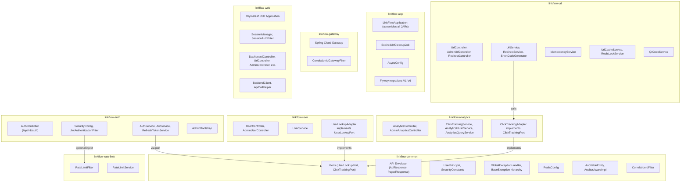

# LinkFlow — Technical Due Diligence Report

**Date:** 2026-06-22  
**Scope:** Full codebase analysis of `SlayerBit/linkflow`  
**Source of truth:** Code, not documentation  

---

## STAGE 1 — SYSTEM RECONSTRUCTION

### What the Product Actually Is

LinkFlow is a **multi-user URL shortening platform** built as a modular monolith in Java 21 / Spring Boot 3.4.1. It allows authenticated users to create shortened URLs, track click analytics, and manage links through both a REST API and a Thymeleaf-rendered web UI.

Three Spring Boot processes compose the system:
- **linkflow-app** (port 8081): the core backend monolith with all business logic
- **linkflow-gateway** (port 8080): a Spring Cloud Gateway routing proxy
- **linkflow-web** (port 8082): a Thymeleaf SSR frontend that talks to the backend via the gateway

Infrastructure: Cloud PostgreSQL (Neon), Redis 7, Prometheus + Grafana.

### Complete Capability Inventory

| # | Capability | Classification | Evidence |
|---|-----------|---------------|----------|
| 1 | User registration (email/password) | **FULLY IMPLEMENTED** | [AuthService.register](file:///Users/slayer/linkflow/linkflow-auth/src/main/java/com/linkflow/auth/application/service/AuthService.java#L34-L61), [AuthController](file:///Users/slayer/linkflow/linkflow-auth/src/main/java/com/linkflow/auth/api/controller/AuthController.java#L24-L30), web UI register form |
| 2 | JWT login with access + refresh tokens | **FULLY IMPLEMENTED** | [AuthService.login](file:///Users/slayer/linkflow/linkflow-auth/src/main/java/com/linkflow/auth/application/service/AuthService.java#L63-L89), rotating refresh tokens with SHA-256 hashing |
| 3 | Token refresh with rotation | **FULLY IMPLEMENTED** | [RefreshTokenService.rotateRefreshToken](file:///Users/slayer/linkflow/linkflow-auth/src/main/java/com/linkflow/auth/application/service/RefreshTokenService.java#L58-L98), revoke-all on reuse detection |
| 4 | Logout (refresh token revocation) | **FULLY IMPLEMENTED** | [AuthService.logout](file:///Users/slayer/linkflow/linkflow-auth/src/main/java/com/linkflow/auth/application/service/AuthService.java#L117-L121) |
| 5 | Short URL creation (single) | **FULLY IMPLEMENTED** | [UrlService.createUrl](file:///Users/slayer/linkflow/linkflow-url/src/main/java/com/linkflow/url/application/service/UrlService.java#L50-L72), custom aliases, expiry |
| 6 | Short URL creation (bulk) | **FULLY IMPLEMENTED** | [UrlService.bulkCreateUrls](file:///Users/slayer/linkflow/linkflow-url/src/main/java/com/linkflow/url/application/service/UrlService.java#L74-L98), idempotency required |
| 7 | Public redirect (`/r/{shortCode}`) | **FULLY IMPLEMENTED** | [RedirectController](file:///Users/slayer/linkflow/linkflow-url/src/main/java/com/linkflow/url/api/controller/RedirectController.java), cache-aside + stampede protection |
| 8 | Redis URL cache with SWR | **FULLY IMPLEMENTED** | [UrlCacheService](file:///Users/slayer/linkflow/linkflow-url/src/main/java/com/linkflow/url/infrastructure/cache/UrlCacheService.java), TTL jitter, negative caching, stale-while-revalidate |
| 9 | Idempotent URL creation | **FULLY IMPLEMENTED** | [IdempotencyService](file:///Users/slayer/linkflow/linkflow-url/src/main/java/com/linkflow/url/application/service/IdempotencyService.java), DB-backed with 24h expiry |
| 10 | QR code generation | **FULLY IMPLEMENTED** | [QrCodeService](file:///Users/slayer/linkflow/linkflow-url/src/main/java/com/linkflow/url/application/service/QrCodeService.java), Caffeine-cached |
| 11 | Per-user and per-IP rate limiting | **FULLY IMPLEMENTED** | [RateLimitService](file:///Users/slayer/linkflow/linkflow-rate-limit/src/main/java/com/linkflow/ratelimit/application/service/RateLimitService.java), Lua sliding-window, fail-open/fail-closed semantics |
| 12 | Async click tracking (Redis → PostgreSQL) | **FULLY IMPLEMENTED** | [ClickTrackingService](file:///Users/slayer/linkflow/linkflow-analytics/src/main/java/com/linkflow/analytics/application/service/ClickTrackingService.java) buffers to Redis Stream, [AnalyticsFlushService](file:///Users/slayer/linkflow/linkflow-analytics/src/main/java/com/linkflow/analytics/application/service/AnalyticsFlushService.java) flushes |
| 13 | Per-URL analytics (total clicks, last accessed) | **FULLY IMPLEMENTED** | [AnalyticsQueryService.getUrlAnalytics](file:///Users/slayer/linkflow/linkflow-analytics/src/main/java/com/linkflow/analytics/application/service/AnalyticsQueryService.java#L36-L61) |
| 14 | Click trends (7d/30d/90d) | **FULLY IMPLEMENTED** | [ClickEventRepository.findClickTrendByUrl](file:///Users/slayer/linkflow/linkflow-analytics/src/main/java/com/linkflow/analytics/domain/repository/ClickEventRepository.java#L21-L28), native query aggregation |
| 15 | Recent click activity feeds (user + admin) | **FULLY IMPLEMENTED** | Projections with IP masking for users, raw for admins |
| 16 | Top URLs by clicks (user + admin) | **FULLY IMPLEMENTED** | [UrlAnalyticsRepository.findTopByOwnerId](file:///Users/slayer/linkflow/linkflow-analytics/src/main/java/com/linkflow/analytics/domain/repository/UrlAnalyticsRepository.java#L19-L27) |
| 17 | System-wide statistics | **FULLY IMPLEMENTED** | [StatsRepository](file:///Users/slayer/linkflow/linkflow-analytics/src/main/java/com/linkflow/analytics/domain/repository/StatsRepository.java), 7 aggregate queries |
| 18 | Admin user management (list/disable/enable/delete) | **FULLY IMPLEMENTED** | [AdminUserController](file:///Users/slayer/linkflow/linkflow-user/src/main/java/com/linkflow/user/api/controller/AdminUserController.java), soft-delete |
| 19 | Admin URL management (list/deactivate/reactivate) | **FULLY IMPLEMENTED** | [AdminUrlController](file:///Users/slayer/linkflow/linkflow-url/src/main/java/com/linkflow/url/api/controller/AdminUrlController.java) |
| 20 | Admin analytics dashboard | **FULLY IMPLEMENTED** | [AdminAnalyticsController](file:///Users/slayer/linkflow/linkflow-analytics/src/main/java/com/linkflow/analytics/api/controller/AdminAnalyticsController.java), system trends + top URLs |
| 21 | Bootstrap admin user | **FULLY IMPLEMENTED** | [AdminBootstrap](file:///Users/slayer/linkflow/linkflow-auth/src/main/java/com/linkflow/auth/bootstrap/AdminBootstrap.java), idempotent, env-var driven |
| 22 | Scheduled expired URL cleanup | **FULLY IMPLEMENTED** | [ExpiredUrlCleanupJob](file:///Users/slayer/linkflow/linkflow-app/src/main/java/com/linkflow/app/scheduler/ExpiredUrlCleanupJob.java), hourly cron |
| 23 | Correlation ID propagation | **FULLY IMPLEMENTED** | [CorrelationIdGatewayFilter](file:///Users/slayer/linkflow/linkflow-gateway/src/main/java/com/linkflow/gateway/filter/CorrelationIdGatewayFilter.java) + [CorrelationIdFilter](file:///Users/slayer/linkflow/linkflow-common/src/main/java/com/linkflow/common/filter/CorrelationIdFilter.java) |
| 24 | Observability (health, metrics) | **FULLY IMPLEMENTED** | [RedisHealthIndicator](file:///Users/slayer/linkflow/linkflow-observability/src/main/java/com/linkflow/observability/health/RedisHealthIndicator.java), Micrometer, Prometheus/Grafana |
| 25 | Web UI (Thymeleaf SSR) | **FULLY IMPLEMENTED** | Separate Spring Boot app with dashboard, URL CRUD, analytics pages, admin panels |
| 26 | Distributed alias lock | **FULLY IMPLEMENTED** | [RedisLockService](file:///Users/slayer/linkflow/linkflow-url/src/main/java/com/linkflow/url/infrastructure/lock/RedisLockService.java), Lua compare-and-delete |
| 27 | Sensitive data masking in logs | **FULLY IMPLEMENTED** | [SensitiveDataMaskingConverter](file:///Users/slayer/linkflow/linkflow-common/src/main/java/com/linkflow/common/logging/SensitiveDataMaskingConverter.java) |
| 28 | User profile management | **PARTIALLY IMPLEMENTED** | [UserService.updateCurrentUser](file:///Users/slayer/linkflow/linkflow-user/src/main/java/com/linkflow/user/application/service/UserService.java#L37-L48) — only first/last name, no email change, no password change |
| 29 | CORS configuration | **BACKEND ONLY** | `linkflow.cors.allowed-origins` is defined in [application.yml](file:///Users/slayer/linkflow/linkflow-app/src/main/resources/application.yml#L32), but no `CorsConfigurationSource` bean or `WebMvcConfigurer` was found applying it to the security filter chain |
| 30 | Admin URL hard delete | **PLANNED BUT ABSENT** | Admin can only deactivate/reactivate; `AdminUrlController` has no `@DeleteMapping`. Soft-delete exists for regular users. |
| 31 | Password change / reset | **PLANNED BUT ABSENT** | No endpoint for password change or forgot-password flow |
| 32 | Email verification | **PLANNED BUT ABSENT** | No email verification on registration; accounts are immediately active |
| 33 | API key authentication | **PLANNED BUT ABSENT** | No API key mechanism; only JWT bearer tokens |
| 34 | Expired refresh token cleanup | **PLANNED BUT ABSENT** | `refresh_tokens` table grows indefinitely; no scheduled job cleans up expired/revoked tokens |
| 35 | Click event archival/purging | **PLANNED BUT ABSENT** | `click_events` table grows unbounded; no retention policy |

---

## STAGE 2 — SYSTEM UNDERSTANDING

### Module Boundaries & Package Ownership



### Request Lifecycle

**API Request (authenticated):**
1. Browser/Client → **Gateway** (port 8080) — `CorrelationIdGatewayFilter` adds `X-Correlation-ID`
2. Gateway routes `/api/**` → **linkflow-app** (port 8081)
3. `CorrelationIdFilter` (servlet filter) reads header into `CorrelationIdContext` (ThreadLocal)
4. `JwtAuthenticationFilter` extracts Bearer token, validates JWT, populates `SecurityContext` with `UserPrincipal`
5. `RateLimitFilter` (after JWT filter) checks per-user or per-IP rate limit via Redis Lua script
6. Spring Security `authorizeHttpRequests` enforces path-based and role-based access
7. Controller → Service → Repository → PostgreSQL/Redis
8. `GlobalExceptionHandler` catches all exceptions, returns structured `ApiErrorResponse`

**Redirect Request (public):**
1. Browser → Gateway → `RedirectController.redirect()`
2. `RedirectService.resolveRedirect()` — cache check → SWR → stampede protection → DB fallback
3. `ClickTrackingPort.trackClick()` — async, fire-and-forget
4. Returns `302 Found` with `Location` header

**Web UI Request:**
1. Browser → Gateway (via `/**` route) → **linkflow-web** (port 8082)
2. `SessionAuthFilter` reads `AuthState` from `HttpSession`, sets Spring Security context
3. Controller uses `ApiCallHelper.withTokenRefresh()` to call backend via Gateway
4. If access token expired (401), helper transparently refreshes using stored refresh token
5. Renders Thymeleaf template

### Authentication Lifecycle

1. **Registration:** Email/password → BCrypt(12) hash → User + roles persisted → `RegisterResponse` (no tokens)
2. **Login:** Email/password → BCrypt verify → JWT access token (HMAC-SHA512, 15m) + opaque refresh token (SHA-256 hashed, 30d) → `TokenResponse`
3. **Token Refresh:** Raw refresh token → hash → DB lookup → revoke old → create new → new access token + new refresh token (rotation)
4. **Logout:** Raw refresh token → hash → mark revoked in DB
5. **Reuse Detection:** If revoked token is presented during rotation, **all** user tokens are revoked (security measure)

### Authorization Lifecycle

- Path-based: `/api/v1/auth/**`, `/r/**` are `permitAll()`
- Role-based: `/api/v1/admin/**` requires `ROLE_ADMIN` (both path-matcher and `@PreAuthorize`)
- Ownership: Service-layer checks (`findOwnedUrl`, `assertUrlOwner`) enforce URL ownership for CRUD and analytics
- JWT claims carry roles; no DB lookup on each request (stateless)

### Cache Lifecycle (Redis)

| Cache | Key Pattern | TTL | Strategy |
|-------|-------------|-----|----------|
| URL redirect | `url:shortcode:{code}` | 30m (15m fresh + 15m stale SWR), ±20% jitter | Cache-aside, SWR, negative caching (90s), stampede lock |
| Rate limit | `rate_limit:user:{id}` / `rate_limit:ip:{ip}` | 60s (sliding window) | Lua sorted-set sliding window |
| Alias lock | `lock:alias:{code}` | 10s | SET NX EX + Lua compare-and-delete |
| Cache refresh lock | `lock:cache_refresh:{code}` | 5s | Same pattern as alias lock |
| Analytics buffer | `analytics:clicks:stream` | Unbounded (drained every 30s) | Redis Stream + consumer group |
| Analytics counter | `analytics:counter:{id}` | Unbounded (flushed every 30s) | Redis Hash, increment/decrement pattern |
| Analytics active set | `analytics:active_urls` | Unbounded | Redis Set tracking active counters |
| QR code | In-memory Caffeine | 1h, max 1000 entries | Per-JVM local cache |

### Deployment Assumptions

1. **Cloud PostgreSQL (Neon):** Database is external, not containerized. Connection uses SSL (`sslmode=require&channelBinding=require`).
2. **Single Redis instance:** No Redis Sentinel or Cluster. All modules share one Redis.
3. **Three-process deployment:** Gateway, App, Web run as separate Spring Boot JARs.
4. **Docker Compose for full stack:** Includes Prometheus + Grafana for observability.
5. **No Kubernetes manifests:** Only mentioned in docs, not present.

---

## STAGE 3 — ARCHITECTURAL INTERROGATION

### Decision 1: Modular Monolith with Port Interfaces

**Why made:** Avoids microservice overhead while maintaining module boundaries. Cross-module calls use `UserLookupPort` and `ClickTrackingPort` in `linkflow-common`.

**Benefits:** Clean compile-time boundaries, single deployment unit, no network calls between modules.

**Tradeoffs:** All modules share the same database, same Redis, same transaction manager. Module boundaries are enforced by convention (Maven module dependencies), not runtime isolation.

**Future constraints:** Extracting a module to a separate service requires replacing in-process port calls with REST/gRPC/messaging — moderate effort.

**Verdict:** ✅ A strong senior engineer would approve. This is the right level of abstraction for a team of 1–3 engineers.

### Decision 2: JWT with HMAC-SHA512 (Symmetric Key)

**Why made:** Simpler than RSA/EC key pairs. Single secret shared between processes.

**Benefits:** Fast, simple, no key distribution problem for monolith.

**Tradeoffs:** All processes that validate tokens must have the same secret. No token issuer verification. Cannot revoke individual access tokens before expiry.

**Future constraints:** If gateway needs to validate tokens independently, it needs the secret. Migrating to asymmetric keys (for zero-trust or multi-service) requires a breaking change.

**Verdict:** ✅ Acceptable for current scale. Would request RSA migration be planned for multi-team scenarios.

### Decision 3: Separate Web UI as Independent Spring Boot App

**Why made:** Decouples frontend rendering from backend API. Web UI stores JWT in server-side `HttpSession`, avoiding XSS exposure.

**Benefits:** Clear BFF (Backend-for-Frontend) pattern. Tokens never exposed to browser JavaScript. Can be scaled independently.

**Tradeoffs:** Every page load makes 2–5 REST calls to the backend via the gateway — increased latency. Session state is in-memory (not Redis-backed).

**Future constraints:** In-memory sessions make horizontal scaling of `linkflow-web` impossible without session replication or sticky sessions.

> [!WARNING]
> **DISTRIBUTED SYSTEM BLOCKER:** `linkflow-web` uses default Tomcat in-memory `HttpSession`. Behind a load balancer, user sessions will be lost on failover. This must be addressed before scaling.

### Decision 4: Redis as Multi-Purpose Infrastructure

**Why made:** Single Redis handles caching, rate limiting, distributed locks, and analytics buffering.

**Benefits:** Operational simplicity — one dependency to manage.

**Tradeoffs:** No isolation between concerns. A Redis failure affects caching, rate limiting, and analytics simultaneously. Redis memory pressure from analytics streams can degrade cache performance.

**Future constraints:** Cannot tune Redis configuration (maxmemory-policy, persistence) differently per concern.

**Verdict:** ⚠️ Acceptable today. Would request a documented plan for Redis separation or at minimum keyspace monitoring.

### Decision 5: Analytics Flush via Redis Stream + Counters

**Why made:** Decouple write-hot click tracking from PostgreSQL. Buffer in Redis, flush periodically.

**Benefits:** Redirect latency is insulated from DB write performance. Redis handles burst traffic well.

**Tradeoffs:** At-most-once delivery for click events (acknowledged before DB write). Counter flush has a read-decrement-write pattern that is not fully atomic across Redis and PostgreSQL.

**Verdict:** ⚠️ The tradeoff of occasional lost clicks is reasonable for analytics, but the counter flush logic has a subtle correctness issue (see Stage 4).

### Architectural Issues Found

| Issue | Type | Location |
|-------|------|----------|
| `StatsRepository` queries `users` and `short_urls` tables directly from the analytics module | **Boundary violation** | [StatsRepository](file:///Users/slayer/linkflow/linkflow-analytics/src/main/java/com/linkflow/analytics/domain/repository/StatsRepository.java) |
| `UrlAnalyticsRepository` queries `short_urls` for `findOwnerIdByShortUrlId` and `findShortCodeByShortUrlId` | **Boundary violation** | [UrlAnalyticsRepository](file:///Users/slayer/linkflow/linkflow-analytics/src/main/java/com/linkflow/analytics/domain/repository/UrlAnalyticsRepository.java#L39-L51) |
| `RedirectService.triggerAsyncRefresh()` is `@Async` but calls it on `this`, which bypasses the proxy | **Spring proxy bypass** | [RedirectService.java:170](file:///Users/slayer/linkflow/linkflow-url/src/main/java/com/linkflow/url/application/service/RedirectService.java#L170) |
| CORS `allowed-origins: *` is configured but never wired into Spring Security's CORS support | **Dead configuration** | [application.yml:32](file:///Users/slayer/linkflow/linkflow-app/src/main/resources/application.yml#L32) |

---

## STAGE 4 — DISTRIBUTED READINESS

Assume tomorrow: 2 instances of `linkflow-app`, 2 instances of `linkflow-web`, behind a load balancer.

### What Remains Correct ✅

- **JWT authentication:** Stateless, works across instances with shared secret.
- **Redis rate limiting:** Shared Redis, sliding-window Lua script is atomic.
- **Redis URL cache:** Shared Redis, SWR and stampede protection work correctly.
- **Redis distributed locks:** Atomic SET NX + Lua unlock work across instances.
- **Analytics buffering:** Redis Stream consumer group supports multiple consumers — each instance gets different messages.

### What Becomes Dangerous ⚠️

#### 1. `linkflow-web` In-Memory Sessions — **DISTRIBUTED SYSTEM BLOCKER**

**Severity:** CRITICAL  
**Execution sequence:**
1. User logs in via web UI on Instance A. Session with JWT is stored in Instance A's memory.
2. Load balancer routes next request to Instance B.
3. Instance B has no session → `SessionAuthFilter` finds no `AuthState` → redirect to login.
4. User appears logged out. Every other request fails.

**Impact:** Complete web UI unusability behind a load balancer.  
**Fix:** Configure Spring Session with Redis: `spring-session-data-redis`.

#### 2. `ExpiredUrlCleanupJob` Runs on Every Instance — **DANGEROUS**

**Severity:** HIGH  
**Execution sequence:**
1. Cron `0 0 * * * *` fires simultaneously on both instances.
2. Both instances call `shortUrlRepository.findExpiredActive(Instant.now())`.
3. Both load the same expired URLs. Both call `saveAll()` — duplicate writes, wasted DB load.
4. Cache evictions fire twice per URL.

**Impact:** Wasted resources, potential DB contention. Not data-corrupting but wasteful.  
**Fix:** Use `ShedLock` or a distributed lock around the scheduled job.

#### 3. `AnalyticsFlushService` Counter Flush Race Condition — **DANGEROUS**

**Severity:** HIGH  
**Execution sequence:**
1. Instance A reads counter for URL X: value = 50.
2. Instance B reads counter for URL X: value = 50 (same value, before A decrements).
3. Instance A decrements by 50, DB += 50. Counter now = 0 + any new clicks.
4. Instance B decrements by 50, DB += 50. Counter now = -50 + any new clicks.
5. Result: **50 clicks double-counted** in PostgreSQL.

The `flushCounters()` method is annotated `@Transactional` and iterates over a shared Redis set. The read-then-decrement pattern (`GET` then `INCREMENT -count`) is not atomic across two JVMs.

**Impact:** Analytics totals become inflated over time.  
**Fix:** Either (a) use a single-leader pattern (ShedLock), (b) use Redis `GETDEL` atomically, or (c) use a Lua script that atomically reads-and-zeros the counter.

#### 4. `AnalyticsFlushService.initConsumerGroup` Called by Both Instances

**Severity:** LOW  
**Execution sequence:** Both instances call `XGROUP CREATE` on startup. The second gets `BUSYGROUP` — handled correctly in catch block. Not dangerous.

#### 5. `QrCodeService` In-Memory Caffeine Cache

**Severity:** LOW  
**Execution sequence:** Different instances have different Caffeine caches. After a URL update:
1. Instance A evicts its local cache.
2. Instance B still serves the old QR code from its local cache (up to 1 hour).

**Impact:** Stale QR codes for up to 1 hour after URL changes. Acceptable for QR codes since the shortcode → URL mapping is what matters.

### What Becomes Impossible ❌

- **Web UI session persistence across instances** (without Redis session store)
- **Guaranteed exactly-once analytics counter flush** (without distributed coordination)

---

## STAGE 5 — FRONTEND/BACKEND REALITY CHECK

| Feature | Backend API | Web UI | User Reachable | Operational |
|---------|:-----------:|:------:|:--------------:|:-----------:|
| Register | ✅ | ✅ | ✅ | ✅ |
| Login | ✅ | ✅ | ✅ | ✅ |
| Logout | ✅ | ✅ | ✅ | ✅ |
| Token Refresh | ✅ | ✅ (transparent) | ✅ | ✅ |
| Create URL (single) | ✅ | ✅ | ✅ | ✅ |
| Create URL (bulk) | ✅ | ❌ | ❌ **API-only** | ✅ |
| List user URLs | ✅ | ✅ | ✅ | ✅ |
| URL detail | ✅ | ✅ | ✅ | ✅ |
| Update URL | ✅ | ✅ | ✅ | ✅ |
| Delete URL | ✅ | ✅ | ✅ | ✅ |
| Reactivate URL | ✅ | ✅ | ✅ | ✅ |
| QR Code | ✅ | ✅ (via proxy) | ✅ | ✅ |
| URL Analytics | ✅ | ✅ | ✅ | ✅ |
| Click Trends | ✅ | ✅ (7d/30d/90d) | ✅ | ✅ |
| Top URLs | ✅ | ✅ | ✅ | ✅ |
| Recent Clicks | ✅ | ✅ | ✅ | ✅ |
| User Profile View | ✅ | ✅ | ✅ | ✅ |
| User Profile Update | ✅ | ✅ | ✅ | ✅ |
| Password Change | ❌ | ❌ | ❌ | ❌ **PRODUCT GAP** |
| Email Change | ❌ | ❌ | ❌ | ❌ **PRODUCT GAP** |
| Admin: List Users | ✅ | ✅ | ✅ | ✅ |
| Admin: User Detail | ✅ | ✅ | ✅ | ✅ |
| Admin: Disable/Enable User | ✅ | ✅ | ✅ | ✅ |
| Admin: Delete User | ✅ | ❌ | ❌ **FRONTEND/BACKEND MISMATCH** | ⚠️ |
| Admin: List URLs | ✅ | ✅ | ✅ | ✅ |
| Admin: Deactivate/Reactivate URL | ✅ | ✅ | ✅ | ✅ |
| Admin: URL Analytics | ✅ | ❌ | ❌ **FRONTEND/BACKEND MISMATCH** | ⚠️ |
| Admin: System Stats | ✅ | ✅ | ✅ | ✅ |
| Admin: System Health | N/A (actuator) | ✅ | ✅ | ✅ |
| Admin: System Click Trend | ✅ | ✅ | ✅ | ✅ |
| Admin: Recent Platform Clicks | ✅ | ✅ | ✅ | ✅ |
| Public Redirect | ✅ | N/A | ✅ | ✅ |
| Swagger UI | ✅ | N/A | ✅ (dev) | ✅ |

**Key gaps:**
- **Bulk URL creation** exists in the API but has no web UI form — `PRODUCT GAP`
- **Admin user delete** has a backend endpoint but no web UI trigger — `FRONTEND/BACKEND MISMATCH`  
- **Admin per-URL analytics** has backend endpoints (`/api/v1/admin/analytics/urls/{id}/clicks`, `/api/v1/admin/analytics/urls/{id}/click-trend`) but no dedicated admin web page — `FRONTEND/BACKEND MISMATCH`
- **Password/email change** is absent everywhere — `PRODUCT GAP`

---

## STAGE 6 — AMBIGUITY HUNT

### Ambiguity 1: What Happens After URL Expiry? — **AMBIGUOUS BEHAVIOR**

**Current behavior:** Expired URLs return `UrlExpiredException` (HTTP 410 Gone) during redirect. The `ExpiredUrlCleanupJob` hourly marks expired URLs as `active=false`. But:

- Between expiry instant and the next hourly job, the URL is still `active=true` in the database. Redirect works correctly because `validateRedirectable()` checks `expiresAt` at request time.
- The cache entry can be stale. If a URL expires while its cache entry is in the SWR window, the stale entry will be served **but** `validateRedirectable` catches the expiry before returning.
- **Can an expired URL be reactivated?** Yes — if an admin calls reactivate, the code throws `InvalidUrlException("Cannot reactivate an expired URL")`. But: the owner can call `PATCH /{id}` with a new `expiresAt` in the future, then reactivate. This is a two-step process that works but is not documented.

**Risk:** A user may interpret "active=false after expiry" as "permanently gone" when it's actually recoverable by changing the expiry date first.

**Recommendation:** Formalize the URL lifecycle states in documentation: Active → Expired → Re-extendable vs. Deleted (permanent soft-delete).

### Ambiguity 2: Can Short Codes Be Reused After Deletion? — **AMBIGUOUS BEHAVIOR**

**Current behavior:** `softDelete()` sets `deleted=true` but does NOT release the `short_code` unique constraint. The short code remains in the `short_urls` table. `existsByShortCode()` checks across ALL rows (including deleted ones).

**Implication:** Deleted short codes can **never** be reused. If a user deletes a custom alias like `my-brand`, nobody can ever claim it again.

**Alternative interpretation:** Some engineers would expect deletion to free the namespace.

**Risk:** Over time, the short code namespace becomes polluted with dead entries. Custom alias collisions increase.

**Recommendation:** Document this as intentional (prevents link resurrection attacks where a deleted link is reclaimed by a malicious user) or implement a hard-delete with a cooldown period.

### Ambiguity 3: What Defines "Disabled" for a User? — **AMBIGUOUS BEHAVIOR**

**Current behavior:** `user.setEnabled(false)` prevents login (checked in `AuthService.login` and `AuthService.refresh`). But:
- Existing valid JWT access tokens remain valid until they expire (up to 15 minutes).
- The user's URLs remain active and redirectable.
- There is no mechanism to revoke all refresh tokens when a user is disabled.

**Risk:** A disabled user can continue making API calls for up to 15 minutes with their existing access token.

**Recommendation:** On user disable, also call `refreshTokenRepository.revokeAllByUserId()`. Consider adding a token blacklist for immediate access token revocation.

### Ambiguity 4: What Happens When the Idempotency Key Exists But For a Different Request Body? — **AMBIGUOUS BEHAVIOR**

**Current behavior:** [IdempotencyService.findCached](file:///Users/slayer/linkflow/linkflow-url/src/main/java/com/linkflow/url/application/service/IdempotencyService.java#L27-L34) matches on `(userId, endpoint, idempotencyKey)` only. The request body is not part of the match.

**Implication:** If a client reuses an idempotency key with a **different** URL, they get back the response from the first request. This violates the principle that idempotency keys should be scoped to identical requests.

**Risk:** Silent data integrity issue. Client thinks they created URL B but receives metadata for URL A.

**Recommendation:** Store a hash of the request body alongside the idempotency record. Return 409 Conflict if the key matches but the request hash differs.

### Ambiguity 5: Rate Limiting Identity Resolution — **AMBIGUOUS BEHAVIOR**

**Current behavior in `RateLimitFilter`:** If `SecurityContext` has a `UserPrincipal`, rate limit by user ID. Otherwise, rate limit by IP.

**Issue:** Authenticated users on redirect paths (`/r/**`) are not authenticated (paths are `permitAll()`). So redirect traffic is **always** rate-limited by IP, even for authenticated users whose browser follows the redirect.

But more critically: the `X-Forwarded-For` header is trusted blindly. An attacker behind the gateway can spoof this header.

**Risk:** Rate limit bypass by IP spoofing via `X-Forwarded-For`.

**Recommendation:** Only trust `X-Forwarded-For` from the gateway. Configure `server.forward-headers-strategy=framework` and use Spring's `ForwardedHeaderFilter` for trusted proxy validation.

---

## STAGE 7 — FAILURE SIMULATION

### Simulation 1: Concurrent Custom Alias Creation

**Scenario:** Two users simultaneously create URLs with the same custom alias `my-link`.

**Execution:**
1. User A's request hits `resolveShortCode("my-link")`. Acquires Redis lock `lock:alias:my-link` with value A.
2. User B's request hits `resolveShortCode("my-link")`. Fails to acquire lock → throws `AliasCollisionException`. ✅ Correct.
3. User A's request checks `existsByShortCode("my-link")` → false. Returns "my-link".
4. User A's `shortUrlRepository.save()` succeeds. Lock released.

**Verdict:** ✅ **Correct.** Redis lock prevents the race. If Redis is down, `tryLock` returns false → collision exception (fail-safe).

### Simulation 2: Redis Failure During Redirect

**Scenario:** Redis goes down while serving redirect requests.

**Execution:**
1. `urlCacheService.get()` catches Redis exception → returns `Optional.empty()` (cache miss).
2. `resolveFromDbWithStampedeProtection()` calls `redisLockService.tryLock()` → returns false (Redis down).
3. Enters stampede retry loop. `urlCacheService.get()` fails 3 more times → all return empty.
4. Falls through to `fetchFromDbAndCache()` → DB query succeeds.
5. `urlCacheService.put()` fails silently (Redis down).
6. Click tracking: `bufferToRedis()` fails → falls back to `directDbWrite()`.

**Verdict:** ✅ **Correct but degraded.** Every redirect hits PostgreSQL. If traffic is high, DB becomes overwhelmed.

### Simulation 3: Partial Analytics Flush (DB Failure Mid-Flush)

**Scenario:** During `flushClickEvents()`, the DB fails after `clickEventRepository.saveAll()` but before `acknowledge()`.

**Execution:**
1. `saveAll(events)` succeeds — events written to PostgreSQL.
2. DB connection drops or app crashes.
3. Next flush cycle: the same events are read again (not yet acknowledged).
4. `saveAll()` inserts duplicate click events (UUIDs are generated fresh by Hibernate).

**Verdict:** ⚠️ **At-most-once is claimed but actually at-least-once for events.** Click events may be duplicated after a crash. The `click_events` table has no deduplication constraint.

**Impact:** Inflated click counts in `click_events`. The `url_analytics.total_clicks` counter (flushed separately) may or may not match.

### Simulation 4: Refresh Token Reuse Attack

**Scenario:** An attacker steals a refresh token that has already been rotated.

**Execution:**
1. Legitimate user refreshes token → old token marked revoked, new token created.
2. Attacker presents the old (revoked) token to `/api/v1/auth/refresh`.
3. `rotateRefreshToken()` finds the token, checks `isRevoked()` → true.
4. Calls `revokeAllByUserId()` → all tokens for this user are revoked.
5. Throws `TokenRevokedException`.
6. Legitimate user's new token is now also revoked → forced re-login.

**Verdict:** ✅ **Correct and secure.** This is the recommended refresh token rotation pattern (RFC 6749 Section 10.4). Token reuse triggers full revocation.

### Simulation 5: `linkflow-web` Session Timeout

**Scenario:** User has been idle for 30 minutes (session timeout).

**Execution:**
1. Session expires (configured in [application.yml](file:///Users/slayer/linkflow/linkflow-web/src/main/resources/application.yml#L5) `timeout: 30m`).
2. Next request: `SessionAuthFilter` gets `null` session → no authentication set.
3. Spring Security `LoginUrlAuthenticationEntryPoint` redirects to `/login`.
4. Backend refresh token may still be valid (30 day TTL), but the raw token is lost with the session.

**Verdict:** ⚠️ **Functional but lossy.** The web session timeout (30m) is much shorter than the refresh token TTL (30 days). When the session expires, the refresh token is silently lost. The user must fully re-authenticate.

---

## STAGE 8 — EVOLUTION AUDIT

| Future Requirement | Difficulty | Constraint Source |
|-------------------|:----------:|-------------------|
| **Organizations/Teams** | 🔴 Hard | `ownerId` is a single UUID on `short_urls`. No organization table. All ownership queries are single-user. Requires schema migration + service changes. |
| **Shared URL Ownership** | 🔴 Hard | Same as above. No `url_permissions` or `url_shares` table. |
| **API Keys** | 🟡 Medium | `JwtAuthenticationFilter` only handles Bearer JWT. Need new filter for API key auth. Schema needs `api_keys` table. Moderate refactor. |
| **Billing** | 🟡 Medium | No concept of plans, quotas, or usage tracking per billing period. Would need new module. URL count per user exists, click counts exist — good foundation. |
| **Advanced Analytics (geo, device, UTM)** | 🟢 Easy | `click_events` stores IP and user-agent. GeoIP lookup can be added to `ClickTrackingService`. Schema supports adding columns. |
| **Public/Shared Dashboards** | 🟡 Medium | All analytics queries require authentication and ownership check. Would need new public query paths. No public share token mechanism. |
| **Bulk Operations (import/export)** | 🟡 Medium | Bulk create exists. No export. Would need async job infrastructure (none exists beyond `@Async` for click tracking). |
| **Role Hierarchies** | 🟡 Medium | Current system has flat roles (`USER`, `ADMIN`). `user_roles` is a join table — extensible. But `SecurityConfig` hardcodes `hasRole('ADMIN')`. |
| **Audit Logs** | 🟢 Easy | `AuditableEntity` provides `createdAt`, `updatedAt`, `createdBy`, `updatedBy`. For a full audit log (who did what when), would need a separate `audit_events` table. |
| **Third-Party Integrations (webhooks)** | 🟡 Medium | No event system. Would need to add application events at service layer. |
| **Search** | 🟡 Medium | No full-text search. Current URL listing is paginated with sort. Would need PostgreSQL `tsvector` or Elasticsearch. |
| **Historical Reporting** | 🟢 Easy | `click_events` has `clicked_at` with index. Click trend queries already support arbitrary date ranges. |

> [!IMPORTANT]
> **FUTURE ARCHITECTURAL RISK:** The single-user ownership model (`ownerId UUID` on `short_urls`) is the largest structural constraint. Any team/org feature requires a fundamental schema change affecting every query in `ShortUrlRepository`, `UrlAnalyticsRepository`, and the analytics ownership checks.

---

## STAGE 9 — SECURITY REVIEW

### 🔴 SECURITY RISK: Committed Credentials in `.env`

**Location:** [.env](file:///Users/slayer/linkflow/.env)  
**Evidence:** Production Neon database password `npg_0pOVo2mrQfAC`, JWT secret, and admin bootstrap password are committed to the repository.

```
SPRING_DATASOURCE_PASSWORD=npg_0pOVo2mrQfAC
LINKFLOW_JWT_SECRET=QWJjZGVmZ2hpamtsbW5vcHFyc3R1dnd4eXoxMjM0NTY3ODkwQUJDREVGR0g=
LINKFLOW_BOOTSTRAP_ADMIN_PASSWORD=ChangeMe123!
```

**Impact:** Anyone with repository access has full database access and can forge JWT tokens.  
**Severity:** CRITICAL  
**Action:** Immediately rotate all credentials. Add `.env` to `.gitignore`. Use a secrets manager.

### 🔴 SECURITY RISK: JWT Secret is Weak

The committed JWT secret decodes to `Abcdefghijklmnopqrstuvwxyz1234567890ABCDEFGH` — a trivially guessable string. `JwtSecretValidator` only runs in `prod` profile and only checks length, not entropy.

**Impact:** Even after rotating, if a similarly weak secret is chosen, tokens can be forged.  
**Action:** Generate a cryptographically random 64-byte secret.

### 🟡 SECURITY RISK: No Access Token Revocation

When a user is disabled or deleted by an admin, their existing JWT access tokens remain valid for up to 15 minutes. There is no token blacklist or revocation mechanism.

**Impact:** Disabled users can continue operating for the token lifetime.  
**Action:** Implement a Redis-backed token blacklist checked in `JwtAuthenticationFilter`, or reduce access token TTL to 5 minutes.

### 🟡 SECURITY RISK: `X-Forwarded-For` Spoofing for Rate Limiting

[RateLimitFilter.resolveClientIp](file:///Users/slayer/linkflow/linkflow-rate-limit/src/main/java/com/linkflow/ratelimit/infrastructure/filter/RateLimitFilter.java#L96-L102) trusts `X-Forwarded-For` without validation. An attacker can bypass IP-based rate limiting by sending arbitrary values.

**Action:** Configure `server.forward-headers-strategy=framework` and ensure only the gateway is trusted.

### 🟡 SECURITY RISK: Admin Cannot Be Demoted or Self-Protected

No endpoint prevents an admin from disabling or deleting themselves or other admins. No "super admin" or self-protection check.

**Execution:** Admin A calls `DELETE /api/v1/admin/users/{admin-B-id}` — succeeds. If Admin A is the only admin and deletes themselves, the system has no admin.

**Action:** Add guard: admins cannot delete themselves. Consider requiring at least one active admin.

### 🟢 Positive Security Findings

- BCrypt strength 12 ✅
- Refresh tokens are SHA-256 hashed before storage ✅
- Refresh token rotation with reuse detection ✅
- CSRF disabled on API (stateless JWT) — correct ✅
- Web UI session cookies: `HttpOnly`, `SameSite=Strict` ✅
- Web UI CSRF enabled (except one endpoint) ✅
- Swagger/actuator locked down in prod profile ✅
- JPA `open-in-view: false` — prevents lazy-loading timing attacks ✅
- Ownership checks enforced at service layer (not just controller) ✅
- IP address masking in user-facing analytics ✅

---

## STAGE 10 — DATA & PERFORMANCE REVIEW

### Schema Analysis

**`click_events` — Growth Concern:**
- No partition strategy. Every click creates a row. At 1000 clicks/day, that's 365K rows/year. At 100K clicks/day, it's 36.5M rows/year.
- Index on `clicked_at` helps trend queries but full table scans for `findRecentClicksProjectionSystemWide` use `ORDER BY ce.clicked_at DESC LIMIT :limit` — this is index-friendly.
- **No retention policy.** Table grows indefinitely.

> [!WARNING]
> **SCALING BOTTLENECK:** `click_events` will become the largest table. Native queries with JOINs to `short_urls` will degrade as it grows past ~10M rows without partitioning.

**`refresh_tokens` — Unbounded Growth:**
- Every login creates a row. Every refresh creates two rows (old revoked + new). No cleanup job.
- At scale: millions of revoked/expired tokens accumulate.

> [!WARNING]
> **SCALING BOTTLENECK:** `refresh_tokens` needs a periodic cleanup job (e.g., delete where `revoked = true AND revoked_at < NOW() - INTERVAL '7 days'`).

**Index Coverage:**

| Query Pattern | Index | Coverage |
|--------------|-------|----------|
| `findByShortCode(code)` | `uq_short_urls_short_code` (unique) | ✅ Excellent |
| `existsByShortCode(code)` | Same unique constraint | ✅ |
| `findByOwnerIdAndNotDeleted(ownerId)` | `idx_short_urls_owner_id` | ✅ |
| `findExpiredActive(now)` | `idx_short_urls_expires_at` (partial: `deleted=false AND active=true`) | ✅ |
| `findByTokenHash(hash)` | `idx_refresh_tokens_token_hash` | ✅ |
| `findRecentClicksProjectionByOwnerId(ownerId)` | Needs composite index on `(owner_id, clicked_at)` via JOIN | ⚠️ Relies on nested loop join |
| `findClickTrendByUrl(shortUrlId, startDate)` | `idx_click_events_short_url_id` + `idx_click_events_clicked_at` | 🟡 Separate indexes; composite would be better |

**Missing Index:**
- `click_events` needs a composite index on `(short_url_id, clicked_at)` for efficient per-URL trend queries.

### Cache Interaction Correctness

The cache invalidation strategy is sound:
- `UrlService.updateUrl()`, `deleteUrl()`, `adminDeactivateUrl()`, `adminReactivateUrl()` all call `invalidateCaches(shortCode)`.
- `persistUrl()` evicts any negative cache entry after creation.
- SWR with async refresh handles stale entries gracefully.

**Gap:** When a user is disabled, their URLs remain active and cached. The cache does not check user status.

### Transaction Boundaries

- `UrlService.createUrl()` is `@Transactional` — the idempotency check, URL creation, and idempotency store all happen in one transaction. ✅
- `RedirectService.resolveRedirect()` is `@Transactional(readOnly = true)` — appropriate for read path. ✅
- `AnalyticsFlushService.flushClickEvents()` is NOT `@Transactional` — the `saveAll` + `acknowledge` are not atomic, leading to potential duplicate events (see Stage 7). ⚠️
- `AnalyticsFlushService.flushCounters()` IS `@Transactional` — but the transaction spans Redis reads and DB writes, which is semantically incorrect (Redis is not part of the JPA transaction). ⚠️

---

## STAGE 11 — TESTING REVIEW

### Test Inventory

| Test Class | Type | Coverage |
|-----------|------|----------|
| [AuthFlowIT](file:///Users/slayer/linkflow/linkflow-app/src/test/java/com/linkflow/app/AuthFlowIT.java) | Integration | Register, login, refresh, logout flow |
| [UrlFlowIT](file:///Users/slayer/linkflow/linkflow-app/src/test/java/com/linkflow/app/UrlFlowIT.java) | Integration | URL CRUD, redirect, idempotency |
| [AdminAuthorizationIT](file:///Users/slayer/linkflow/linkflow-app/src/test/java/com/linkflow/app/AdminAuthorizationIT.java) | Integration | Admin role enforcement |
| [AdminUserManagementIT](file:///Users/slayer/linkflow/linkflow-app/src/test/java/com/linkflow/app/AdminUserManagementIT.java) | Integration | Admin user CRUD |
| [AnalyticsAndCacheIT](file:///Users/slayer/linkflow/linkflow-app/src/test/java/com/linkflow/app/AnalyticsAndCacheIT.java) | Integration | Click tracking, cache behavior |
| [RateLimitIT](file:///Users/slayer/linkflow/linkflow-app/src/test/java/com/linkflow/app/RateLimitIT.java) | Integration | Rate limit enforcement |
| [AuthRateLimitRedisDownIT](file:///Users/slayer/linkflow/linkflow-app/src/test/java/com/linkflow/app/AuthRateLimitRedisDownIT.java) | Integration | Fail-closed behavior on auth paths |
| [ActuatorExposureIT](file:///Users/slayer/linkflow/linkflow-app/src/test/java/com/linkflow/app/ActuatorExposureIT.java) | Integration | Actuator endpoint exposure |
| [AuthServiceTest](file:///Users/slayer/linkflow/linkflow-auth/src/test/java/com/linkflow/auth/application/service/AuthServiceTest.java) | Unit | Auth service logic |
| [RefreshTokenServiceTest](file:///Users/slayer/linkflow/linkflow-auth/src/test/java/com/linkflow/auth/application/service/RefreshTokenServiceTest.java) | Unit | Token rotation, revocation |
| [RedirectServiceTest](file:///Users/slayer/linkflow/linkflow-url/src/test/java/com/linkflow/url/application/service/RedirectServiceTest.java) | Unit | Redirect resolution, cache behavior |
| [ShortCodeGeneratorTest](file:///Users/slayer/linkflow/linkflow-url/src/test/java/com/linkflow/url/application/service/ShortCodeGeneratorTest.java) | Unit | Code generation, collision retry |
| [UrlCacheServiceTest](file:///Users/slayer/linkflow/linkflow-url/src/test/java/com/linkflow/url/infrastructure/cache/UrlCacheServiceTest.java) | Unit | Cache SWR, jitter, negative caching |
| [IdempotencyServiceTest](file:///Users/slayer/linkflow/linkflow-url/src/test/java/com/linkflow/url/application/service/IdempotencyServiceTest.java) | Unit | Idempotency store/retrieve |
| [RateLimitServiceTest](file:///Users/slayer/linkflow/linkflow-rate-limit/src/test/java/com/linkflow/ratelimit/application/service/RateLimitServiceTest.java) | Unit | Rate limit logic |
| [Base62Test](file:///Users/slayer/linkflow/linkflow-common/src/test/java/com/linkflow/common/util/Base62Test.java) | Unit | Base62 encoding |
| [SensitiveDataMaskingConverterTest](file:///Users/slayer/linkflow/linkflow-common/src/test/java/com/linkflow/common/logging/SensitiveDataMaskingConverterTest.java) | Unit | Log masking |
| [GatewayRoutingIT](file:///Users/slayer/linkflow/linkflow-gateway/src/test/java/com/linkflow/gateway/GatewayRoutingIT.java) | Integration | Gateway routing |

### Confidence Assessment

**Well-tested paths:**
- Auth flow (register/login/refresh/logout) ✅
- URL CRUD lifecycle ✅
- Redirect with caching ✅
- Rate limiting (including Redis-down scenario) ✅
- Admin authorization ✅

**Critical paths WITHOUT tests:** — **UNTESTED CRITICAL PATH**

| Path | Risk |
|------|------|
| Analytics flush service (click event flushing, counter flush) | HIGH — Contains the double-counting race condition and the at-least-once event duplication |
| `@Async` click tracking execution (verifying it actually runs asynchronously) | MEDIUM |
| Web UI session management (session expiry, token refresh flow) | MEDIUM — Entire `linkflow-web` has zero tests |
| Bulk URL creation with mixed alias collisions | MEDIUM |
| `triggerAsyncRefresh()` proxy bypass behavior | LOW |
| Admin disabling a user and verifying their tokens stop working | HIGH |
| Concurrent alias creation with Redis locks | HIGH — Only proven by code review, not by test |

**Tests that create false confidence:**
- Integration tests use shared Testcontainers (singleton pattern), so tests may have order-dependent state leakage between test classes.
- No test verifies the analytics counter flush correctness under concurrent conditions.

---

## STAGE 12 — FINAL JUDGMENT

### Executive Summary

LinkFlow is a **well-structured, production-aspirational** URL shortener that demonstrates strong architectural judgment for a single-engineer project. The modular monolith design, port/adapter pattern for cross-module calls, production-grade caching with SWR and stampede protection, and secure JWT rotation are all above-average implementations.

However, the system has **critical blockers** that prevent production deployment at scale:

1. **Committed credentials** (`.env` with real database password and JWT secret)
2. **In-memory web sessions** (prevents horizontal scaling of the web UI)
3. **Analytics counter double-counting** (under multi-instance deployment)
4. **No refresh token cleanup** (unbounded database growth)
5. **`@Async` self-invocation proxy bypass** in `RedirectService`

The codebase is investment-worthy with targeted fixes. The architecture is sound, the code quality is high, and the feature set is comprehensive for an MVP.

### Risk Register

| ID | Finding | Severity | Confidence | Stage | Label | Impact | Recommended Action |
|----|---------|----------|------------|-------|-------|--------|--------------------|
| R1 | Committed credentials in `.env` | 🔴 Critical | Certain | 9 | SECURITY RISK | Full system compromise | Rotate all creds immediately, add `.env` to `.gitignore`, use secrets manager |
| R2 | JWT secret is trivially guessable | 🔴 Critical | Certain | 9 | SECURITY RISK | Token forgery | Generate 64-byte cryptographically random secret |
| R3 | `linkflow-web` in-memory sessions | 🔴 Critical | Certain | 4 | DISTRIBUTED SYSTEM BLOCKER | Web UI unusable behind LB | Add `spring-session-data-redis` |
| R4 | Analytics counter double-counting | 🟠 High | High | 4 | DISTRIBUTED SYSTEM BLOCKER | Inflated analytics | Use ShedLock or atomic Lua counter-and-reset |
| R5 | `ExpiredUrlCleanupJob` runs on all instances | 🟡 Medium | Certain | 4 | DISTRIBUTED SYSTEM BLOCKER | Wasted resources, duplicate work | Add ShedLock |
| R6 | `triggerAsyncRefresh()` self-invocation bypasses proxy | 🟡 Medium | Certain | 3 | Bug | SWR refresh runs synchronously, blocking redirect response | Extract to separate `@Service` or inject self reference |
| R7 | Idempotency key doesn't validate request body | 🟡 Medium | Certain | 6 | AMBIGUOUS BEHAVIOR | Silent wrong response | Store and verify request hash |
| R8 | No refresh token cleanup | 🟡 Medium | Certain | 10 | SCALING BOTTLENECK | Unbounded DB growth | Add scheduled cleanup job |
| R9 | No `click_events` retention | 🟡 Medium | Certain | 10 | SCALING BOTTLENECK | Multi-million row table | Add TTL-based purge or partitioning |
| R10 | `X-Forwarded-For` spoofing | 🟡 Medium | High | 9 | SECURITY RISK | Rate limit bypass | Configure trusted proxy headers |
| R11 | Disabled users retain valid access tokens | 🟡 Medium | Certain | 6, 9 | SECURITY RISK | 15-min window of unauthorized access | Revoke refresh tokens on disable; consider blacklist |
| R12 | CORS configuration is dead code | 🟢 Low | Certain | 3 | Dead code | No cross-origin API access possible | Wire into `SecurityConfig` or remove |
| R13 | Analytics boundary violations (queries across modules) | 🟢 Low | Certain | 3 | Boundary violation | Harder to extract module | Route cross-module queries through ports |
| R14 | `click_events` missing composite index | 🟢 Low | High | 10 | SCALING BOTTLENECK | Slow trend queries at scale | Add `(short_url_id, clicked_at)` index |
| R15 | Password change not implemented | 🟢 Low | Certain | 5 | PRODUCT GAP | Poor user experience | Implement password change endpoint |
| R16 | No admin self-protection | 🟢 Low | Certain | 9 | SECURITY RISK | System can lose all admins | Guard against self-deletion |
| R17 | QR code Caffeine cache per-JVM inconsistency | 🟢 Low | Certain | 4 | Inconsistency | Stale QR codes up to 1hr | Accept or move to Redis cache |
| R18 | AnalyticsFlushService.flushClickEvents not transactional | 🟡 Medium | High | 7, 10 | Data integrity | Duplicate click events after crash | Wrap in transaction or add dedup |

### Prioritized Roadmap

**Phase 1 — Security Emergency (Before any deployment)**
1. ✅ Rotate all credentials (database, JWT secret, admin password)
2. ✅ Add `.env` to `.gitignore`, purge from git history
3. ✅ Generate cryptographically strong JWT secret

**Phase 2 — Distributed Readiness (Before horizontal scaling)**
4. Add `spring-session-data-redis` to `linkflow-web`
5. Add ShedLock for `ExpiredUrlCleanupJob` and `AnalyticsFlushService.flush()`
6. Fix analytics counter flush with atomic Lua read-and-zero
7. Fix `triggerAsyncRefresh()` proxy bypass

**Phase 3 — Data Integrity & Growth (Within 30 days)**
8. Add refresh token cleanup scheduled job
9. Add `click_events` retention policy (partition by month or TTL-based purge)
10. Add composite index on `click_events(short_url_id, clicked_at)`
11. Add request body hash to idempotency records
12. Make `flushClickEvents` transactional or add deduplication

**Phase 4 — Security Hardening (Within 60 days)**
13. Configure trusted proxy headers for `X-Forwarded-For`
14. Revoke all refresh tokens when user is disabled
15. Add admin self-protection guard
16. Wire CORS configuration or remove dead code
17. Implement password change endpoint

---

### The 10 Things a New Team Must Know

1. **The `.env` file contains real production credentials** — database password, JWT secret, admin password. Rotate immediately.

2. **The web UI uses in-memory sessions.** You cannot run more than one instance of `linkflow-web` behind a load balancer without adding Redis-backed session storage.

3. **The analytics counter flush is not safe for multi-instance deployment.** Two instances will double-count clicks. Use ShedLock or redesign the flush to be atomic.

4. **`RedirectService.triggerAsyncRefresh()` does NOT actually run asynchronously** — it calls a method on `this`, bypassing the Spring `@Async` proxy. SWR cache refreshes block the redirect response thread.

5. **JWT access tokens cannot be revoked.** When you disable a user, they can still operate for up to 15 minutes. The only revocation is via refresh tokens.

6. **Deleted short codes can never be reused.** The unique constraint on `short_code` is not released on soft-delete. This is by design but not documented.

7. **The analytics module violates module boundaries.** `StatsRepository` and `UrlAnalyticsRepository` directly query `users` and `short_urls` tables. If you ever extract analytics as a separate service, these queries break.

8. **The `refresh_tokens` and `click_events` tables grow indefinitely.** There is no cleanup job for expired/revoked refresh tokens, and no retention policy for click events. These will be your first scaling problems.

9. **The idempotency system does not validate request body consistency.** Reusing an idempotency key with a different request body silently returns the first response. This can cause subtle data integrity issues.

10. **Three processes must be running for the full product to work:** `linkflow-app` (8081), `linkflow-gateway` (8080), and `linkflow-web` (8082). The gateway routes to both. If you're debugging, you can bypass the gateway and hit the app directly on 8081 for API calls.
